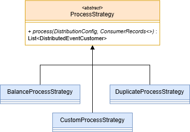
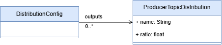
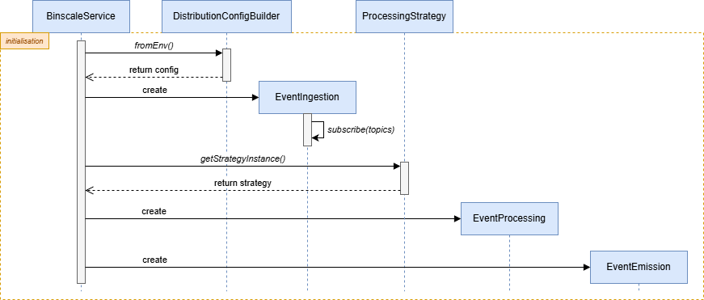
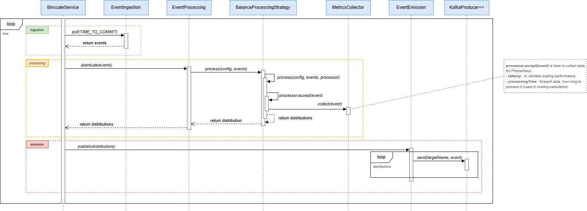

# Consumer

The `binscale-consumer` project is a Java-based application designed to consume messages from Kafka topics while
supporting dynamic scaling and workload management. It includes configurable parameters for fine-tuning consumer
behavior and integrates with Prometheus.\
The consumer consumes and distributes messages, between 0 to many child topics, using different processing strategies.

## Features

- **Dynamic Scaling**: Supports scaling of consumer groups based on workload.
- **Configurable Parameters**: Allows customization of consumer behavior through environment variables.
- **Kafka Integration**: Efficiently consumes messages from Kafka topics.
- **Event Ingestion and Distribution**: Consumes messages from a topic and distributes them to multiple child topics.
- **Processing Strategies**: Supports multiple processing strategies such as `Balanced`, `Duplicated`, and `Custom`.
- **Monitoring**: Provides metrics for Prometheus integration.

## Requirements

- **Java**: Version 11
- **Maven**: For dependency management and build

## Installation

1. Build `binscale-common`
    ```sh
    cd ./binscale-common
    mvn clean install
    ```
2. Build `binscale-consumer`
    ```sh
    cd ./binscale-consumer
    mvn clean compile
    ```

## Usage

Deployed on a Kubernetes cluster.
Refer to the [deployment GitHub repository](https://github.com/benneuville/binscale-deployment).

Deployment file related to the
consumer [here](https://github.com/benneuville/binscale-deployment/blob/master/experience/consumer.yaml).

## Code Structure / Software architecture

### Introduction

The consumer application is structured to handle message consumption from a Kafka topic and distribute messages in
children topics (0 to many).

In fact, the consumer have differents processing strategies to consume and process messages :

- `Balanced` : The workload is evenly distributed across all partitions.
- `Duplicated` : Each consumer process all messages from all partitions.
- `Custom` : Allows to user to decide how messages are processed and distributed between all children topics.

### Processing Strategy Integration



### Distribution Configuration

The configuration of the distribution is given in a YAML file. File is located in `/config/topics-config.yaml` inside
the container.
This file is automatically mapped to Java objects with `ObjectMapper`.



### Sequence diagram

On this example, the distribution strategy is `Balance`.\
This diagram illustrates the global interaction between the components of the application with initialisation,
ingestion, processing & emission phases.

#### Initialisation phase



#### Run phase (ingestion, processing & emission)



### Shutdown hook

To ensure a graceful shutdown of the consumer application, a shutdown hook is implemented. This hook is triggered
when the application receives a termination signal, allowing it to close properly KafkaConsumer & KafkaProducer for
correct rebalancing.

## 🔧 Environment Variables

*This part is auto generated.*

| Name                              | Description                                                                                | Default value                                                             |
|-----------------------------------|--------------------------------------------------------------------------------------------|---------------------------------------------------------------------------|
| `SCALE`                           | Scale parameter                                                                            | *(undefined)*                                                             |
| `TIME_TO_COMMIT`                  | Time to commit parameter                                                                   | *(undefined)*                                                             |
| `SHAPE`                           | Shape parameter                                                                            | *(undefined)*                                                             |
| `WSLA_S`                          | WSLA parameter                                                                             | *(undefined)*                                                             |
| `ASYNC_COMMIT`                    | Async commit parameter. Have the Kafka commit to be asynchronous?                          | *(undefined)*                                                             |
| `BOOTSTRAP_SERVERS`               | Bootstrap servers, Example : 'localhost:9092'                                              | *(undefined)*                                                             |
| `SLEEP`                           | Sleep time                                                                                 | 0                                                                         |
| `ADDITIONAL_CONFIG`               | Additional consumer configuration in the form 'key1=value1,key2=value2'                    | ""                                                                        |
| `MESSAGE_COUNT`                   | Message count                                                                              | 10L                                                                       |
| `CLIENT_RACK`                     | Client rack                                                                                | null                                                                      |
| `MAX_POLL_RECORDS`                | Max poll records parameter. Max number of events returned in a call to Kafka topic.        | 500                                                                       |
| `SESSION_TIMEOUT_MS`              | Kafka session timeout in milliseconds                                                      | "3000"                                                                    |
| `HEARTBEAT_INTERVAL_MS`           | Heartbeat interval in milliseconds                                                         | "1000"                                                                    |
| `PROCESSING_STRATEGY`             | Processing strategy. Example : 'balanced', 'dupplicated', custom'                          | ProcessStrategyMapping.defaultStrategy, ProcessStrategyMapping::getByName |
| `HEADERS`                         | Headers to add to each message, comma separated. Example : 'header1:value1,header2:value2' | ""                                                                        |
| `PRODUCER_ACKS`                   | Producer acks config. Example : '0', '1' or 'all'                                          | "0"                                                                       |
| `TOPICS_DISTRIBUTION_CONFIG_PATH` | Config path for Topics distribution                                                        | "/config/topics-config.yaml"                                              |

