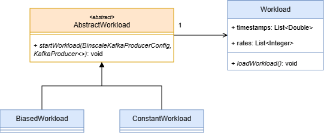
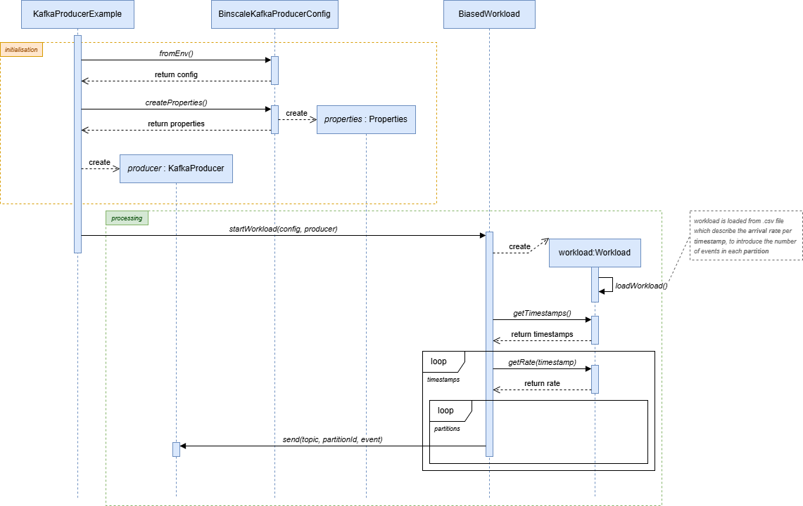

# Producer

The `binscale-producer` project is a Java-based application designed to handle workload management and message
production. It
leverages gRPC for communication and includes configurable workload strategies to simulate different production
scenarios.

## Features

- **Workload Management**: Supports multiple workload strategies such as `Biased`, `Constant`, and `Non-Uniform`.
- **Environment Configuration**: Easily configurable via environment variables.
- **gRPC Service**: Provides a gRPC-based `ArrivalService` for managing arrival rates.

## Requirements

- **Java**: Version 11
- **Maven**: For dependency management and build

## Installation

1. Build `binscale-common`
    ```sh
    cd ./binscale-common
    mvn clean install
    ```
2. Build `binscale-producer`
    ```sh
    cd ./binscale-producer
    mvn clean compile
    ```

## Usage

Deployed on a Kubernetes cluster.
Refer to the [deployment Github repository](https://github.com/benneuville/binscale-deployment).

Deployment file related to the
producer [here](https://github.com/benneuville/binscale-deployment/blob/master/experience/producer.yaml).

## Code Structure / Software architecture

### Introduction

To facilitate workload management and application, the consumer application is structured around differents workload
strategy :

- `Biased` : The workload is distributed based on defined weights for each partition. *(refer to `PARTITION_WEIGHTS`
  environment variable)*
- `Constant` : The workload is evenly distributed across all partitions.
- `Non-Uniform` : The workload follows a non-uniform distribution pattern. Same as `Biased`.

### Workload Strategy Integration



### Workload Loading

A workload schematic have to be provided by a CSV file. Files are located in `src/main/ressources` folder.

### Sequence diagram

On this example, the workload strategy is `Biased`.\
This diagram illustrates the global interaction between the components of the application with initialisation & processing phase.



## 🔧 Environment Variables

*This part is auto generated.*

| Name | Description | Default value |
|-----|--------------|-------------------|
| `PARTITION_WEIGHTS` | List of partition weights, comma separated. Example : '1,1,1,1,1' | *(undefined)* |
| `INPUT_WORKLOAD` | Input workload file name. Example : 'defaultArrivalRatesm.csv' | "defaultArrivalRatesm.csv" |
| `BOOTSTRAP_SERVERS` | Bootstrap servers, Example : 'localhost:9092' | *(undefined)* |
| `DELAY_MS` | Delay between two messages in milliseconds. Example : 1000 | *(undefined)* |
| `MESSAGES_COUNT` | Number of messages to send. Example : 10 | 10L |
| `MESSAGE` | Message content. Example : 'Hello World !' | "Hello World !" |
| `PRODUCER_ACKS` | Producer acks config. Example : '0', '1' or 'all' | "0" |
| `HEADERS` | Headers to add to each message, comma separated. Example : 'header1:value1,header2:value2' | "" |
| `ADDITIONAL_CONFIG` | Additional producer configuration in the form 'key1=value1,key2=value2' | "" |
| `WORKLOAD` | Workload mapping strategy. Example : 'constant' | "constant" |
| `SERVER_PORT` | Server port for the health check endpoint | 5002 |


## 🔧 Environment Variables

*This part is auto generated.*

| Name | Description | Default value |
|-----|--------------|-------------------|
| `TOPIC` | Topic name. Example : 'testtopic1' | *(undefined)* |
| `PARTITION_WEIGHTS` | List of partition weights, comma separated. Example : '1,1,1,1,1' | *(undefined)* |
| `INPUT_WORKLOAD` | Input workload file name. Example : 'defaultArrivalRatesm.csv' | "defaultArrivalRatesm.csv" |
| `BOOTSTRAP_SERVERS` | Bootstrap servers, Example : 'localhost:9092' | *(undefined)* |
| `DELAY_MS` | Delay between two messages in milliseconds. Example : 1000 | *(undefined)* |
| `MESSAGES_COUNT` | Number of messages to send. Example : 10 | 10L |
| `MESSAGE` | Message content. Example : 'Hello World !' | "Hello World !" |
| `PRODUCER_ACKS` | Producer acks config. Example : '0', '1' or 'all' | "0" |
| `HEADERS` | Headers to add to each message, comma separated. Example : 'header1:value1,header2:value2' | "" |
| `ADDITIONAL_CONFIG` | Additional producer configuration in the form 'key1=value1,key2=value2' | "" |
| `WORKLOAD` | Workload mapping strategy. Example : 'constant' | "constant" |
| `SERVER_PORT` | Server port for the health check endpoint | 5002 |

## 🔧 Environment Variables

*This part is auto generated.*

| Name | Description | Default value |
|-----|--------------|-------------------|
| `PRODUCER_ID` | producer id/name to identify event provenance | *(undefined)* |
| `TOPIC` | Topic name. Example : 'testtopic1' | *(undefined)* |
| `PARTITION_WEIGHTS` | List of partition weights, comma separated. Example : '1,1,1,1,1' | *(undefined)* |
| `INPUT_WORKLOAD` | Input workload file name. Example : 'defaultArrivalRatesm.csv' | "defaultArrivalRatesm.csv" |
| `BOOTSTRAP_SERVERS` | Bootstrap servers, Example : 'localhost:9092' | *(undefined)* |
| `DELAY_MS` | Delay between two messages in milliseconds. Example : 1000 | *(undefined)* |
| `MESSAGES_COUNT` | Number of messages to send. Example : 10 | 10L |
| `MESSAGE` | Message content. Example : 'Hello World !' | "Hello World !" |
| `PRODUCER_ACKS` | Producer acks config. Example : '0', '1' or 'all' | "0" |
| `HEADERS` | Headers to add to each message, comma separated. Example : 'header1:value1,header2:value2' | "" |
| `ADDITIONAL_CONFIG` | Additional producer configuration in the form 'key1=value1,key2=value2' | "" |
| `WORKLOAD` | Workload mapping strategy. Example : 'constant' | "constant" |
| `SERVER_PORT` | Server port for the health check endpoint | 5002 |

## 🔧 Environment Variables

*This part is auto generated.*

| Name | Description | Default value |
|-----|--------------|-------------------|
| `PRODUCER_ID` | producer id/name to identify event provenance | *(undefined)* |
| `TOPIC` | Topic name. Example : 'testtopic1' | *(undefined)* |
| `PARTITION_WEIGHTS` | List of partition weights, comma separated. Example : '1,1,1,1,1' | *(undefined)* |
| `INPUT_WORKLOAD` | Input workload file name. Example : 'defaultArrivalRatesm.csv' | "defaultArrivalRatesm.csv" |
| `BOOTSTRAP_SERVERS` | Bootstrap servers, Example : 'localhost:9092' | *(undefined)* |
| `DELAY_MS` | Delay between two messages in milliseconds. Example : 1000 | *(undefined)* |
| `MESSAGES_COUNT` | Number of messages to send. Example : 10 | 10L |
| `MESSAGE` | Message content. Example : 'Hello World !' | "Hello World !" |
| `PRODUCER_ACKS` | Producer acks config. Example : '0', '1' or 'all' | "0" |
| `HEADERS` | Headers to add to each message, comma separated. Example : 'header1:value1,header2:value2' | "" |
| `ADDITIONAL_CONFIG` | Additional producer configuration in the form 'key1=value1,key2=value2' | "" |
| `WORKLOAD` | Workload mapping strategy. Example : 'constant' | "constant" |
| `SERVER_PORT` | Server port for the health check endpoint | 5002 |

## 🔧 Environment Variables

*This part is auto generated.*

| Name | Description | Default value |
|-----|--------------|-------------------|
| `PRODUCER_ID` | producer id/name to identify event provenance | *(undefined)* |
| `TOPIC` | Topic name. Example : 'testtopic1' | *(undefined)* |
| `PARTITION_WEIGHTS` | List of partition weights, comma separated. Example : '1,1,1,1,1' | *(undefined)* |
| `INPUT_WORKLOAD` | Input workload file name. Example : 'defaultArrivalRatesm.csv' | "defaultArrivalRatesm.csv" |
| `BOOTSTRAP_SERVERS` | Bootstrap servers, Example : 'localhost:9092' | *(undefined)* |
| `DELAY_MS` | Delay between two messages in milliseconds. Example : 1000 | *(undefined)* |
| `MESSAGES_COUNT` | Number of messages to send. Example : 10 | 10L |
| `MESSAGE` | Message content. Example : 'Hello World !' | "Hello World !" |
| `PRODUCER_ACKS` | Producer acks config. Example : '0', '1' or 'all' | "0" |
| `HEADERS` | Headers to add to each message, comma separated. Example : 'header1:value1,header2:value2' | "" |
| `ADDITIONAL_CONFIG` | Additional producer configuration in the form 'key1=value1,key2=value2' | "" |
| `WORKLOAD` | Workload mapping strategy. Example : 'constant' | "constant" |
| `SERVER_PORT` | Server port for the health check endpoint | 5002 |

## 🔧 Environment Variables

*This part is auto generated.*

| Name | Description | Default value |
|-----|--------------|-------------------|
| `PRODUCER_ID` | producer id/name to identify event provenance | *(undefined)* |
| `TOPIC` | Topic name. Example : 'testtopic1' | *(undefined)* |
| `PARTITION_WEIGHTS` | List of partition weights, comma separated. Example : '1,1,1,1,1' | *(undefined)* |
| `INPUT_WORKLOAD` | Input workload file name. Example : 'defaultArrivalRatesm.csv' | "defaultArrivalRatesm.csv" |
| `BOOTSTRAP_SERVERS` | Bootstrap servers, Example : 'localhost:9092' | *(undefined)* |
| `DELAY_MS` | Delay between two messages in milliseconds. Example : 1000 | *(undefined)* |
| `MESSAGES_COUNT` | Number of messages to send. Example : 10 | 10L |
| `MESSAGE` | Message content. Example : 'Hello World !' | "Hello World !" |
| `PRODUCER_ACKS` | Producer acks config. Example : '0', '1' or 'all' | "0" |
| `HEADERS` | Headers to add to each message, comma separated. Example : 'header1:value1,header2:value2' | "" |
| `ADDITIONAL_CONFIG` | Additional producer configuration in the form 'key1=value1,key2=value2' | "" |
| `WORKLOAD` | Workload mapping strategy. Example : 'constant' | "constant" |
| `SERVER_PORT` | Server port for the health check endpoint | 5002 |

## 🔧 Environment Variables

*This part is auto generated.*

| Name | Description | Default value |
|-----|--------------|-------------------|
| `PRODUCER_ID` | producer id/name to identify event provenance | *(undefined)* |
| `TOPIC` | Topic name. Example : 'testtopic1' | *(undefined)* |
| `PARTITION_WEIGHTS` | List of partition weights, comma separated. Example : '1,1,1,1,1' | *(undefined)* |
| `INPUT_WORKLOAD` | Input workload file name. Example : 'defaultArrivalRatesm.csv' | "defaultArrivalRatesm.csv" |
| `BOOTSTRAP_SERVERS` | Bootstrap servers, Example : 'localhost:9092' | *(undefined)* |
| `DELAY_MS` | Delay between two messages in milliseconds. Example : 1000 | *(undefined)* |
| `MESSAGES_COUNT` | Number of messages to send. Example : 10 | 10L |
| `MESSAGE` | Message content. Example : 'Hello World !' | "Hello World !" |
| `PRODUCER_ACKS` | Producer acks config. Example : '0', '1' or 'all' | "0" |
| `HEADERS` | Headers to add to each message, comma separated. Example : 'header1:value1,header2:value2' | "" |
| `ADDITIONAL_CONFIG` | Additional producer configuration in the form 'key1=value1,key2=value2' | "" |
| `WORKLOAD` | Workload mapping strategy. Example : 'constant' | "constant" |
| `SERVER_PORT` | Server port for the health check endpoint | 5002 |

## 🔧 Environment Variables

*This part is auto generated.*

| Name | Description | Default value |
|-----|--------------|-------------------|
| `PRODUCER_ID` | producer id/name to identify event provenance | *(undefined)* |
| `TOPIC` | Topic name. Example : 'testtopic1' | *(undefined)* |
| `PARTITION_WEIGHTS` | List of partition weights, comma separated. Example : '1,1,1,1,1' | *(undefined)* |
| `INPUT_WORKLOAD` | Input workload file name. Example : 'defaultArrivalRatesm.csv' | "defaultArrivalRatesm.csv" |
| `BOOTSTRAP_SERVERS` | Bootstrap servers, Example : 'localhost:9092' | *(undefined)* |
| `DELAY_MS` | Delay between two messages in milliseconds. Example : 1000 | *(undefined)* |
| `MESSAGES_COUNT` | Number of messages to send. Example : 10 | 10L |
| `MESSAGE` | Message content. Example : 'Hello World !' | "Hello World !" |
| `PRODUCER_ACKS` | Producer acks config. Example : '0', '1' or 'all' | "0" |
| `HEADERS` | Headers to add to each message, comma separated. Example : 'header1:value1,header2:value2' | "" |
| `ADDITIONAL_CONFIG` | Additional producer configuration in the form 'key1=value1,key2=value2' | "" |
| `WORKLOAD` | Workload mapping strategy. Example : 'constant' | "constant" |
| `SERVER_PORT` | Server port for the health check endpoint | 5002 |

## 🔧 Environment Variables

*This part is auto generated.*

| Name | Description | Default value |
|-----|--------------|-------------------|
| `PRODUCER_ID` | producer id/name to identify event provenance | *(undefined)* |
| `TOPIC` | Topic name. Example : 'testtopic1' | *(undefined)* |
| `PARTITION_WEIGHTS` | List of partition weights, comma separated. Example : '1,1,1,1,1' | *(undefined)* |
| `INPUT_WORKLOAD` | Input workload file name. Example : 'defaultArrivalRatesm.csv' | "defaultArrivalRatesm.csv" |
| `BOOTSTRAP_SERVERS` | Bootstrap servers, Example : 'localhost:9092' | *(undefined)* |
| `DELAY_MS` | Delay between two messages in milliseconds. Example : 1000 | *(undefined)* |
| `MESSAGES_COUNT` | Number of messages to send. Example : 10 | 10L |
| `MESSAGE` | Message content. Example : 'Hello World !' | "Hello World !" |
| `PRODUCER_ACKS` | Producer acks config. Example : '0', '1' or 'all' | "0" |
| `HEADERS` | Headers to add to each message, comma separated. Example : 'header1:value1,header2:value2' | "" |
| `ADDITIONAL_CONFIG` | Additional producer configuration in the form 'key1=value1,key2=value2' | "" |
| `WORKLOAD` | Workload mapping strategy. Example : 'constant' | "constant" |
| `SERVER_PORT` | Server port for the health check endpoint | 5002 |

## 🔧 Environment Variables

*This part is auto generated.*

| Name | Description | Default value |
|-----|--------------|-------------------|
| `PRODUCER_ID` | producer id/name to identify event provenance | *(undefined)* |
| `TOPIC` | Topic name. Example : 'testtopic1' | *(undefined)* |
| `PARTITION_WEIGHTS` | List of partition weights, comma separated. Example : '1,1,1,1,1' | *(undefined)* |
| `INPUT_WORKLOAD` | Input workload file name. Example : 'defaultArrivalRatesm.csv' | "defaultArrivalRatesm.csv" |
| `BOOTSTRAP_SERVERS` | Bootstrap servers, Example : 'localhost:9092' | *(undefined)* |
| `DELAY_MS` | Delay between two messages in milliseconds. Example : 1000 | *(undefined)* |
| `MESSAGES_COUNT` | Number of messages to send. Example : 10 | 10L |
| `MESSAGE` | Message content. Example : 'Hello World !' | "Hello World !" |
| `PRODUCER_ACKS` | Producer acks config. Example : '0', '1' or 'all' | "0" |
| `HEADERS` | Headers to add to each message, comma separated. Example : 'header1:value1,header2:value2' | "" |
| `ADDITIONAL_CONFIG` | Additional producer configuration in the form 'key1=value1,key2=value2' | "" |
| `WORKLOAD` | Workload mapping strategy. Example : 'constant' | "constant" |
| `SERVER_PORT` | Server port for the health check endpoint | 5002 |

## 🔧 Environment Variables

*This part is auto generated.*

| Name | Description | Default value |
|-----|--------------|-------------------|
| `PRODUCER_ID` | producer id/name to identify event provenance | *(undefined)* |
| `TOPIC` | Topic name. Example : 'testtopic1' | *(undefined)* |
| `PARTITION_WEIGHTS` | List of partition weights, comma separated. Example : '1,1,1,1,1' | *(undefined)* |
| `INPUT_WORKLOAD` | Input workload file name. Example : 'defaultArrivalRatesm.csv' | "defaultArrivalRatesm.csv" |
| `BOOTSTRAP_SERVERS` | Bootstrap servers, Example : 'localhost:9092' | *(undefined)* |
| `DELAY_MS` | Delay between two messages in milliseconds. Example : 1000 | *(undefined)* |
| `MESSAGES_COUNT` | Number of messages to send. Example : 10 | 10L |
| `MESSAGE` | Message content. Example : 'Hello World !' | "Hello World !" |
| `PRODUCER_ACKS` | Producer acks config. Example : '0', '1' or 'all' | "0" |
| `HEADERS` | Headers to add to each message, comma separated. Example : 'header1:value1,header2:value2' | "" |
| `ADDITIONAL_CONFIG` | Additional producer configuration in the form 'key1=value1,key2=value2' | "" |
| `WORKLOAD` | Workload mapping strategy. Example : 'constant' | "constant" |
| `SERVER_PORT` | Server port for the health check endpoint | 5002 |

## 🔧 Environment Variables

*This part is auto generated.*

| Name | Description | Default value |
|-----|--------------|-------------------|
| `PRODUCER_ID` | producer id/name to identify event provenance | *(undefined)* |
| `TOPIC` | Topic name. Example : 'testtopic1' | *(undefined)* |
| `PARTITION_WEIGHTS` | List of partition weights, comma separated. Example : '1,1,1,1,1' | *(undefined)* |
| `INPUT_WORKLOAD` | Input workload file name. Example : 'defaultArrivalRatesm.csv' | "defaultArrivalRatesm.csv" |
| `BOOTSTRAP_SERVERS` | Bootstrap servers, Example : 'localhost:9092' | *(undefined)* |
| `DELAY_MS` | Delay between two messages in milliseconds. Example : 1000 | *(undefined)* |
| `MESSAGES_COUNT` | Number of messages to send. Example : 10 | 10L |
| `MESSAGE` | Message content. Example : 'Hello World !' | "Hello World !" |
| `PRODUCER_ACKS` | Producer acks config. Example : '0', '1' or 'all' | "0" |
| `HEADERS` | Headers to add to each message, comma separated. Example : 'header1:value1,header2:value2' | "" |
| `ADDITIONAL_CONFIG` | Additional producer configuration in the form 'key1=value1,key2=value2' | "" |
| `WORKLOAD` | Workload mapping strategy. Example : 'constant' | "constant" |
| `SERVER_PORT` | Server port for the health check endpoint | 5002 |

## 🔧 Environment Variables

*This part is auto generated.*

| Name | Description | Default value |
|-----|--------------|-------------------|
| `PRODUCER_ID` | producer id/name to identify event provenance | *(undefined)* |
| `TOPIC` | Topic name. Example : 'testtopic1' | *(undefined)* |
| `PARTITION_WEIGHTS` | List of partition weights, comma separated. Example : '1,1,1,1,1' | *(undefined)* |
| `INPUT_WORKLOAD` | Input workload file name. Example : 'defaultArrivalRatesm.csv' | "defaultArrivalRatesm.csv" |
| `BOOTSTRAP_SERVERS` | Bootstrap servers, Example : 'localhost:9092' | *(undefined)* |
| `DELAY_MS` | Delay between two messages in milliseconds. Example : 1000 | *(undefined)* |
| `MESSAGES_COUNT` | Number of messages to send. Example : 10 | 10L |
| `MESSAGE` | Message content. Example : 'Hello World !' | "Hello World !" |
| `PRODUCER_ACKS` | Producer acks config. Example : '0', '1' or 'all' | "0" |
| `HEADERS` | Headers to add to each message, comma separated. Example : 'header1:value1,header2:value2' | "" |
| `ADDITIONAL_CONFIG` | Additional producer configuration in the form 'key1=value1,key2=value2' | "" |
| `WORKLOAD` | Workload mapping strategy. Example : 'constant' | "constant" |
| `SERVER_PORT` | Server port for the health check endpoint | 5002 |

## 🔧 Environment Variables

*This part is auto generated.*

| Name | Description | Default value |
|-----|--------------|-------------------|
| `PRODUCER_ID` | producer id/name to identify event provenance | *(undefined)* |
| `TOPIC` | Topic name. Example : 'testtopic1' | *(undefined)* |
| `PARTITION_WEIGHTS` | List of partition weights, comma separated. Example : '1,1,1,1,1' | *(undefined)* |
| `INPUT_WORKLOAD` | Input workload file name. Example : 'defaultArrivalRatesm.csv' | "defaultArrivalRatesm.csv" |
| `BOOTSTRAP_SERVERS` | Bootstrap servers, Example : 'localhost:9092' | *(undefined)* |
| `DELAY_MS` | Delay between two messages in milliseconds. Example : 1000 | *(undefined)* |
| `MESSAGES_COUNT` | Number of messages to send. Example : 10 | 10L |
| `MESSAGE` | Message content. Example : 'Hello World !' | "Hello World !" |
| `PRODUCER_ACKS` | Producer acks config. Example : '0', '1' or 'all' | "0" |
| `HEADERS` | Headers to add to each message, comma separated. Example : 'header1:value1,header2:value2' | "" |
| `ADDITIONAL_CONFIG` | Additional producer configuration in the form 'key1=value1,key2=value2' | "" |
| `WORKLOAD` | Workload mapping strategy. Example : 'constant' | "constant" |
| `SERVER_PORT` | Server port for the health check endpoint | 5002 |

## 🔧 Environment Variables

*This part is auto generated.*

| Name | Description | Default value |
|-----|--------------|-------------------|
| `PRODUCER_ID` | producer id/name to identify event provenance | *(undefined)* |
| `TOPIC` | Topic name. Example : 'testtopic1' | *(undefined)* |
| `PARTITION_WEIGHTS` | List of partition weights, comma separated. Example : '1,1,1,1,1' | *(undefined)* |
| `INPUT_WORKLOAD` | Input workload file name. Example : 'defaultArrivalRatesm.csv' | "defaultArrivalRatesm.csv" |
| `BOOTSTRAP_SERVERS` | Bootstrap servers, Example : 'localhost:9092' | *(undefined)* |
| `DELAY_MS` | Delay between two messages in milliseconds. Example : 1000 | *(undefined)* |
| `MESSAGES_COUNT` | Number of messages to send. Example : 10 | 10L |
| `MESSAGE` | Message content. Example : 'Hello World !' | "Hello World !" |
| `PRODUCER_ACKS` | Producer acks config. Example : '0', '1' or 'all' | "0" |
| `HEADERS` | Headers to add to each message, comma separated. Example : 'header1:value1,header2:value2' | "" |
| `ADDITIONAL_CONFIG` | Additional producer configuration in the form 'key1=value1,key2=value2' | "" |
| `WORKLOAD` | Workload mapping strategy. Example : 'constant' | "constant" |
| `SERVER_PORT` | Server port for the health check endpoint | 5002 |

## 🔧 Environment Variables

*This part is auto generated.*

| Name | Description | Default value |
|-----|--------------|-------------------|
| `PRODUCER_ID` | producer id/name to identify event provenance | *(undefined)* |
| `TOPIC` | Topic name. Example : 'testtopic1' | *(undefined)* |
| `PARTITION_WEIGHTS` | List of partition weights, comma separated. Example : '1,1,1,1,1' | *(undefined)* |
| `INPUT_WORKLOAD` | Input workload file name. Example : 'defaultArrivalRatesm.csv' | "defaultArrivalRatesm.csv" |
| `BOOTSTRAP_SERVERS` | Bootstrap servers, Example : 'localhost:9092' | *(undefined)* |
| `DELAY_MS` | Delay between two messages in milliseconds. Example : 1000 | *(undefined)* |
| `MESSAGES_COUNT` | Number of messages to send. Example : 10 | 10L |
| `MESSAGE` | Message content. Example : 'Hello World !' | "Hello World !" |
| `PRODUCER_ACKS` | Producer acks config. Example : '0', '1' or 'all' | "0" |
| `HEADERS` | Headers to add to each message, comma separated. Example : 'header1:value1,header2:value2' | "" |
| `ADDITIONAL_CONFIG` | Additional producer configuration in the form 'key1=value1,key2=value2' | "" |
| `WORKLOAD` | Workload mapping strategy. Example : 'constant' | "constant" |
| `SERVER_PORT` | Server port for the health check endpoint | 5002 |

## 🔧 Environment Variables

*This part is auto generated.*

| Name | Description | Default value |
|-----|--------------|-------------------|
| `PRODUCER_ID` | producer id/name to identify event provenance | *(undefined)* |
| `TOPIC` | Topic name. Example : 'testtopic1' | *(undefined)* |
| `PARTITION_WEIGHTS` | List of partition weights, comma separated. Example : '1,1,1,1,1' | *(undefined)* |
| `INPUT_WORKLOAD` | Input workload file name. Example : 'defaultArrivalRatesm.csv' | "defaultArrivalRatesm.csv" |
| `BOOTSTRAP_SERVERS` | Bootstrap servers, Example : 'localhost:9092' | *(undefined)* |
| `DELAY_MS` | Delay between two messages in milliseconds. Example : 1000 | *(undefined)* |
| `MESSAGES_COUNT` | Number of messages to send. Example : 10 | 10L |
| `MESSAGE` | Message content. Example : 'Hello World !' | "Hello World !" |
| `PRODUCER_ACKS` | Producer acks config. Example : '0', '1' or 'all' | "0" |
| `HEADERS` | Headers to add to each message, comma separated. Example : 'header1:value1,header2:value2' | "" |
| `ADDITIONAL_CONFIG` | Additional producer configuration in the form 'key1=value1,key2=value2' | "" |
| `WORKLOAD` | Workload mapping strategy. Example : 'constant' | "constant" |
| `SERVER_PORT` | Server port for the health check endpoint | 5002 |

## 🔧 Environment Variables

*This part is auto generated.*

| Name | Description | Default value |
|-----|--------------|-------------------|
| `PRODUCER_ID` | producer id/name to identify event provenance | *(undefined)* |
| `TOPIC` | Topic name. Example : 'testtopic1' | *(undefined)* |
| `PARTITION_WEIGHTS` | List of partition weights, comma separated. Example : '1,1,1,1,1' | *(undefined)* |
| `INPUT_WORKLOAD` | Input workload file name. Example : 'defaultArrivalRatesm.csv' | "defaultArrivalRatesm.csv" |
| `BOOTSTRAP_SERVERS` | Bootstrap servers, Example : 'localhost:9092' | *(undefined)* |
| `DELAY_MS` | Delay between two messages in milliseconds. Example : 1000 | *(undefined)* |
| `MESSAGES_COUNT` | Number of messages to send. Example : 10 | 10L |
| `MESSAGE` | Message content. Example : 'Hello World !' | "Hello World !" |
| `PRODUCER_ACKS` | Producer acks config. Example : '0', '1' or 'all' | "0" |
| `HEADERS` | Headers to add to each message, comma separated. Example : 'header1:value1,header2:value2' | "" |
| `ADDITIONAL_CONFIG` | Additional producer configuration in the form 'key1=value1,key2=value2' | "" |
| `WORKLOAD` | Workload mapping strategy. Example : 'constant' | "constant" |
| `SERVER_PORT` | Server port for the health check endpoint | 5002 |


## 🔧 Environment Variables

*This part is auto generated.*

| Name | Description | Default value |
|-----|--------------|-------------------|
| `PRODUCER_ID` | producer id/name to identify event provenance | *(undefined)* |
| `TOPIC` | Topic name. Example : 'testtopic1' | *(undefined)* |
| `PARTITION_WEIGHTS` | List of partition weights, comma separated. Example : '1,1,1,1,1' | *(undefined)* |
| `INPUT_WORKLOAD` | Input workload file name. Example : 'defaultArrivalRatesm.csv' | "defaultArrivalRatesm.csv" |
| `BOOTSTRAP_SERVERS` | Bootstrap servers, Example : 'localhost:9092' | *(undefined)* |
| `DELAY_MS` | Delay between two messages in milliseconds. Example : 1000 | *(undefined)* |
| `MESSAGES_COUNT` | Number of messages to send. Example : 10 | 10L |
| `MESSAGE` | Message content. Example : 'Hello World !' | "Hello World !" |
| `PRODUCER_ACKS` | Producer acks config. Example : '0', '1' or 'all' | "0" |
| `HEADERS` | Headers to add to each message, comma separated. Example : 'header1:value1,header2:value2' | "" |
| `ADDITIONAL_CONFIG` | Additional producer configuration in the form 'key1=value1,key2=value2' | "" |
| `WORKLOAD` | Workload mapping strategy. Example : 'constant' | "constant" |
| `SERVER_PORT` | Server port for the health check endpoint | 5002 |

## 🔧 Environment Variables

*This part is auto generated.*

| Name | Description | Default value |
|-----|--------------|-------------------|
| `PRODUCER_ID` | producer id/name to identify event provenance | *(undefined)* |
| `TOPIC` | Topic name. Example : 'testtopic1' | *(undefined)* |
| `PARTITION_WEIGHTS` | List of partition weights, comma separated. Example : '1,1,1,1,1' | *(undefined)* |
| `INPUT_WORKLOAD` | Input workload file name. Example : 'defaultArrivalRatesm.csv' | "defaultArrivalRatesm.csv" |
| `BOOTSTRAP_SERVERS` | Bootstrap servers, Example : 'localhost:9092' | *(undefined)* |
| `DELAY_MS` | Delay between two messages in milliseconds. Example : 1000 | *(undefined)* |
| `MESSAGES_COUNT` | Number of messages to send. Example : 10 | 10L |
| `MESSAGE` | Message content. Example : 'Hello World !' | "Hello World !" |
| `PRODUCER_ACKS` | Producer acks config. Example : '0', '1' or 'all' | "0" |
| `HEADERS` | Headers to add to each message, comma separated. Example : 'header1:value1,header2:value2' | "" |
| `ADDITIONAL_CONFIG` | Additional producer configuration in the form 'key1=value1,key2=value2' | "" |
| `WORKLOAD` | Workload mapping strategy. Example : 'constant' | "constant" |
| `SERVER_PORT` | Server port for the health check endpoint | 5002 |

## 🔧 Environment Variables

*This part is auto generated.*

| Name | Description | Default value |
|-----|--------------|-------------------|
| `PRODUCER_ID` | producer id/name to identify event provenance | *(undefined)* |
| `TOPIC` | Topic name. Example : 'testtopic1' | *(undefined)* |
| `PARTITION_WEIGHTS` | List of partition weights, comma separated. Example : '1,1,1,1,1' | *(undefined)* |
| `INPUT_WORKLOAD` | Input workload file name. Example : 'defaultArrivalRatesm.csv' | "defaultArrivalRatesm.csv" |
| `BOOTSTRAP_SERVERS` | Bootstrap servers, Example : 'localhost:9092' | *(undefined)* |
| `DELAY_MS` | Delay between two messages in milliseconds. Example : 1000 | *(undefined)* |
| `MESSAGES_COUNT` | Number of messages to send. Example : 10 | 10L |
| `MESSAGE` | Message content. Example : 'Hello World !' | "Hello World !" |
| `PRODUCER_ACKS` | Producer acks config. Example : '0', '1' or 'all' | "0" |
| `HEADERS` | Headers to add to each message, comma separated. Example : 'header1:value1,header2:value2' | "" |
| `ADDITIONAL_CONFIG` | Additional producer configuration in the form 'key1=value1,key2=value2' | "" |
| `WORKLOAD` | Workload mapping strategy. Example : 'constant' | "constant" |
| `SERVER_PORT` | Server port for the health check endpoint | 5002 |

## 🔧 Environment Variables

*This part is auto generated.*

| Name | Description | Default value |
|-----|--------------|-------------------|
| `PRODUCER_ID` | producer id/name to identify event provenance | *(undefined)* |
| `TOPIC` | Topic name. Example : 'testtopic1' | *(undefined)* |
| `PARTITION_WEIGHTS` | List of partition weights, comma separated. Example : '1,1,1,1,1' | *(undefined)* |
| `INPUT_WORKLOAD` | Input workload file name. Example : 'defaultArrivalRatesm.csv' | "defaultArrivalRatesm.csv" |
| `BOOTSTRAP_SERVERS` | Bootstrap servers, Example : 'localhost:9092' | *(undefined)* |
| `DELAY_MS` | Delay between two messages in milliseconds. Example : 1000 | *(undefined)* |
| `MESSAGES_COUNT` | Number of messages to send. Example : 10 | 10L |
| `MESSAGE` | Message content. Example : 'Hello World !' | "Hello World !" |
| `PRODUCER_ACKS` | Producer acks config. Example : '0', '1' or 'all' | "0" |
| `HEADERS` | Headers to add to each message, comma separated. Example : 'header1:value1,header2:value2' | "" |
| `ADDITIONAL_CONFIG` | Additional producer configuration in the form 'key1=value1,key2=value2' | "" |
| `WORKLOAD` | Workload mapping strategy. Example : 'constant' | "constant" |
| `SERVER_PORT` | Server port for the health check endpoint | 5002 |

## 🔧 Environment Variables

*This part is auto generated.*

| Name | Description | Default value |
|-----|--------------|-------------------|
| `PRODUCER_ID` | producer id/name to identify event provenance | *(undefined)* |
| `TOPIC` | Topic name. Example : 'testtopic1' | *(undefined)* |
| `PARTITION_WEIGHTS` | List of partition weights, comma separated. Example : '1,1,1,1,1' | *(undefined)* |
| `INPUT_WORKLOAD` | Input workload file name. Example : 'defaultArrivalRatesm.csv' | "defaultArrivalRatesm.csv" |
| `BOOTSTRAP_SERVERS` | Bootstrap servers, Example : 'localhost:9092' | *(undefined)* |
| `DELAY_MS` | Delay between two messages in milliseconds. Example : 1000 | *(undefined)* |
| `MESSAGES_COUNT` | Number of messages to send. Example : 10 | 10L |
| `MESSAGE` | Message content. Example : 'Hello World !' | "Hello World !" |
| `PRODUCER_ACKS` | Producer acks config. Example : '0', '1' or 'all' | "0" |
| `HEADERS` | Headers to add to each message, comma separated. Example : 'header1:value1,header2:value2' | "" |
| `ADDITIONAL_CONFIG` | Additional producer configuration in the form 'key1=value1,key2=value2' | "" |
| `WORKLOAD` | Workload mapping strategy. Example : 'constant' | "constant" |
| `SERVER_PORT` | Server port for the health check endpoint | 5002 |

## 🔧 Environment Variables

*This part is auto generated.*

| Name | Description | Default value |
|-----|--------------|-------------------|
| `PRODUCER_ID` | producer id/name to identify event provenance | *(undefined)* |
| `TOPIC` | Topic name. Example : 'testtopic1' | *(undefined)* |
| `PARTITION_WEIGHTS` | List of partition weights, comma separated. Example : '1,1,1,1,1' | *(undefined)* |
| `INPUT_WORKLOAD` | Input workload file name. Example : 'defaultArrivalRatesm.csv' | "defaultArrivalRatesm.csv" |
| `BOOTSTRAP_SERVERS` | Bootstrap servers, Example : 'localhost:9092' | *(undefined)* |
| `DELAY_MS` | Delay between two messages in milliseconds. Example : 1000 | *(undefined)* |
| `MESSAGES_COUNT` | Number of messages to send. Example : 10 | 10L |
| `MESSAGE` | Message content. Example : 'Hello World !' | "Hello World !" |
| `PRODUCER_ACKS` | Producer acks config. Example : '0', '1' or 'all' | "0" |
| `HEADERS` | Headers to add to each message, comma separated. Example : 'header1:value1,header2:value2' | "" |
| `ADDITIONAL_CONFIG` | Additional producer configuration in the form 'key1=value1,key2=value2' | "" |
| `WORKLOAD` | Workload mapping strategy. Example : 'constant' | "constant" |
| `SERVER_PORT` | Server port for the health check endpoint | 5002 |

## 🔧 Environment Variables

*This part is auto generated.*

| Name | Description | Default value |
|-----|--------------|-------------------|
| `PRODUCER_ID` | producer id/name to identify event provenance | *(undefined)* |
| `TOPIC` | Topic name. Example : 'testtopic1' | *(undefined)* |
| `PARTITION_WEIGHTS` | List of partition weights, comma separated. Example : '1,1,1,1,1' | *(undefined)* |
| `INPUT_WORKLOAD` | Input workload file name. Example : 'defaultArrivalRatesm.csv' | "defaultArrivalRatesm.csv" |
| `BOOTSTRAP_SERVERS` | Bootstrap servers, Example : 'localhost:9092' | *(undefined)* |
| `DELAY_MS` | Delay between two messages in milliseconds. Example : 1000 | *(undefined)* |
| `MESSAGES_COUNT` | Number of messages to send. Example : 10 | 10L |
| `MESSAGE` | Message content. Example : 'Hello World !' | "Hello World !" |
| `PRODUCER_ACKS` | Producer acks config. Example : '0', '1' or 'all' | "0" |
| `HEADERS` | Headers to add to each message, comma separated. Example : 'header1:value1,header2:value2' | "" |
| `ADDITIONAL_CONFIG` | Additional producer configuration in the form 'key1=value1,key2=value2' | "" |
| `WORKLOAD` | Workload mapping strategy. Example : 'constant' | "constant" |
| `SERVER_PORT` | Server port for the health check endpoint | 5002 |

## 🔧 Environment Variables

*This part is auto generated.*

| Name | Description | Default value |
|-----|--------------|-------------------|
| `PRODUCER_ID` | producer id/name to identify event provenance | *(undefined)* |
| `TOPIC` | Topic name. Example : 'testtopic1' | *(undefined)* |
| `PARTITION_WEIGHTS` | List of partition weights, comma separated. Example : '1,1,1,1,1' | *(undefined)* |
| `INPUT_WORKLOAD` | Input workload file name. Example : 'defaultArrivalRatesm.csv' | "defaultArrivalRatesm.csv" |
| `BOOTSTRAP_SERVERS` | Bootstrap servers, Example : 'localhost:9092' | *(undefined)* |
| `DELAY_MS` | Delay between two messages in milliseconds. Example : 1000 | *(undefined)* |
| `MESSAGES_COUNT` | Number of messages to send. Example : 10 | 10L |
| `MESSAGE` | Message content. Example : 'Hello World !' | "Hello World !" |
| `PRODUCER_ACKS` | Producer acks config. Example : '0', '1' or 'all' | "0" |
| `HEADERS` | Headers to add to each message, comma separated. Example : 'header1:value1,header2:value2' | "" |
| `ADDITIONAL_CONFIG` | Additional producer configuration in the form 'key1=value1,key2=value2' | "" |
| `WORKLOAD` | Workload mapping strategy. Example : 'constant' | "constant" |
| `SERVER_PORT` | Server port for the health check endpoint | 5002 |

## 🔧 Environment Variables

*This part is auto generated.*

| Name | Description | Default value |
|-----|--------------|-------------------|
| `PRODUCER_ID` | producer id/name to identify event provenance | *(undefined)* |
| `TOPIC` | Topic name. Example : 'testtopic1' | *(undefined)* |
| `PARTITION_WEIGHTS` | List of partition weights, comma separated. Example : '1,1,1,1,1' | *(undefined)* |
| `INPUT_WORKLOAD` | Input workload file name. Example : 'defaultArrivalRatesm.csv' | "defaultArrivalRatesm.csv" |
| `BOOTSTRAP_SERVERS` | Bootstrap servers, Example : 'localhost:9092' | *(undefined)* |
| `DELAY_MS` | Delay between two messages in milliseconds. Example : 1000 | *(undefined)* |
| `MESSAGES_COUNT` | Number of messages to send. Example : 10 | 10L |
| `MESSAGE` | Message content. Example : 'Hello World !' | "Hello World !" |
| `PRODUCER_ACKS` | Producer acks config. Example : '0', '1' or 'all' | "0" |
| `HEADERS` | Headers to add to each message, comma separated. Example : 'header1:value1,header2:value2' | "" |
| `ADDITIONAL_CONFIG` | Additional producer configuration in the form 'key1=value1,key2=value2' | "" |
| `WORKLOAD` | Workload mapping strategy. Example : 'constant' | "constant" |
| `SERVER_PORT` | Server port for the health check endpoint | 5002 |

## 🔧 Environment Variables

*This part is auto generated.*

| Name | Description | Default value |
|-----|--------------|-------------------|
| `PRODUCER_ID` | producer id/name to identify event provenance | *(undefined)* |
| `TOPIC` | Topic name. Example : 'testtopic1' | *(undefined)* |
| `PARTITION_WEIGHTS` | List of partition weights, comma separated. Example : '1,1,1,1,1' | *(undefined)* |
| `INPUT_WORKLOAD` | Input workload file name. Example : 'defaultArrivalRatesm.csv' | "defaultArrivalRatesm.csv" |
| `BOOTSTRAP_SERVERS` | Bootstrap servers, Example : 'localhost:9092' | *(undefined)* |
| `DELAY_MS` | Delay between two messages in milliseconds. Example : 1000 | *(undefined)* |
| `MESSAGES_COUNT` | Number of messages to send. Example : 10 | 10L |
| `MESSAGE` | Message content. Example : 'Hello World !' | "Hello World !" |
| `PRODUCER_ACKS` | Producer acks config. Example : '0', '1' or 'all' | "0" |
| `HEADERS` | Headers to add to each message, comma separated. Example : 'header1:value1,header2:value2' | "" |
| `ADDITIONAL_CONFIG` | Additional producer configuration in the form 'key1=value1,key2=value2' | "" |
| `WORKLOAD` | Workload mapping strategy. Example : 'constant' | "constant" |
| `SERVER_PORT` | Server port for the health check endpoint | 5002 |

## 🔧 Environment Variables

*This part is auto generated.*

| Name | Description | Default value |
|-----|--------------|-------------------|
| `PRODUCER_ID` | producer id/name to identify event provenance | *(undefined)* |
| `TOPIC` | Topic name. Example : 'testtopic1' | *(undefined)* |
| `PARTITION_WEIGHTS` | List of partition weights, comma separated. Example : '1,1,1,1,1' | *(undefined)* |
| `INPUT_WORKLOAD` | Input workload file name. Example : 'defaultArrivalRatesm.csv' | "defaultArrivalRatesm.csv" |
| `BOOTSTRAP_SERVERS` | Bootstrap servers, Example : 'localhost:9092' | *(undefined)* |
| `DELAY_MS` | Delay between two messages in milliseconds. Example : 1000 | *(undefined)* |
| `MESSAGES_COUNT` | Number of messages to send. Example : 10 | 10L |
| `MESSAGE` | Message content. Example : 'Hello World !' | "Hello World !" |
| `PRODUCER_ACKS` | Producer acks config. Example : '0', '1' or 'all' | "0" |
| `HEADERS` | Headers to add to each message, comma separated. Example : 'header1:value1,header2:value2' | "" |
| `ADDITIONAL_CONFIG` | Additional producer configuration in the form 'key1=value1,key2=value2' | "" |
| `WORKLOAD` | Workload mapping strategy. Example : 'constant' | "constant" |
| `SERVER_PORT` | Server port for the health check endpoint | 5002 |

## 🔧 Environment Variables

*This part is auto generated.*

| Name | Description | Default value |
|-----|--------------|-------------------|
| `PRODUCER_ID` | producer id/name to identify event provenance | *(undefined)* |
| `TOPIC` | Topic name. Example : 'testtopic1' | *(undefined)* |
| `PARTITION_WEIGHTS` | List of partition weights, comma separated. Example : '1,1,1,1,1' | *(undefined)* |
| `INPUT_WORKLOAD` | Input workload file name. Example : 'defaultArrivalRatesm.csv' | "defaultArrivalRatesm.csv" |
| `BOOTSTRAP_SERVERS` | Bootstrap servers, Example : 'localhost:9092' | *(undefined)* |
| `DELAY_MS` | Delay between two messages in milliseconds. Example : 1000 | *(undefined)* |
| `MESSAGES_COUNT` | Number of messages to send. Example : 10 | 10L |
| `MESSAGE` | Message content. Example : 'Hello World !' | "Hello World !" |
| `PRODUCER_ACKS` | Producer acks config. Example : '0', '1' or 'all' | "0" |
| `HEADERS` | Headers to add to each message, comma separated. Example : 'header1:value1,header2:value2' | "" |
| `ADDITIONAL_CONFIG` | Additional producer configuration in the form 'key1=value1,key2=value2' | "" |
| `WORKLOAD` | Workload mapping strategy. Example : 'constant' | "constant" |
| `SERVER_PORT` | Server port for the health check endpoint | 5002 |

## 🔧 Environment Variables

*This part is auto generated.*

| Name | Description | Default value |
|-----|--------------|-------------------|
| `PRODUCER_ID` | producer id/name to identify event provenance | *(undefined)* |
| `TOPIC` | Topic name. Example : 'testtopic1' | *(undefined)* |
| `PARTITION_WEIGHTS` | List of partition weights, comma separated. Example : '1,1,1,1,1' | *(undefined)* |
| `INPUT_WORKLOAD` | Input workload file name. Example : 'defaultArrivalRatesm.csv' | "defaultArrivalRatesm.csv" |
| `BOOTSTRAP_SERVERS` | Bootstrap servers, Example : 'localhost:9092' | *(undefined)* |
| `DELAY_MS` | Delay between two messages in milliseconds. Example : 1000 | *(undefined)* |
| `MESSAGES_COUNT` | Number of messages to send. Example : 10 | 10L |
| `MESSAGE` | Message content. Example : 'Hello World !' | "Hello World !" |
| `PRODUCER_ACKS` | Producer acks config. Example : '0', '1' or 'all' | "0" |
| `HEADERS` | Headers to add to each message, comma separated. Example : 'header1:value1,header2:value2' | "" |
| `ADDITIONAL_CONFIG` | Additional producer configuration in the form 'key1=value1,key2=value2' | "" |
| `WORKLOAD` | Workload mapping strategy. Example : 'constant' | "constant" |
| `SERVER_PORT` | Server port for the health check endpoint | 5002 |

## 🔧 Environment Variables

*This part is auto generated.*

| Name | Description | Default value |
|-----|--------------|-------------------|
| `PRODUCER_ID` | producer id/name to identify event provenance | *(undefined)* |
| `TOPIC` | Topic name. Example : 'testtopic1' | *(undefined)* |
| `PARTITION_WEIGHTS` | List of partition weights, comma separated. Example : '1,1,1,1,1' | *(undefined)* |
| `INPUT_WORKLOAD` | Input workload file name. Example : 'defaultArrivalRatesm.csv' | "defaultArrivalRatesm.csv" |
| `BOOTSTRAP_SERVERS` | Bootstrap servers, Example : 'localhost:9092' | *(undefined)* |
| `DELAY_MS` | Delay between two messages in milliseconds. Example : 1000 | *(undefined)* |
| `MESSAGES_COUNT` | Number of messages to send. Example : 10 | 10L |
| `MESSAGE` | Message content. Example : 'Hello World !' | "Hello World !" |
| `PRODUCER_ACKS` | Producer acks config. Example : '0', '1' or 'all' | "0" |
| `HEADERS` | Headers to add to each message, comma separated. Example : 'header1:value1,header2:value2' | "" |
| `ADDITIONAL_CONFIG` | Additional producer configuration in the form 'key1=value1,key2=value2' | "" |
| `WORKLOAD` | Workload mapping strategy. Example : 'constant' | "constant" |
| `SERVER_PORT` | Server port for the health check endpoint | 5002 |

## 🔧 Environment Variables

*This part is auto generated.*

| Name | Description | Default value |
|-----|--------------|-------------------|
| `PRODUCER_ID` | producer id/name to identify event provenance | *(undefined)* |
| `TOPIC` | Topic name. Example : 'testtopic1' | *(undefined)* |
| `PARTITION_WEIGHTS` | List of partition weights, comma separated. Example : '1,1,1,1,1' | *(undefined)* |
| `INPUT_WORKLOAD` | Input workload file name. Example : 'defaultArrivalRatesm.csv' | "defaultArrivalRatesm.csv" |
| `BOOTSTRAP_SERVERS` | Bootstrap servers, Example : 'localhost:9092' | *(undefined)* |
| `DELAY_MS` | Delay between two messages in milliseconds. Example : 1000 | *(undefined)* |
| `MESSAGES_COUNT` | Number of messages to send. Example : 10 | 10L |
| `MESSAGE` | Message content. Example : 'Hello World !' | "Hello World !" |
| `PRODUCER_ACKS` | Producer acks config. Example : '0', '1' or 'all' | "0" |
| `HEADERS` | Headers to add to each message, comma separated. Example : 'header1:value1,header2:value2' | "" |
| `ADDITIONAL_CONFIG` | Additional producer configuration in the form 'key1=value1,key2=value2' | "" |
| `WORKLOAD` | Workload mapping strategy. Example : 'constant' | "constant" |
| `SERVER_PORT` | Server port for the health check endpoint | 5002 |

## 🔧 Environment Variables

*This part is auto generated.*

| Name | Description | Default value |
|-----|--------------|-------------------|
| `PRODUCER_ID` | producer id/name to identify event provenance | *(undefined)* |
| `TOPIC` | Topic name. Example : 'testtopic1' | *(undefined)* |
| `PARTITION_WEIGHTS` | List of partition weights, comma separated. Example : '1,1,1,1,1' | *(undefined)* |
| `INPUT_WORKLOAD` | Input workload file name. Example : 'defaultArrivalRatesm.csv' | "defaultArrivalRatesm.csv" |
| `BOOTSTRAP_SERVERS` | Bootstrap servers, Example : 'localhost:9092' | *(undefined)* |
| `DELAY_MS` | Delay between two messages in milliseconds. Example : 1000 | *(undefined)* |
| `MESSAGES_COUNT` | Number of messages to send. Example : 10 | 10L |
| `MESSAGE` | Message content. Example : 'Hello World !' | "Hello World !" |
| `PRODUCER_ACKS` | Producer acks config. Example : '0', '1' or 'all' | "0" |
| `HEADERS` | Headers to add to each message, comma separated. Example : 'header1:value1,header2:value2' | "" |
| `ADDITIONAL_CONFIG` | Additional producer configuration in the form 'key1=value1,key2=value2' | "" |
| `WORKLOAD` | Workload mapping strategy. Example : 'constant' | "constant" |
| `SERVER_PORT` | Server port for the health check endpoint | 5002 |

## 🔧 Environment Variables

*This part is auto generated.*

| Name | Description | Default value |
|-----|--------------|-------------------|
| `PRODUCER_ID` | producer id/name to identify event provenance | *(undefined)* |
| `TOPIC` | Topic name. Example : 'testtopic1' | *(undefined)* |
| `PARTITION_WEIGHTS` | List of partition weights, comma separated. Example : '1,1,1,1,1' | *(undefined)* |
| `INPUT_WORKLOAD` | Input workload file name. Example : 'defaultArrivalRatesm.csv' | "defaultArrivalRatesm.csv" |
| `BOOTSTRAP_SERVERS` | Bootstrap servers, Example : 'localhost:9092' | *(undefined)* |
| `DELAY_MS` | Delay between two messages in milliseconds. Example : 1000 | *(undefined)* |
| `MESSAGES_COUNT` | Number of messages to send. Example : 10 | 10L |
| `MESSAGE` | Message content. Example : 'Hello World !' | "Hello World !" |
| `PRODUCER_ACKS` | Producer acks config. Example : '0', '1' or 'all' | "0" |
| `HEADERS` | Headers to add to each message, comma separated. Example : 'header1:value1,header2:value2' | "" |
| `ADDITIONAL_CONFIG` | Additional producer configuration in the form 'key1=value1,key2=value2' | "" |
| `WORKLOAD` | Workload mapping strategy. Example : 'constant' | "constant" |
| `SERVER_PORT` | Server port for the health check endpoint | 5002 |

## 🔧 Environment Variables

*This part is auto generated.*

| Name | Description | Default value |
|-----|--------------|-------------------|
| `PRODUCER_ID` | producer id/name to identify event provenance | *(undefined)* |
| `TOPIC` | Topic name. Example : 'testtopic1' | *(undefined)* |
| `PARTITION_WEIGHTS` | List of partition weights, comma separated. Example : '1,1,1,1,1' | *(undefined)* |
| `INPUT_WORKLOAD` | Input workload file name. Example : 'defaultArrivalRatesm.csv' | "defaultArrivalRatesm.csv" |
| `BOOTSTRAP_SERVERS` | Bootstrap servers, Example : 'localhost:9092' | *(undefined)* |
| `DELAY_MS` | Delay between two messages in milliseconds. Example : 1000 | *(undefined)* |
| `MESSAGES_COUNT` | Number of messages to send. Example : 10 | 10L |
| `MESSAGE` | Message content. Example : 'Hello World !' | "Hello World !" |
| `PRODUCER_ACKS` | Producer acks config. Example : '0', '1' or 'all' | "0" |
| `HEADERS` | Headers to add to each message, comma separated. Example : 'header1:value1,header2:value2' | "" |
| `ADDITIONAL_CONFIG` | Additional producer configuration in the form 'key1=value1,key2=value2' | "" |
| `WORKLOAD` | Workload mapping strategy. Example : 'constant' | "constant" |
| `SERVER_PORT` | Server port for the health check endpoint | 5002 |

## 🔧 Environment Variables

*This part is auto generated.*

| Name | Description | Default value |
|-----|--------------|-------------------|
| `PRODUCER_ID` | producer id/name to identify event provenance | *(undefined)* |
| `TOPIC` | Topic name. Example : 'testtopic1' | *(undefined)* |
| `PARTITION_WEIGHTS` | List of partition weights, comma separated. Example : '1,1,1,1,1' | *(undefined)* |
| `INPUT_WORKLOAD` | Input workload file name. Example : 'defaultArrivalRatesm.csv' | "defaultArrivalRatesm.csv" |
| `BOOTSTRAP_SERVERS` | Bootstrap servers, Example : 'localhost:9092' | *(undefined)* |
| `DELAY_MS` | Delay between two messages in milliseconds. Example : 1000 | *(undefined)* |
| `MESSAGES_COUNT` | Number of messages to send. Example : 10 | 10L |
| `MESSAGE` | Message content. Example : 'Hello World !' | "Hello World !" |
| `PRODUCER_ACKS` | Producer acks config. Example : '0', '1' or 'all' | "0" |
| `HEADERS` | Headers to add to each message, comma separated. Example : 'header1:value1,header2:value2' | "" |
| `ADDITIONAL_CONFIG` | Additional producer configuration in the form 'key1=value1,key2=value2' | "" |
| `WORKLOAD` | Workload mapping strategy. Example : 'constant' | "constant" |
| `SERVER_PORT` | Server port for the health check endpoint | 5002 |

## 🔧 Environment Variables

*This part is auto generated.*

| Name | Description | Default value |
|-----|--------------|-------------------|
| `PRODUCER_ID` | producer id/name to identify event provenance | *(undefined)* |
| `TOPIC` | Topic name. Example : 'testtopic1' | *(undefined)* |
| `PARTITION_WEIGHTS` | List of partition weights, comma separated. Example : '1,1,1,1,1' | *(undefined)* |
| `INPUT_WORKLOAD` | Input workload file name. Example : 'defaultArrivalRatesm.csv' | "defaultArrivalRatesm.csv" |
| `BOOTSTRAP_SERVERS` | Bootstrap servers, Example : 'localhost:9092' | *(undefined)* |
| `DELAY_MS` | Delay between two messages in milliseconds. Example : 1000 | *(undefined)* |
| `MESSAGES_COUNT` | Number of messages to send. Example : 10 | 10L |
| `MESSAGE` | Message content. Example : 'Hello World !' | "Hello World !" |
| `PRODUCER_ACKS` | Producer acks config. Example : '0', '1' or 'all' | "0" |
| `HEADERS` | Headers to add to each message, comma separated. Example : 'header1:value1,header2:value2' | "" |
| `ADDITIONAL_CONFIG` | Additional producer configuration in the form 'key1=value1,key2=value2' | "" |
| `WORKLOAD` | Workload mapping strategy. Example : 'constant' | "constant" |
| `SERVER_PORT` | Server port for the health check endpoint | 5002 |

## 🔧 Environment Variables

*This part is auto generated.*

| Name | Description | Default value |
|-----|--------------|-------------------|
| `PRODUCER_ID` | producer id/name to identify event provenance | *(undefined)* |
| `TOPIC` | Topic name. Example : 'testtopic1' | *(undefined)* |
| `PARTITION_WEIGHTS` | List of partition weights, comma separated. Example : '1,1,1,1,1' | *(undefined)* |
| `INPUT_WORKLOAD` | Input workload file name. Example : 'defaultArrivalRatesm.csv' | "defaultArrivalRatesm.csv" |
| `BOOTSTRAP_SERVERS` | Bootstrap servers, Example : 'localhost:9092' | *(undefined)* |
| `DELAY_MS` | Delay between two messages in milliseconds. Example : 1000 | *(undefined)* |
| `MESSAGES_COUNT` | Number of messages to send. Example : 10 | 10L |
| `MESSAGE` | Message content. Example : 'Hello World !' | "Hello World !" |
| `PRODUCER_ACKS` | Producer acks config. Example : '0', '1' or 'all' | "0" |
| `HEADERS` | Headers to add to each message, comma separated. Example : 'header1:value1,header2:value2' | "" |
| `ADDITIONAL_CONFIG` | Additional producer configuration in the form 'key1=value1,key2=value2' | "" |
| `WORKLOAD` | Workload mapping strategy. Example : 'constant' | "constant" |
| `SERVER_PORT` | Server port for the health check endpoint | 5002 |

## 🔧 Environment Variables

*This part is auto generated.*

| Name | Description | Default value |
|-----|--------------|-------------------|
| `PRODUCER_ID` | producer id/name to identify event provenance | *(undefined)* |
| `TOPIC` | Topic name. Example : 'testtopic1' | *(undefined)* |
| `PARTITION_WEIGHTS` | List of partition weights, comma separated. Example : '1,1,1,1,1' | *(undefined)* |
| `INPUT_WORKLOAD` | Input workload file name. Example : 'defaultArrivalRatesm.csv' | "defaultArrivalRatesm.csv" |
| `BOOTSTRAP_SERVERS` | Bootstrap servers, Example : 'localhost:9092' | *(undefined)* |
| `DELAY_MS` | Delay between two messages in milliseconds. Example : 1000 | *(undefined)* |
| `MESSAGES_COUNT` | Number of messages to send. Example : 10 | 10L |
| `MESSAGE` | Message content. Example : 'Hello World !' | "Hello World !" |
| `PRODUCER_ACKS` | Producer acks config. Example : '0', '1' or 'all' | "0" |
| `HEADERS` | Headers to add to each message, comma separated. Example : 'header1:value1,header2:value2' | "" |
| `ADDITIONAL_CONFIG` | Additional producer configuration in the form 'key1=value1,key2=value2' | "" |
| `WORKLOAD` | Workload mapping strategy. Example : 'constant' | "constant" |
| `SERVER_PORT` | Server port for the health check endpoint | 5002 |

## 🔧 Environment Variables

*This part is auto generated.*

| Name | Description | Default value |
|-----|--------------|-------------------|
| `PRODUCER_ID` | producer id/name to identify event provenance | *(undefined)* |
| `TOPIC` | Topic name. Example : 'testtopic1' | *(undefined)* |
| `PARTITION_WEIGHTS` | List of partition weights, comma separated. Example : '1,1,1,1,1' | *(undefined)* |
| `INPUT_WORKLOAD` | Input workload file name. Example : 'defaultArrivalRatesm.csv' | "defaultArrivalRatesm.csv" |
| `BOOTSTRAP_SERVERS` | Bootstrap servers, Example : 'localhost:9092' | *(undefined)* |
| `DELAY_MS` | Delay between two messages in milliseconds. Example : 1000 | *(undefined)* |
| `MESSAGES_COUNT` | Number of messages to send. Example : 10 | 10L |
| `MESSAGE` | Message content. Example : 'Hello World !' | "Hello World !" |
| `PRODUCER_ACKS` | Producer acks config. Example : '0', '1' or 'all' | "0" |
| `HEADERS` | Headers to add to each message, comma separated. Example : 'header1:value1,header2:value2' | "" |
| `ADDITIONAL_CONFIG` | Additional producer configuration in the form 'key1=value1,key2=value2' | "" |
| `WORKLOAD` | Workload mapping strategy. Example : 'constant' | "constant" |
| `SERVER_PORT` | Server port for the health check endpoint | 5002 |

## 🔧 Environment Variables

*This part is auto generated.*

| Name | Description | Default value |
|-----|--------------|-------------------|
| `PRODUCER_ID` | producer id/name to identify event provenance | *(undefined)* |
| `TOPIC` | Topic name. Example : 'testtopic1' | *(undefined)* |
| `PARTITION_WEIGHTS` | List of partition weights, comma separated. Example : '1,1,1,1,1' | *(undefined)* |
| `INPUT_WORKLOAD` | Input workload file name. Example : 'defaultArrivalRatesm.csv' | "defaultArrivalRatesm.csv" |
| `BOOTSTRAP_SERVERS` | Bootstrap servers, Example : 'localhost:9092' | *(undefined)* |
| `DELAY_MS` | Delay between two messages in milliseconds. Example : 1000 | *(undefined)* |
| `MESSAGES_COUNT` | Number of messages to send. Example : 10 | 10L |
| `MESSAGE` | Message content. Example : 'Hello World !' | "Hello World !" |
| `PRODUCER_ACKS` | Producer acks config. Example : '0', '1' or 'all' | "0" |
| `HEADERS` | Headers to add to each message, comma separated. Example : 'header1:value1,header2:value2' | "" |
| `ADDITIONAL_CONFIG` | Additional producer configuration in the form 'key1=value1,key2=value2' | "" |
| `WORKLOAD` | Workload mapping strategy. Example : 'constant' | "constant" |
| `SERVER_PORT` | Server port for the health check endpoint | 5002 |

## 🔧 Environment Variables

*This part is auto generated.*

| Name | Description | Default value |
|-----|--------------|-------------------|
| `PRODUCER_ID` | producer id/name to identify event provenance | *(undefined)* |
| `TOPIC` | Topic name. Example : 'testtopic1' | *(undefined)* |
| `PARTITION_WEIGHTS` | List of partition weights, comma separated. Example : '1,1,1,1,1' | *(undefined)* |
| `INPUT_WORKLOAD` | Input workload file name. Example : 'defaultArrivalRatesm.csv' | "defaultArrivalRatesm.csv" |
| `BOOTSTRAP_SERVERS` | Bootstrap servers, Example : 'localhost:9092' | *(undefined)* |
| `DELAY_MS` | Delay between two messages in milliseconds. Example : 1000 | *(undefined)* |
| `MESSAGES_COUNT` | Number of messages to send. Example : 10 | 10L |
| `MESSAGE` | Message content. Example : 'Hello World !' | "Hello World !" |
| `PRODUCER_ACKS` | Producer acks config. Example : '0', '1' or 'all' | "0" |
| `HEADERS` | Headers to add to each message, comma separated. Example : 'header1:value1,header2:value2' | "" |
| `ADDITIONAL_CONFIG` | Additional producer configuration in the form 'key1=value1,key2=value2' | "" |
| `WORKLOAD` | Workload mapping strategy. Example : 'constant' | "constant" |
| `SERVER_PORT` | Server port for the health check endpoint | 5002 |

## 🔧 Environment Variables

*This part is auto generated.*

| Name | Description | Default value |
|-----|--------------|-------------------|
| `PRODUCER_ID` | producer id/name to identify event provenance | *(undefined)* |
| `TOPIC` | Topic name. Example : 'testtopic1' | *(undefined)* |
| `PARTITION_WEIGHTS` | List of partition weights, comma separated. Example : '1,1,1,1,1' | *(undefined)* |
| `INPUT_WORKLOAD` | Input workload file name. Example : 'defaultArrivalRatesm.csv' | "defaultArrivalRatesm.csv" |
| `BOOTSTRAP_SERVERS` | Bootstrap servers, Example : 'localhost:9092' | *(undefined)* |
| `DELAY_MS` | Delay between two messages in milliseconds. Example : 1000 | *(undefined)* |
| `MESSAGES_COUNT` | Number of messages to send. Example : 10 | 10L |
| `MESSAGE` | Message content. Example : 'Hello World !' | "Hello World !" |
| `PRODUCER_ACKS` | Producer acks config. Example : '0', '1' or 'all' | "0" |
| `HEADERS` | Headers to add to each message, comma separated. Example : 'header1:value1,header2:value2' | "" |
| `ADDITIONAL_CONFIG` | Additional producer configuration in the form 'key1=value1,key2=value2' | "" |
| `WORKLOAD` | Workload mapping strategy. Example : 'constant' | "constant" |
| `SERVER_PORT` | Server port for the health check endpoint | 5002 |

## 🔧 Environment Variables

*This part is auto generated.*

| Name | Description | Default value |
|-----|--------------|-------------------|
| `PRODUCER_ID` | producer id/name to identify event provenance | *(undefined)* |
| `TOPIC` | Topic name. Example : 'testtopic1' | *(undefined)* |
| `PARTITION_WEIGHTS` | List of partition weights, comma separated. Example : '1,1,1,1,1' | *(undefined)* |
| `INPUT_WORKLOAD` | Input workload file name. Example : 'defaultArrivalRatesm.csv' | "defaultArrivalRatesm.csv" |
| `BOOTSTRAP_SERVERS` | Bootstrap servers, Example : 'localhost:9092' | *(undefined)* |
| `DELAY_MS` | Delay between two messages in milliseconds. Example : 1000 | *(undefined)* |
| `MESSAGES_COUNT` | Number of messages to send. Example : 10 | 10L |
| `MESSAGE` | Message content. Example : 'Hello World !' | "Hello World !" |
| `PRODUCER_ACKS` | Producer acks config. Example : '0', '1' or 'all' | "0" |
| `HEADERS` | Headers to add to each message, comma separated. Example : 'header1:value1,header2:value2' | "" |
| `ADDITIONAL_CONFIG` | Additional producer configuration in the form 'key1=value1,key2=value2' | "" |
| `WORKLOAD` | Workload mapping strategy. Example : 'constant' | "constant" |
| `SERVER_PORT` | Server port for the health check endpoint | 5002 |

## 🔧 Environment Variables

*This part is auto generated.*

| Name | Description | Default value |
|-----|--------------|-------------------|
| `PRODUCER_ID` | producer id/name to identify event provenance | *(undefined)* |
| `TOPIC` | Topic name. Example : 'testtopic1' | *(undefined)* |
| `PARTITION_WEIGHTS` | List of partition weights, comma separated. Example : '1,1,1,1,1' | *(undefined)* |
| `INPUT_WORKLOAD` | Input workload file name. Example : 'defaultArrivalRatesm.csv' | "defaultArrivalRatesm.csv" |
| `BOOTSTRAP_SERVERS` | Bootstrap servers, Example : 'localhost:9092' | *(undefined)* |
| `DELAY_MS` | Delay between two messages in milliseconds. Example : 1000 | *(undefined)* |
| `MESSAGES_COUNT` | Number of messages to send. Example : 10 | 10L |
| `MESSAGE` | Message content. Example : 'Hello World !' | "Hello World !" |
| `PRODUCER_ACKS` | Producer acks config. Example : '0', '1' or 'all' | "0" |
| `HEADERS` | Headers to add to each message, comma separated. Example : 'header1:value1,header2:value2' | "" |
| `ADDITIONAL_CONFIG` | Additional producer configuration in the form 'key1=value1,key2=value2' | "" |
| `WORKLOAD` | Workload mapping strategy. Example : 'constant' | "constant" |
| `SERVER_PORT` | Server port for the health check endpoint | 5002 |

## 🔧 Environment Variables

*This part is auto generated.*

| Name | Description | Default value |
|-----|--------------|-------------------|
| `PRODUCER_ID` | producer id/name to identify event provenance | *(undefined)* |
| `TOPIC` | Topic name. Example : 'testtopic1' | *(undefined)* |
| `PARTITION_WEIGHTS` | List of partition weights, comma separated. Example : '1,1,1,1,1' | *(undefined)* |
| `INPUT_WORKLOAD` | Input workload file name. Example : 'defaultArrivalRatesm.csv' | "defaultArrivalRatesm.csv" |
| `BOOTSTRAP_SERVERS` | Bootstrap servers, Example : 'localhost:9092' | *(undefined)* |
| `DELAY_MS` | Delay between two messages in milliseconds. Example : 1000 | *(undefined)* |
| `MESSAGES_COUNT` | Number of messages to send. Example : 10 | 10L |
| `MESSAGE` | Message content. Example : 'Hello World !' | "Hello World !" |
| `PRODUCER_ACKS` | Producer acks config. Example : '0', '1' or 'all' | "0" |
| `HEADERS` | Headers to add to each message, comma separated. Example : 'header1:value1,header2:value2' | "" |
| `ADDITIONAL_CONFIG` | Additional producer configuration in the form 'key1=value1,key2=value2' | "" |
| `WORKLOAD` | Workload mapping strategy. Example : 'constant' | "constant" |
| `SERVER_PORT` | Server port for the health check endpoint | 5002 |

## 🔧 Environment Variables

*This part is auto generated.*

| Name | Description | Default value |
|-----|--------------|-------------------|
| `PRODUCER_ID` | producer id/name to identify event provenance | *(undefined)* |
| `TOPIC` | Topic name. Example : 'testtopic1' | *(undefined)* |
| `PARTITION_WEIGHTS` | List of partition weights, comma separated. Example : '1,1,1,1,1' | *(undefined)* |
| `INPUT_WORKLOAD` | Input workload file name. Example : 'defaultArrivalRatesm.csv' | "defaultArrivalRatesm.csv" |
| `BOOTSTRAP_SERVERS` | Bootstrap servers, Example : 'localhost:9092' | *(undefined)* |
| `DELAY_MS` | Delay between two messages in milliseconds. Example : 1000 | *(undefined)* |
| `MESSAGES_COUNT` | Number of messages to send. Example : 10 | 10L |
| `MESSAGE` | Message content. Example : 'Hello World !' | "Hello World !" |
| `PRODUCER_ACKS` | Producer acks config. Example : '0', '1' or 'all' | "0" |
| `HEADERS` | Headers to add to each message, comma separated. Example : 'header1:value1,header2:value2' | "" |
| `ADDITIONAL_CONFIG` | Additional producer configuration in the form 'key1=value1,key2=value2' | "" |
| `WORKLOAD` | Workload mapping strategy. Example : 'constant' | "constant" |
| `SERVER_PORT` | Server port for the health check endpoint | 5002 |

## 🔧 Environment Variables

*This part is auto generated.*

| Name | Description | Default value |
|-----|--------------|-------------------|
| `PRODUCER_ID` | producer id/name to identify event provenance | *(undefined)* |
| `TOPIC` | Topic name. Example : 'testtopic1' | *(undefined)* |
| `PARTITION_WEIGHTS` | List of partition weights, comma separated. Example : '1,1,1,1,1' | *(undefined)* |
| `INPUT_WORKLOAD` | Input workload file name. Example : 'defaultArrivalRatesm.csv' | "defaultArrivalRatesm.csv" |
| `BOOTSTRAP_SERVERS` | Bootstrap servers, Example : 'localhost:9092' | *(undefined)* |
| `DELAY_MS` | Delay between two messages in milliseconds. Example : 1000 | *(undefined)* |
| `MESSAGES_COUNT` | Number of messages to send. Example : 10 | 10L |
| `MESSAGE` | Message content. Example : 'Hello World !' | "Hello World !" |
| `PRODUCER_ACKS` | Producer acks config. Example : '0', '1' or 'all' | "0" |
| `HEADERS` | Headers to add to each message, comma separated. Example : 'header1:value1,header2:value2' | "" |
| `ADDITIONAL_CONFIG` | Additional producer configuration in the form 'key1=value1,key2=value2' | "" |
| `WORKLOAD` | Workload mapping strategy. Example : 'constant' | "constant" |
| `SERVER_PORT` | Server port for the health check endpoint | 5002 |

## 🔧 Environment Variables

*This part is auto generated.*

| Name | Description | Default value |
|-----|--------------|-------------------|
| `PRODUCER_ID` | producer id/name to identify event provenance | *(undefined)* |
| `TOPIC` | Topic name. Example : 'testtopic1' | *(undefined)* |
| `PARTITION_WEIGHTS` | List of partition weights, comma separated. Example : '1,1,1,1,1' | *(undefined)* |
| `INPUT_WORKLOAD` | Input workload file name. Example : 'defaultArrivalRatesm.csv' | "defaultArrivalRatesm.csv" |
| `BOOTSTRAP_SERVERS` | Bootstrap servers, Example : 'localhost:9092' | *(undefined)* |
| `DELAY_MS` | Delay between two messages in milliseconds. Example : 1000 | *(undefined)* |
| `MESSAGES_COUNT` | Number of messages to send. Example : 10 | 10L |
| `MESSAGE` | Message content. Example : 'Hello World !' | "Hello World !" |
| `PRODUCER_ACKS` | Producer acks config. Example : '0', '1' or 'all' | "0" |
| `HEADERS` | Headers to add to each message, comma separated. Example : 'header1:value1,header2:value2' | "" |
| `ADDITIONAL_CONFIG` | Additional producer configuration in the form 'key1=value1,key2=value2' | "" |
| `WORKLOAD` | Workload mapping strategy. Example : 'constant' | "constant" |
| `SERVER_PORT` | Server port for the health check endpoint | 5002 |

## 🔧 Environment Variables

*This part is auto generated.*

| Name | Description | Default value |
|-----|--------------|-------------------|
| `PRODUCER_ID` | producer id/name to identify event provenance | *(undefined)* |
| `TOPIC` | Topic name. Example : 'testtopic1' | *(undefined)* |
| `PARTITION_WEIGHTS` | List of partition weights, comma separated. Example : '1,1,1,1,1' | *(undefined)* |
| `INPUT_WORKLOAD` | Input workload file name. Example : 'defaultArrivalRatesm.csv' | "defaultArrivalRatesm.csv" |
| `BOOTSTRAP_SERVERS` | Bootstrap servers, Example : 'localhost:9092' | *(undefined)* |
| `DELAY_MS` | Delay between two messages in milliseconds. Example : 1000 | *(undefined)* |
| `MESSAGES_COUNT` | Number of messages to send. Example : 10 | 10L |
| `MESSAGE` | Message content. Example : 'Hello World !' | "Hello World !" |
| `PRODUCER_ACKS` | Producer acks config. Example : '0', '1' or 'all' | "0" |
| `HEADERS` | Headers to add to each message, comma separated. Example : 'header1:value1,header2:value2' | "" |
| `ADDITIONAL_CONFIG` | Additional producer configuration in the form 'key1=value1,key2=value2' | "" |
| `WORKLOAD` | Workload mapping strategy. Example : 'constant' | "constant" |
| `SERVER_PORT` | Server port for the health check endpoint | 5002 |

## 🔧 Environment Variables

*This part is auto generated.*

| Name | Description | Default value |
|-----|--------------|-------------------|
| `PRODUCER_ID` | producer id/name to identify event provenance | *(undefined)* |
| `TOPIC` | Topic name. Example : 'testtopic1' | *(undefined)* |
| `PARTITION_WEIGHTS` | List of partition weights, comma separated. Example : '1,1,1,1,1' | *(undefined)* |
| `INPUT_WORKLOAD` | Input workload file name. Example : 'defaultArrivalRatesm.csv' | "defaultArrivalRatesm.csv" |
| `BOOTSTRAP_SERVERS` | Bootstrap servers, Example : 'localhost:9092' | *(undefined)* |
| `DELAY_MS` | Delay between two messages in milliseconds. Example : 1000 | *(undefined)* |
| `MESSAGES_COUNT` | Number of messages to send. Example : 10 | 10L |
| `MESSAGE` | Message content. Example : 'Hello World !' | "Hello World !" |
| `PRODUCER_ACKS` | Producer acks config. Example : '0', '1' or 'all' | "0" |
| `HEADERS` | Headers to add to each message, comma separated. Example : 'header1:value1,header2:value2' | "" |
| `ADDITIONAL_CONFIG` | Additional producer configuration in the form 'key1=value1,key2=value2' | "" |
| `WORKLOAD` | Workload mapping strategy. Example : 'constant' | "constant" |
| `SERVER_PORT` | Server port for the health check endpoint | 5002 |

## 🔧 Environment Variables

*This part is auto generated.*

| Name | Description | Default value |
|-----|--------------|-------------------|
| `PRODUCER_ID` | producer id/name to identify event provenance | *(undefined)* |
| `TOPIC` | Topic name. Example : 'testtopic1' | *(undefined)* |
| `PARTITION_WEIGHTS` | List of partition weights, comma separated. Example : '1,1,1,1,1' | *(undefined)* |
| `INPUT_WORKLOAD` | Input workload file name. Example : 'defaultArrivalRatesm.csv' | "defaultArrivalRatesm.csv" |
| `BOOTSTRAP_SERVERS` | Bootstrap servers, Example : 'localhost:9092' | *(undefined)* |
| `DELAY_MS` | Delay between two messages in milliseconds. Example : 1000 | *(undefined)* |
| `MESSAGES_COUNT` | Number of messages to send. Example : 10 | 10L |
| `MESSAGE` | Message content. Example : 'Hello World !' | "Hello World !" |
| `PRODUCER_ACKS` | Producer acks config. Example : '0', '1' or 'all' | "0" |
| `HEADERS` | Headers to add to each message, comma separated. Example : 'header1:value1,header2:value2' | "" |
| `ADDITIONAL_CONFIG` | Additional producer configuration in the form 'key1=value1,key2=value2' | "" |
| `WORKLOAD` | Workload mapping strategy. Example : 'constant' | "constant" |
| `SERVER_PORT` | Server port for the health check endpoint | 5002 |

## 🔧 Environment Variables

*This part is auto generated.*

| Name | Description | Default value |
|-----|--------------|-------------------|
| `PRODUCER_ID` | producer id/name to identify event provenance | *(undefined)* |
| `TOPIC` | Topic name. Example : 'testtopic1' | *(undefined)* |
| `PARTITION_WEIGHTS` | List of partition weights, comma separated. Example : '1,1,1,1,1' | *(undefined)* |
| `INPUT_WORKLOAD` | Input workload file name. Example : 'defaultArrivalRatesm.csv' | "defaultArrivalRatesm.csv" |
| `BOOTSTRAP_SERVERS` | Bootstrap servers, Example : 'localhost:9092' | *(undefined)* |
| `DELAY_MS` | Delay between two messages in milliseconds. Example : 1000 | *(undefined)* |
| `MESSAGES_COUNT` | Number of messages to send. Example : 10 | 10L |
| `MESSAGE` | Message content. Example : 'Hello World !' | "Hello World !" |
| `PRODUCER_ACKS` | Producer acks config. Example : '0', '1' or 'all' | "0" |
| `HEADERS` | Headers to add to each message, comma separated. Example : 'header1:value1,header2:value2' | "" |
| `ADDITIONAL_CONFIG` | Additional producer configuration in the form 'key1=value1,key2=value2' | "" |
| `WORKLOAD` | Workload mapping strategy. Example : 'constant' | "constant" |
| `SERVER_PORT` | Server port for the health check endpoint | 5002 |

## 🔧 Environment Variables

*This part is auto generated.*

| Name | Description | Default value |
|-----|--------------|-------------------|
| `PRODUCER_ID` | producer id/name to identify event provenance | *(undefined)* |
| `TOPIC` | Topic name. Example : 'testtopic1' | *(undefined)* |
| `PARTITION_WEIGHTS` | List of partition weights, comma separated. Example : '1,1,1,1,1' | *(undefined)* |
| `INPUT_WORKLOAD` | Input workload file name. Example : 'defaultArrivalRatesm.csv' | "defaultArrivalRatesm.csv" |
| `BOOTSTRAP_SERVERS` | Bootstrap servers, Example : 'localhost:9092' | *(undefined)* |
| `DELAY_MS` | Delay between two messages in milliseconds. Example : 1000 | *(undefined)* |
| `MESSAGES_COUNT` | Number of messages to send. Example : 10 | 10L |
| `MESSAGE` | Message content. Example : 'Hello World !' | "Hello World !" |
| `PRODUCER_ACKS` | Producer acks config. Example : '0', '1' or 'all' | "0" |
| `HEADERS` | Headers to add to each message, comma separated. Example : 'header1:value1,header2:value2' | "" |
| `ADDITIONAL_CONFIG` | Additional producer configuration in the form 'key1=value1,key2=value2' | "" |
| `WORKLOAD` | Workload mapping strategy. Example : 'constant' | "constant" |
| `SERVER_PORT` | Server port for the health check endpoint | 5002 |

## 🔧 Environment Variables

*This part is auto generated.*

| Name | Description | Default value |
|-----|--------------|-------------------|
| `PRODUCER_ID` | producer id/name to identify event provenance | *(undefined)* |
| `TOPIC` | Topic name. Example : 'testtopic1' | *(undefined)* |
| `PARTITION_WEIGHTS` | List of partition weights, comma separated. Example : '1,1,1,1,1' | *(undefined)* |
| `INPUT_WORKLOAD` | Input workload file name. Example : 'defaultArrivalRatesm.csv' | "defaultArrivalRatesm.csv" |
| `BOOTSTRAP_SERVERS` | Bootstrap servers, Example : 'localhost:9092' | *(undefined)* |
| `DELAY_MS` | Delay between two messages in milliseconds. Example : 1000 | *(undefined)* |
| `MESSAGES_COUNT` | Number of messages to send. Example : 10 | 10L |
| `MESSAGE` | Message content. Example : 'Hello World !' | "Hello World !" |
| `PRODUCER_ACKS` | Producer acks config. Example : '0', '1' or 'all' | "0" |
| `HEADERS` | Headers to add to each message, comma separated. Example : 'header1:value1,header2:value2' | "" |
| `ADDITIONAL_CONFIG` | Additional producer configuration in the form 'key1=value1,key2=value2' | "" |
| `WORKLOAD` | Workload mapping strategy. Example : 'constant' | "constant" |
| `SERVER_PORT` | Server port for the health check endpoint | 5002 |

## 🔧 Environment Variables

*This part is auto generated.*

| Name | Description | Default value |
|-----|--------------|-------------------|
| `PRODUCER_ID` | producer id/name to identify event provenance | *(undefined)* |
| `TOPIC` | Topic name. Example : 'testtopic1' | *(undefined)* |
| `PARTITION_WEIGHTS` | List of partition weights, comma separated. Example : '1,1,1,1,1' | *(undefined)* |
| `INPUT_WORKLOAD` | Input workload file name. Example : 'defaultArrivalRatesm.csv' | "defaultArrivalRatesm.csv" |
| `BOOTSTRAP_SERVERS` | Bootstrap servers, Example : 'localhost:9092' | *(undefined)* |
| `DELAY_MS` | Delay between two messages in milliseconds. Example : 1000 | *(undefined)* |
| `MESSAGES_COUNT` | Number of messages to send. Example : 10 | 10L |
| `MESSAGE` | Message content. Example : 'Hello World !' | "Hello World !" |
| `PRODUCER_ACKS` | Producer acks config. Example : '0', '1' or 'all' | "0" |
| `HEADERS` | Headers to add to each message, comma separated. Example : 'header1:value1,header2:value2' | "" |
| `ADDITIONAL_CONFIG` | Additional producer configuration in the form 'key1=value1,key2=value2' | "" |
| `WORKLOAD` | Workload mapping strategy. Example : 'constant' | "constant" |
| `SERVER_PORT` | Server port for the health check endpoint | 5002 |

## 🔧 Environment Variables

*This part is auto generated.*

| Name | Description | Default value |
|-----|--------------|-------------------|
| `PRODUCER_ID` | producer id/name to identify event provenance | *(undefined)* |
| `TOPIC` | Topic name. Example : 'testtopic1' | *(undefined)* |
| `PARTITION_WEIGHTS` | List of partition weights, comma separated. Example : '1,1,1,1,1' | *(undefined)* |
| `INPUT_WORKLOAD` | Input workload file name. Example : 'defaultArrivalRatesm.csv' | "defaultArrivalRatesm.csv" |
| `BOOTSTRAP_SERVERS` | Bootstrap servers, Example : 'localhost:9092' | *(undefined)* |
| `DELAY_MS` | Delay between two messages in milliseconds. Example : 1000 | *(undefined)* |
| `MESSAGES_COUNT` | Number of messages to send. Example : 10 | 10L |
| `MESSAGE` | Message content. Example : 'Hello World !' | "Hello World !" |
| `PRODUCER_ACKS` | Producer acks config. Example : '0', '1' or 'all' | "0" |
| `HEADERS` | Headers to add to each message, comma separated. Example : 'header1:value1,header2:value2' | "" |
| `ADDITIONAL_CONFIG` | Additional producer configuration in the form 'key1=value1,key2=value2' | "" |
| `WORKLOAD` | Workload mapping strategy. Example : 'constant' | "constant" |
| `SERVER_PORT` | Server port for the health check endpoint | 5002 |

## 🔧 Environment Variables

*This part is auto generated.*

| Name | Description | Default value |
|-----|--------------|-------------------|
| `PRODUCER_ID` | producer id/name to identify event provenance | *(undefined)* |
| `TOPIC` | Topic name. Example : 'testtopic1' | *(undefined)* |
| `PARTITION_WEIGHTS` | List of partition weights, comma separated. Example : '1,1,1,1,1' | *(undefined)* |
| `INPUT_WORKLOAD` | Input workload file name. Example : 'defaultArrivalRatesm.csv' | "defaultArrivalRatesm.csv" |
| `BOOTSTRAP_SERVERS` | Bootstrap servers, Example : 'localhost:9092' | *(undefined)* |
| `DELAY_MS` | Delay between two messages in milliseconds. Example : 1000 | *(undefined)* |
| `MESSAGES_COUNT` | Number of messages to send. Example : 10 | 10L |
| `MESSAGE` | Message content. Example : 'Hello World !' | "Hello World !" |
| `PRODUCER_ACKS` | Producer acks config. Example : '0', '1' or 'all' | "0" |
| `HEADERS` | Headers to add to each message, comma separated. Example : 'header1:value1,header2:value2' | "" |
| `ADDITIONAL_CONFIG` | Additional producer configuration in the form 'key1=value1,key2=value2' | "" |
| `WORKLOAD` | Workload mapping strategy. Example : 'constant' | "constant" |
| `SERVER_PORT` | Server port for the health check endpoint | 5002 |

## 🔧 Environment Variables

*This part is auto generated.*

| Name | Description | Default value |
|-----|--------------|-------------------|
| `PRODUCER_ID` | producer id/name to identify event provenance | *(undefined)* |
| `TOPIC` | Topic name. Example : 'testtopic1' | *(undefined)* |
| `PARTITION_WEIGHTS` | List of partition weights, comma separated. Example : '1,1,1,1,1' | *(undefined)* |
| `INPUT_WORKLOAD` | Input workload file name. Example : 'defaultArrivalRatesm.csv' | "defaultArrivalRatesm.csv" |
| `BOOTSTRAP_SERVERS` | Bootstrap servers, Example : 'localhost:9092' | *(undefined)* |
| `DELAY_MS` | Delay between two messages in milliseconds. Example : 1000 | *(undefined)* |
| `MESSAGES_COUNT` | Number of messages to send. Example : 10 | 10L |
| `MESSAGE` | Message content. Example : 'Hello World !' | "Hello World !" |
| `PRODUCER_ACKS` | Producer acks config. Example : '0', '1' or 'all' | "0" |
| `HEADERS` | Headers to add to each message, comma separated. Example : 'header1:value1,header2:value2' | "" |
| `ADDITIONAL_CONFIG` | Additional producer configuration in the form 'key1=value1,key2=value2' | "" |
| `WORKLOAD` | Workload mapping strategy. Example : 'constant' | "constant" |
| `SERVER_PORT` | Server port for the health check endpoint | 5002 |

## 🔧 Environment Variables

*This part is auto generated.*

| Name | Description | Default value |
|-----|--------------|-------------------|
| `PRODUCER_ID` | producer id/name to identify event provenance | *(undefined)* |
| `TOPIC` | Topic name. Example : 'testtopic1' | *(undefined)* |
| `PARTITION_WEIGHTS` | List of partition weights, comma separated. Example : '1,1,1,1,1' | *(undefined)* |
| `INPUT_WORKLOAD` | Input workload file name. Example : 'defaultArrivalRatesm.csv' | "defaultArrivalRatesm.csv" |
| `BOOTSTRAP_SERVERS` | Bootstrap servers, Example : 'localhost:9092' | *(undefined)* |
| `DELAY_MS` | Delay between two messages in milliseconds. Example : 1000 | *(undefined)* |
| `MESSAGES_COUNT` | Number of messages to send. Example : 10 | 10L |
| `MESSAGE` | Message content. Example : 'Hello World !' | "Hello World !" |
| `PRODUCER_ACKS` | Producer acks config. Example : '0', '1' or 'all' | "0" |
| `HEADERS` | Headers to add to each message, comma separated. Example : 'header1:value1,header2:value2' | "" |
| `ADDITIONAL_CONFIG` | Additional producer configuration in the form 'key1=value1,key2=value2' | "" |
| `WORKLOAD` | Workload mapping strategy. Example : 'constant' | "constant" |
| `SERVER_PORT` | Server port for the health check endpoint | 5002 |

## 🔧 Environment Variables

*This part is auto generated.*

| Name | Description | Default value |
|-----|--------------|-------------------|
| `PRODUCER_ID` | producer id/name to identify event provenance | *(undefined)* |
| `TOPIC` | Topic name. Example : 'testtopic1' | *(undefined)* |
| `PARTITION_WEIGHTS` | List of partition weights, comma separated. Example : '1,1,1,1,1' | *(undefined)* |
| `INPUT_WORKLOAD` | Input workload file name. Example : 'defaultArrivalRatesm.csv' | "defaultArrivalRatesm.csv" |
| `BOOTSTRAP_SERVERS` | Bootstrap servers, Example : 'localhost:9092' | *(undefined)* |
| `DELAY_MS` | Delay between two messages in milliseconds. Example : 1000 | *(undefined)* |
| `MESSAGES_COUNT` | Number of messages to send. Example : 10 | 10L |
| `MESSAGE` | Message content. Example : 'Hello World !' | "Hello World !" |
| `PRODUCER_ACKS` | Producer acks config. Example : '0', '1' or 'all' | "0" |
| `HEADERS` | Headers to add to each message, comma separated. Example : 'header1:value1,header2:value2' | "" |
| `ADDITIONAL_CONFIG` | Additional producer configuration in the form 'key1=value1,key2=value2' | "" |
| `WORKLOAD` | Workload mapping strategy. Example : 'constant' | "constant" |
| `SERVER_PORT` | Server port for the health check endpoint | 5002 |

## 🔧 Environment Variables

*This part is auto generated.*

| Name | Description | Default value |
|-----|--------------|-------------------|
| `PRODUCER_ID` | producer id/name to identify event provenance | *(undefined)* |
| `TOPIC` | Topic name. Example : 'testtopic1' | *(undefined)* |
| `PARTITION_WEIGHTS` | List of partition weights, comma separated. Example : '1,1,1,1,1' | *(undefined)* |
| `INPUT_WORKLOAD` | Input workload file name. Example : 'defaultArrivalRatesm.csv' | "defaultArrivalRatesm.csv" |
| `BOOTSTRAP_SERVERS` | Bootstrap servers, Example : 'localhost:9092' | *(undefined)* |
| `DELAY_MS` | Delay between two messages in milliseconds. Example : 1000 | *(undefined)* |
| `MESSAGES_COUNT` | Number of messages to send. Example : 10 | 10L |
| `MESSAGE` | Message content. Example : 'Hello World !' | "Hello World !" |
| `PRODUCER_ACKS` | Producer acks config. Example : '0', '1' or 'all' | "0" |
| `HEADERS` | Headers to add to each message, comma separated. Example : 'header1:value1,header2:value2' | "" |
| `ADDITIONAL_CONFIG` | Additional producer configuration in the form 'key1=value1,key2=value2' | "" |
| `WORKLOAD` | Workload mapping strategy. Example : 'constant' | "constant" |
| `SERVER_PORT` | Server port for the health check endpoint | 5002 |

## 🔧 Environment Variables

*This part is auto generated.*

| Name | Description | Default value |
|-----|--------------|-------------------|
| `PRODUCER_ID` | producer id/name to identify event provenance | *(undefined)* |
| `TOPIC` | Topic name. Example : 'testtopic1' | *(undefined)* |
| `PARTITION_WEIGHTS` | List of partition weights, comma separated. Example : '1,1,1,1,1' | *(undefined)* |
| `INPUT_WORKLOAD` | Input workload file name. Example : 'defaultArrivalRatesm.csv' | "defaultArrivalRatesm.csv" |
| `BOOTSTRAP_SERVERS` | Bootstrap servers, Example : 'localhost:9092' | *(undefined)* |
| `DELAY_MS` | Delay between two messages in milliseconds. Example : 1000 | *(undefined)* |
| `MESSAGES_COUNT` | Number of messages to send. Example : 10 | 10L |
| `MESSAGE` | Message content. Example : 'Hello World !' | "Hello World !" |
| `PRODUCER_ACKS` | Producer acks config. Example : '0', '1' or 'all' | "0" |
| `HEADERS` | Headers to add to each message, comma separated. Example : 'header1:value1,header2:value2' | "" |
| `ADDITIONAL_CONFIG` | Additional producer configuration in the form 'key1=value1,key2=value2' | "" |
| `WORKLOAD` | Workload mapping strategy. Example : 'constant' | "constant" |
| `SERVER_PORT` | Server port for the health check endpoint | 5002 |

## 🔧 Environment Variables

*This part is auto generated.*

| Name | Description | Default value |
|-----|--------------|-------------------|
| `PRODUCER_ID` | producer id/name to identify event provenance | *(undefined)* |
| `TOPIC` | Topic name. Example : 'testtopic1' | *(undefined)* |
| `PARTITION_WEIGHTS` | List of partition weights, comma separated. Example : '1,1,1,1,1' | *(undefined)* |
| `INPUT_WORKLOAD` | Input workload file name. Example : 'defaultArrivalRatesm.csv' | "defaultArrivalRatesm.csv" |
| `BOOTSTRAP_SERVERS` | Bootstrap servers, Example : 'localhost:9092' | *(undefined)* |
| `DELAY_MS` | Delay between two messages in milliseconds. Example : 1000 | *(undefined)* |
| `MESSAGES_COUNT` | Number of messages to send. Example : 10 | 10L |
| `MESSAGE` | Message content. Example : 'Hello World !' | "Hello World !" |
| `PRODUCER_ACKS` | Producer acks config. Example : '0', '1' or 'all' | "0" |
| `HEADERS` | Headers to add to each message, comma separated. Example : 'header1:value1,header2:value2' | "" |
| `ADDITIONAL_CONFIG` | Additional producer configuration in the form 'key1=value1,key2=value2' | "" |
| `WORKLOAD` | Workload mapping strategy. Example : 'constant' | "constant" |
| `SERVER_PORT` | Server port for the health check endpoint | 5002 |

## 🔧 Environment Variables

*This part is auto generated.*

| Name | Description | Default value |
|-----|--------------|-------------------|
| `PRODUCER_ID` | producer id/name to identify event provenance | *(undefined)* |
| `TOPIC` | Topic name. Example : 'testtopic1' | *(undefined)* |
| `PARTITION_WEIGHTS` | List of partition weights, comma separated. Example : '1,1,1,1,1' | *(undefined)* |
| `INPUT_WORKLOAD` | Input workload file name. Example : 'defaultArrivalRatesm.csv' | "defaultArrivalRatesm.csv" |
| `BOOTSTRAP_SERVERS` | Bootstrap servers, Example : 'localhost:9092' | *(undefined)* |
| `DELAY_MS` | Delay between two messages in milliseconds. Example : 1000 | *(undefined)* |
| `MESSAGES_COUNT` | Number of messages to send. Example : 10 | 10L |
| `MESSAGE` | Message content. Example : 'Hello World !' | "Hello World !" |
| `PRODUCER_ACKS` | Producer acks config. Example : '0', '1' or 'all' | "0" |
| `HEADERS` | Headers to add to each message, comma separated. Example : 'header1:value1,header2:value2' | "" |
| `ADDITIONAL_CONFIG` | Additional producer configuration in the form 'key1=value1,key2=value2' | "" |
| `WORKLOAD` | Workload mapping strategy. Example : 'constant' | "constant" |
| `SERVER_PORT` | Server port for the health check endpoint | 5002 |

## 🔧 Environment Variables

*This part is auto generated.*

| Name | Description | Default value |
|-----|--------------|-------------------|
| `PRODUCER_ID` | producer id/name to identify event provenance | *(undefined)* |
| `TOPIC` | Topic name. Example : 'testtopic1' | *(undefined)* |
| `PARTITION_WEIGHTS` | List of partition weights, comma separated. Example : '1,1,1,1,1' | *(undefined)* |
| `INPUT_WORKLOAD` | Input workload file name. Example : 'defaultArrivalRatesm.csv' | "defaultArrivalRatesm.csv" |
| `BOOTSTRAP_SERVERS` | Bootstrap servers, Example : 'localhost:9092' | *(undefined)* |
| `DELAY_MS` | Delay between two messages in milliseconds. Example : 1000 | *(undefined)* |
| `MESSAGES_COUNT` | Number of messages to send. Example : 10 | 10L |
| `MESSAGE` | Message content. Example : 'Hello World !' | "Hello World !" |
| `PRODUCER_ACKS` | Producer acks config. Example : '0', '1' or 'all' | "0" |
| `HEADERS` | Headers to add to each message, comma separated. Example : 'header1:value1,header2:value2' | "" |
| `ADDITIONAL_CONFIG` | Additional producer configuration in the form 'key1=value1,key2=value2' | "" |
| `WORKLOAD` | Workload mapping strategy. Example : 'constant' | "constant" |
| `SERVER_PORT` | Server port for the health check endpoint | 5002 |

## 🔧 Environment Variables

*This part is auto generated.*

| Name | Description | Default value |
|-----|--------------|-------------------|
| `PRODUCER_ID` | producer id/name to identify event provenance | *(undefined)* |
| `TOPIC` | Topic name. Example : 'testtopic1' | *(undefined)* |
| `PARTITION_WEIGHTS` | List of partition weights, comma separated. Example : '1,1,1,1,1' | *(undefined)* |
| `INPUT_WORKLOAD` | Input workload file name. Example : 'defaultArrivalRatesm.csv' | "defaultArrivalRatesm.csv" |
| `BOOTSTRAP_SERVERS` | Bootstrap servers, Example : 'localhost:9092' | *(undefined)* |
| `DELAY_MS` | Delay between two messages in milliseconds. Example : 1000 | *(undefined)* |
| `MESSAGES_COUNT` | Number of messages to send. Example : 10 | 10L |
| `MESSAGE` | Message content. Example : 'Hello World !' | "Hello World !" |
| `PRODUCER_ACKS` | Producer acks config. Example : '0', '1' or 'all' | "0" |
| `HEADERS` | Headers to add to each message, comma separated. Example : 'header1:value1,header2:value2' | "" |
| `ADDITIONAL_CONFIG` | Additional producer configuration in the form 'key1=value1,key2=value2' | "" |
| `WORKLOAD` | Workload mapping strategy. Example : 'constant' | "constant" |
| `SERVER_PORT` | Server port for the health check endpoint | 5002 |

## 🔧 Environment Variables

*This part is auto generated.*

| Name | Description | Default value |
|-----|--------------|-------------------|
| `PRODUCER_ID` | producer id/name to identify event provenance | *(undefined)* |
| `TOPIC` | Topic name. Example : 'testtopic1' | *(undefined)* |
| `PARTITION_WEIGHTS` | List of partition weights, comma separated. Example : '1,1,1,1,1' | *(undefined)* |
| `INPUT_WORKLOAD` | Input workload file name. Example : 'defaultArrivalRatesm.csv' | "defaultArrivalRatesm.csv" |
| `BOOTSTRAP_SERVERS` | Bootstrap servers, Example : 'localhost:9092' | *(undefined)* |
| `DELAY_MS` | Delay between two messages in milliseconds. Example : 1000 | *(undefined)* |
| `MESSAGES_COUNT` | Number of messages to send. Example : 10 | 10L |
| `MESSAGE` | Message content. Example : 'Hello World !' | "Hello World !" |
| `PRODUCER_ACKS` | Producer acks config. Example : '0', '1' or 'all' | "0" |
| `HEADERS` | Headers to add to each message, comma separated. Example : 'header1:value1,header2:value2' | "" |
| `ADDITIONAL_CONFIG` | Additional producer configuration in the form 'key1=value1,key2=value2' | "" |
| `WORKLOAD` | Workload mapping strategy. Example : 'constant' | "constant" |
| `SERVER_PORT` | Server port for the health check endpoint | 5002 |

## 🔧 Environment Variables

*This part is auto generated.*

| Name | Description | Default value |
|-----|--------------|-------------------|
| `PRODUCER_ID` | producer id/name to identify event provenance | *(undefined)* |
| `TOPIC` | Topic name. Example : 'testtopic1' | *(undefined)* |
| `PARTITION_WEIGHTS` | List of partition weights, comma separated. Example : '1,1,1,1,1' | *(undefined)* |
| `INPUT_WORKLOAD` | Input workload file name. Example : 'defaultArrivalRatesm.csv' | "defaultArrivalRatesm.csv" |
| `BOOTSTRAP_SERVERS` | Bootstrap servers, Example : 'localhost:9092' | *(undefined)* |
| `DELAY_MS` | Delay between two messages in milliseconds. Example : 1000 | *(undefined)* |
| `MESSAGES_COUNT` | Number of messages to send. Example : 10 | 10L |
| `MESSAGE` | Message content. Example : 'Hello World !' | "Hello World !" |
| `PRODUCER_ACKS` | Producer acks config. Example : '0', '1' or 'all' | "0" |
| `HEADERS` | Headers to add to each message, comma separated. Example : 'header1:value1,header2:value2' | "" |
| `ADDITIONAL_CONFIG` | Additional producer configuration in the form 'key1=value1,key2=value2' | "" |
| `WORKLOAD` | Workload mapping strategy. Example : 'constant' | "constant" |
| `SERVER_PORT` | Server port for the health check endpoint | 5002 |

## 🔧 Environment Variables

*This part is auto generated.*

| Name | Description | Default value |
|-----|--------------|-------------------|
| `PRODUCER_ID` | producer id/name to identify event provenance | *(undefined)* |
| `TOPIC` | Topic name. Example : 'testtopic1' | *(undefined)* |
| `PARTITION_WEIGHTS` | List of partition weights, comma separated. Example : '1,1,1,1,1' | *(undefined)* |
| `INPUT_WORKLOAD` | Input workload file name. Example : 'defaultArrivalRatesm.csv' | "defaultArrivalRatesm.csv" |
| `BOOTSTRAP_SERVERS` | Bootstrap servers, Example : 'localhost:9092' | *(undefined)* |
| `DELAY_MS` | Delay between two messages in milliseconds. Example : 1000 | *(undefined)* |
| `MESSAGES_COUNT` | Number of messages to send. Example : 10 | 10L |
| `MESSAGE` | Message content. Example : 'Hello World !' | "Hello World !" |
| `PRODUCER_ACKS` | Producer acks config. Example : '0', '1' or 'all' | "0" |
| `HEADERS` | Headers to add to each message, comma separated. Example : 'header1:value1,header2:value2' | "" |
| `ADDITIONAL_CONFIG` | Additional producer configuration in the form 'key1=value1,key2=value2' | "" |
| `WORKLOAD` | Workload mapping strategy. Example : 'constant' | "constant" |
| `SERVER_PORT` | Server port for the health check endpoint | 5002 |

## 🔧 Environment Variables

*This part is auto generated.*

| Name | Description | Default value |
|-----|--------------|-------------------|
| `PRODUCER_ID` | producer id/name to identify event provenance | *(undefined)* |
| `TOPIC` | Topic name. Example : 'testtopic1' | *(undefined)* |
| `PARTITION_WEIGHTS` | List of partition weights, comma separated. Example : '1,1,1,1,1' | *(undefined)* |
| `INPUT_WORKLOAD` | Input workload file name. Example : 'defaultArrivalRatesm.csv' | "defaultArrivalRatesm.csv" |
| `BOOTSTRAP_SERVERS` | Bootstrap servers, Example : 'localhost:9092' | *(undefined)* |
| `DELAY_MS` | Delay between two messages in milliseconds. Example : 1000 | *(undefined)* |
| `MESSAGES_COUNT` | Number of messages to send. Example : 10 | 10L |
| `MESSAGE` | Message content. Example : 'Hello World !' | "Hello World !" |
| `PRODUCER_ACKS` | Producer acks config. Example : '0', '1' or 'all' | "0" |
| `HEADERS` | Headers to add to each message, comma separated. Example : 'header1:value1,header2:value2' | "" |
| `ADDITIONAL_CONFIG` | Additional producer configuration in the form 'key1=value1,key2=value2' | "" |
| `WORKLOAD` | Workload mapping strategy. Example : 'constant' | "constant" |
| `SERVER_PORT` | Server port for the health check endpoint | 5002 |

## 🔧 Environment Variables

*This part is auto generated.*

| Name | Description | Default value |
|-----|--------------|-------------------|
| `PRODUCER_ID` | producer id/name to identify event provenance | *(undefined)* |
| `TOPIC` | Topic name. Example : 'testtopic1' | *(undefined)* |
| `PARTITION_WEIGHTS` | List of partition weights, comma separated. Example : '1,1,1,1,1' | *(undefined)* |
| `INPUT_WORKLOAD` | Input workload file name. Example : 'defaultArrivalRatesm.csv' | "defaultArrivalRatesm.csv" |
| `BOOTSTRAP_SERVERS` | Bootstrap servers, Example : 'localhost:9092' | *(undefined)* |
| `DELAY_MS` | Delay between two messages in milliseconds. Example : 1000 | *(undefined)* |
| `MESSAGES_COUNT` | Number of messages to send. Example : 10 | 10L |
| `MESSAGE` | Message content. Example : 'Hello World !' | "Hello World !" |
| `PRODUCER_ACKS` | Producer acks config. Example : '0', '1' or 'all' | "0" |
| `HEADERS` | Headers to add to each message, comma separated. Example : 'header1:value1,header2:value2' | "" |
| `ADDITIONAL_CONFIG` | Additional producer configuration in the form 'key1=value1,key2=value2' | "" |
| `WORKLOAD` | Workload mapping strategy. Example : 'constant' | "constant" |
| `SERVER_PORT` | Server port for the health check endpoint | 5002 |

## 🔧 Environment Variables

*This part is auto generated.*

| Name | Description | Default value |
|-----|--------------|-------------------|
| `PRODUCER_ID` | producer id/name to identify event provenance | *(undefined)* |
| `TOPIC` | Topic name. Example : 'testtopic1' | *(undefined)* |
| `PARTITION_WEIGHTS` | List of partition weights, comma separated. Example : '1,1,1,1,1' | *(undefined)* |
| `INPUT_WORKLOAD` | Input workload file name. Example : 'defaultArrivalRatesm.csv' | "defaultArrivalRatesm.csv" |
| `BOOTSTRAP_SERVERS` | Bootstrap servers, Example : 'localhost:9092' | *(undefined)* |
| `DELAY_MS` | Delay between two messages in milliseconds. Example : 1000 | *(undefined)* |
| `MESSAGES_COUNT` | Number of messages to send. Example : 10 | 10L |
| `MESSAGE` | Message content. Example : 'Hello World !' | "Hello World !" |
| `PRODUCER_ACKS` | Producer acks config. Example : '0', '1' or 'all' | "0" |
| `HEADERS` | Headers to add to each message, comma separated. Example : 'header1:value1,header2:value2' | "" |
| `ADDITIONAL_CONFIG` | Additional producer configuration in the form 'key1=value1,key2=value2' | "" |
| `WORKLOAD` | Workload mapping strategy. Example : 'constant' | "constant" |
| `SERVER_PORT` | Server port for the health check endpoint | 5002 |

## 🔧 Environment Variables

*This part is auto generated.*

| Name | Description | Default value |
|-----|--------------|-------------------|
| `PRODUCER_ID` | producer id/name to identify event provenance | *(undefined)* |
| `TOPIC` | Topic name. Example : 'testtopic1' | *(undefined)* |
| `PARTITION_WEIGHTS` | List of partition weights, comma separated. Example : '1,1,1,1,1' | *(undefined)* |
| `INPUT_WORKLOAD` | Input workload file name. Example : 'defaultArrivalRatesm.csv' | "defaultArrivalRatesm.csv" |
| `BOOTSTRAP_SERVERS` | Bootstrap servers, Example : 'localhost:9092' | *(undefined)* |
| `DELAY_MS` | Delay between two messages in milliseconds. Example : 1000 | *(undefined)* |
| `MESSAGES_COUNT` | Number of messages to send. Example : 10 | 10L |
| `MESSAGE` | Message content. Example : 'Hello World !' | "Hello World !" |
| `PRODUCER_ACKS` | Producer acks config. Example : '0', '1' or 'all' | "0" |
| `HEADERS` | Headers to add to each message, comma separated. Example : 'header1:value1,header2:value2' | "" |
| `ADDITIONAL_CONFIG` | Additional producer configuration in the form 'key1=value1,key2=value2' | "" |
| `WORKLOAD` | Workload mapping strategy. Example : 'constant' | "constant" |
| `SERVER_PORT` | Server port for the health check endpoint | 5002 |

## 🔧 Environment Variables

*This part is auto generated.*

| Name | Description | Default value |
|-----|--------------|-------------------|
| `PRODUCER_ID` | producer id/name to identify event provenance | *(undefined)* |
| `TOPIC` | Topic name. Example : 'testtopic1' | *(undefined)* |
| `PARTITION_WEIGHTS` | List of partition weights, comma separated. Example : '1,1,1,1,1' | *(undefined)* |
| `INPUT_WORKLOAD` | Input workload file name. Example : 'defaultArrivalRatesm.csv' | "defaultArrivalRatesm.csv" |
| `BOOTSTRAP_SERVERS` | Bootstrap servers, Example : 'localhost:9092' | *(undefined)* |
| `DELAY_MS` | Delay between two messages in milliseconds. Example : 1000 | *(undefined)* |
| `MESSAGES_COUNT` | Number of messages to send. Example : 10 | 10L |
| `MESSAGE` | Message content. Example : 'Hello World !' | "Hello World !" |
| `PRODUCER_ACKS` | Producer acks config. Example : '0', '1' or 'all' | "0" |
| `HEADERS` | Headers to add to each message, comma separated. Example : 'header1:value1,header2:value2' | "" |
| `ADDITIONAL_CONFIG` | Additional producer configuration in the form 'key1=value1,key2=value2' | "" |
| `WORKLOAD` | Workload mapping strategy. Example : 'constant' | "constant" |
| `SERVER_PORT` | Server port for the health check endpoint | 5002 |

## 🔧 Environment Variables

*This part is auto generated.*

| Name | Description | Default value |
|-----|--------------|-------------------|
| `PRODUCER_ID` | producer id/name to identify event provenance | *(undefined)* |
| `TOPIC` | Topic name. Example : 'testtopic1' | *(undefined)* |
| `PARTITION_WEIGHTS` | List of partition weights, comma separated. Example : '1,1,1,1,1' | *(undefined)* |
| `INPUT_WORKLOAD` | Input workload file name. Example : 'defaultArrivalRatesm.csv' | "defaultArrivalRatesm.csv" |
| `BOOTSTRAP_SERVERS` | Bootstrap servers, Example : 'localhost:9092' | *(undefined)* |
| `DELAY_MS` | Delay between two messages in milliseconds. Example : 1000 | *(undefined)* |
| `MESSAGES_COUNT` | Number of messages to send. Example : 10 | 10L |
| `MESSAGE` | Message content. Example : 'Hello World !' | "Hello World !" |
| `PRODUCER_ACKS` | Producer acks config. Example : '0', '1' or 'all' | "0" |
| `HEADERS` | Headers to add to each message, comma separated. Example : 'header1:value1,header2:value2' | "" |
| `ADDITIONAL_CONFIG` | Additional producer configuration in the form 'key1=value1,key2=value2' | "" |
| `WORKLOAD` | Workload mapping strategy. Example : 'constant' | "constant" |
| `SERVER_PORT` | Server port for the health check endpoint | 5002 |

## 🔧 Environment Variables

*This part is auto generated.*

| Name | Description | Default value |
|-----|--------------|-------------------|
| `PRODUCER_ID` | producer id/name to identify event provenance | *(undefined)* |
| `TOPIC` | Topic name. Example : 'testtopic1' | *(undefined)* |
| `PARTITION_WEIGHTS` | List of partition weights, comma separated. Example : '1,1,1,1,1' | *(undefined)* |
| `INPUT_WORKLOAD` | Input workload file name. Example : 'defaultArrivalRatesm.csv' | "defaultArrivalRatesm.csv" |
| `BOOTSTRAP_SERVERS` | Bootstrap servers, Example : 'localhost:9092' | *(undefined)* |
| `DELAY_MS` | Delay between two messages in milliseconds. Example : 1000 | *(undefined)* |
| `MESSAGES_COUNT` | Number of messages to send. Example : 10 | 10L |
| `MESSAGE` | Message content. Example : 'Hello World !' | "Hello World !" |
| `PRODUCER_ACKS` | Producer acks config. Example : '0', '1' or 'all' | "0" |
| `HEADERS` | Headers to add to each message, comma separated. Example : 'header1:value1,header2:value2' | "" |
| `ADDITIONAL_CONFIG` | Additional producer configuration in the form 'key1=value1,key2=value2' | "" |
| `WORKLOAD` | Workload mapping strategy. Example : 'constant' | "constant" |
| `SERVER_PORT` | Server port for the health check endpoint | 5002 |

## 🔧 Environment Variables

*This part is auto generated.*

| Name | Description | Default value |
|-----|--------------|-------------------|
| `PRODUCER_ID` | producer id/name to identify event provenance | *(undefined)* |
| `TOPIC` | Topic name. Example : 'testtopic1' | *(undefined)* |
| `PARTITION_WEIGHTS` | List of partition weights, comma separated. Example : '1,1,1,1,1' | *(undefined)* |
| `INPUT_WORKLOAD` | Input workload file name. Example : 'defaultArrivalRatesm.csv' | "defaultArrivalRatesm.csv" |
| `BOOTSTRAP_SERVERS` | Bootstrap servers, Example : 'localhost:9092' | *(undefined)* |
| `DELAY_MS` | Delay between two messages in milliseconds. Example : 1000 | *(undefined)* |
| `MESSAGES_COUNT` | Number of messages to send. Example : 10 | 10L |
| `MESSAGE` | Message content. Example : 'Hello World !' | "Hello World !" |
| `PRODUCER_ACKS` | Producer acks config. Example : '0', '1' or 'all' | "0" |
| `HEADERS` | Headers to add to each message, comma separated. Example : 'header1:value1,header2:value2' | "" |
| `ADDITIONAL_CONFIG` | Additional producer configuration in the form 'key1=value1,key2=value2' | "" |
| `WORKLOAD` | Workload mapping strategy. Example : 'constant' | "constant" |
| `SERVER_PORT` | Server port for the health check endpoint | 5002 |

## 🔧 Environment Variables

*This part is auto generated.*

| Name | Description | Default value |
|-----|--------------|-------------------|
| `PRODUCER_ID` | producer id/name to identify event provenance | *(undefined)* |
| `TOPIC` | Topic name. Example : 'testtopic1' | *(undefined)* |
| `PARTITION_WEIGHTS` | List of partition weights, comma separated. Example : '1,1,1,1,1' | *(undefined)* |
| `INPUT_WORKLOAD` | Input workload file name. Example : 'defaultArrivalRatesm.csv' | "defaultArrivalRatesm.csv" |
| `BOOTSTRAP_SERVERS` | Bootstrap servers, Example : 'localhost:9092' | *(undefined)* |
| `DELAY_MS` | Delay between two messages in milliseconds. Example : 1000 | *(undefined)* |
| `MESSAGES_COUNT` | Number of messages to send. Example : 10 | 10L |
| `MESSAGE` | Message content. Example : 'Hello World !' | "Hello World !" |
| `PRODUCER_ACKS` | Producer acks config. Example : '0', '1' or 'all' | "0" |
| `HEADERS` | Headers to add to each message, comma separated. Example : 'header1:value1,header2:value2' | "" |
| `ADDITIONAL_CONFIG` | Additional producer configuration in the form 'key1=value1,key2=value2' | "" |
| `WORKLOAD` | Workload mapping strategy. Example : 'constant' | "constant" |
| `SERVER_PORT` | Server port for the health check endpoint | 5002 |

## 🔧 Environment Variables

*This part is auto generated.*

| Name | Description | Default value |
|-----|--------------|-------------------|
| `PRODUCER_ID` | producer id/name to identify event provenance | *(undefined)* |
| `TOPIC` | Topic name. Example : 'testtopic1' | *(undefined)* |
| `PARTITION_WEIGHTS` | List of partition weights, comma separated. Example : '1,1,1,1,1' | *(undefined)* |
| `INPUT_WORKLOAD` | Input workload file name. Example : 'defaultArrivalRatesm.csv' | "defaultArrivalRatesm.csv" |
| `BOOTSTRAP_SERVERS` | Bootstrap servers, Example : 'localhost:9092' | *(undefined)* |
| `DELAY_MS` | Delay between two messages in milliseconds. Example : 1000 | *(undefined)* |
| `MESSAGES_COUNT` | Number of messages to send. Example : 10 | 10L |
| `MESSAGE` | Message content. Example : 'Hello World !' | "Hello World !" |
| `PRODUCER_ACKS` | Producer acks config. Example : '0', '1' or 'all' | "0" |
| `HEADERS` | Headers to add to each message, comma separated. Example : 'header1:value1,header2:value2' | "" |
| `ADDITIONAL_CONFIG` | Additional producer configuration in the form 'key1=value1,key2=value2' | "" |
| `WORKLOAD` | Workload mapping strategy. Example : 'constant' | "constant" |
| `SERVER_PORT` | Server port for the health check endpoint | 5002 |

## 🔧 Environment Variables

*This part is auto generated.*

| Name | Description | Default value |
|-----|--------------|-------------------|
| `PRODUCER_ID` | producer id/name to identify event provenance | *(undefined)* |
| `TOPIC` | Topic name. Example : 'testtopic1' | *(undefined)* |
| `PARTITION_WEIGHTS` | List of partition weights, comma separated. Example : '1,1,1,1,1' | *(undefined)* |
| `INPUT_WORKLOAD` | Input workload file name. Example : 'defaultArrivalRatesm.csv' | "defaultArrivalRatesm.csv" |
| `BOOTSTRAP_SERVERS` | Bootstrap servers, Example : 'localhost:9092' | *(undefined)* |
| `DELAY_MS` | Delay between two messages in milliseconds. Example : 1000 | *(undefined)* |
| `MESSAGES_COUNT` | Number of messages to send. Example : 10 | 10L |
| `MESSAGE` | Message content. Example : 'Hello World !' | "Hello World !" |
| `PRODUCER_ACKS` | Producer acks config. Example : '0', '1' or 'all' | "0" |
| `HEADERS` | Headers to add to each message, comma separated. Example : 'header1:value1,header2:value2' | "" |
| `ADDITIONAL_CONFIG` | Additional producer configuration in the form 'key1=value1,key2=value2' | "" |
| `WORKLOAD` | Workload mapping strategy. Example : 'constant' | "constant" |
| `SERVER_PORT` | Server port for the health check endpoint | 5002 |

## 🔧 Environment Variables

*This part is auto generated.*

| Name | Description | Default value |
|-----|--------------|-------------------|
| `PRODUCER_ID` | producer id/name to identify event provenance | *(undefined)* |
| `TOPIC` | Topic name. Example : 'testtopic1' | *(undefined)* |
| `PARTITION_WEIGHTS` | List of partition weights, comma separated. Example : '1,1,1,1,1' | *(undefined)* |
| `INPUT_WORKLOAD` | Input workload file name. Example : 'defaultArrivalRatesm.csv' | "defaultArrivalRatesm.csv" |
| `BOOTSTRAP_SERVERS` | Bootstrap servers, Example : 'localhost:9092' | *(undefined)* |
| `DELAY_MS` | Delay between two messages in milliseconds. Example : 1000 | *(undefined)* |
| `MESSAGES_COUNT` | Number of messages to send. Example : 10 | 10L |
| `MESSAGE` | Message content. Example : 'Hello World !' | "Hello World !" |
| `PRODUCER_ACKS` | Producer acks config. Example : '0', '1' or 'all' | "0" |
| `HEADERS` | Headers to add to each message, comma separated. Example : 'header1:value1,header2:value2' | "" |
| `ADDITIONAL_CONFIG` | Additional producer configuration in the form 'key1=value1,key2=value2' | "" |
| `WORKLOAD` | Workload mapping strategy. Example : 'constant' | "constant" |
| `SERVER_PORT` | Server port for the health check endpoint | 5002 |

## 🔧 Environment Variables

*This part is auto generated.*

| Name | Description | Default value |
|-----|--------------|-------------------|
| `PRODUCER_ID` | producer id/name to identify event provenance | *(undefined)* |
| `TOPIC` | Topic name. Example : 'testtopic1' | *(undefined)* |
| `PARTITION_WEIGHTS` | List of partition weights, comma separated. Example : '1,1,1,1,1' | *(undefined)* |
| `INPUT_WORKLOAD` | Input workload file name. Example : 'defaultArrivalRatesm.csv' | "defaultArrivalRatesm.csv" |
| `BOOTSTRAP_SERVERS` | Bootstrap servers, Example : 'localhost:9092' | *(undefined)* |
| `DELAY_MS` | Delay between two messages in milliseconds. Example : 1000 | *(undefined)* |
| `MESSAGES_COUNT` | Number of messages to send. Example : 10 | 10L |
| `MESSAGE` | Message content. Example : 'Hello World !' | "Hello World !" |
| `PRODUCER_ACKS` | Producer acks config. Example : '0', '1' or 'all' | "0" |
| `HEADERS` | Headers to add to each message, comma separated. Example : 'header1:value1,header2:value2' | "" |
| `ADDITIONAL_CONFIG` | Additional producer configuration in the form 'key1=value1,key2=value2' | "" |
| `WORKLOAD` | Workload mapping strategy. Example : 'constant' | "constant" |
| `SERVER_PORT` | Server port for the health check endpoint | 5002 |

## 🔧 Environment Variables

*This part is auto generated.*

| Name | Description | Default value |
|-----|--------------|-------------------|
| `PRODUCER_ID` | producer id/name to identify event provenance | *(undefined)* |
| `TOPIC` | Topic name. Example : 'testtopic1' | *(undefined)* |
| `PARTITION_WEIGHTS` | List of partition weights, comma separated. Example : '1,1,1,1,1' | *(undefined)* |
| `INPUT_WORKLOAD` | Input workload file name. Example : 'defaultArrivalRatesm.csv' | "defaultArrivalRatesm.csv" |
| `BOOTSTRAP_SERVERS` | Bootstrap servers, Example : 'localhost:9092' | *(undefined)* |
| `DELAY_MS` | Delay between two messages in milliseconds. Example : 1000 | *(undefined)* |
| `MESSAGES_COUNT` | Number of messages to send. Example : 10 | 10L |
| `MESSAGE` | Message content. Example : 'Hello World !' | "Hello World !" |
| `PRODUCER_ACKS` | Producer acks config. Example : '0', '1' or 'all' | "0" |
| `HEADERS` | Headers to add to each message, comma separated. Example : 'header1:value1,header2:value2' | "" |
| `ADDITIONAL_CONFIG` | Additional producer configuration in the form 'key1=value1,key2=value2' | "" |
| `WORKLOAD` | Workload mapping strategy. Example : 'constant' | "constant" |
| `SERVER_PORT` | Server port for the health check endpoint | 5002 |

## 🔧 Environment Variables

*This part is auto generated.*

| Name | Description | Default value |
|-----|--------------|-------------------|
| `PRODUCER_ID` | producer id/name to identify event provenance | *(undefined)* |
| `TOPIC` | Topic name. Example : 'testtopic1' | *(undefined)* |
| `PARTITION_WEIGHTS` | List of partition weights, comma separated. Example : '1,1,1,1,1' | *(undefined)* |
| `INPUT_WORKLOAD` | Input workload file name. Example : 'defaultArrivalRatesm.csv' | "defaultArrivalRatesm.csv" |
| `BOOTSTRAP_SERVERS` | Bootstrap servers, Example : 'localhost:9092' | *(undefined)* |
| `DELAY_MS` | Delay between two messages in milliseconds. Example : 1000 | *(undefined)* |
| `MESSAGES_COUNT` | Number of messages to send. Example : 10 | 10L |
| `MESSAGE` | Message content. Example : 'Hello World !' | "Hello World !" |
| `PRODUCER_ACKS` | Producer acks config. Example : '0', '1' or 'all' | "0" |
| `HEADERS` | Headers to add to each message, comma separated. Example : 'header1:value1,header2:value2' | "" |
| `ADDITIONAL_CONFIG` | Additional producer configuration in the form 'key1=value1,key2=value2' | "" |
| `WORKLOAD` | Workload mapping strategy. Example : 'constant' | "constant" |
| `SERVER_PORT` | Server port for the health check endpoint | 5002 |

## 🔧 Environment Variables

*This part is auto generated.*

| Name | Description | Default value |
|-----|--------------|-------------------|
| `PRODUCER_ID` | producer id/name to identify event provenance | *(undefined)* |
| `TOPIC` | Topic name. Example : 'testtopic1' | *(undefined)* |
| `PARTITION_WEIGHTS` | List of partition weights, comma separated. Example : '1,1,1,1,1' | *(undefined)* |
| `INPUT_WORKLOAD` | Input workload file name. Example : 'defaultArrivalRatesm.csv' | "defaultArrivalRatesm.csv" |
| `BOOTSTRAP_SERVERS` | Bootstrap servers, Example : 'localhost:9092' | *(undefined)* |
| `DELAY_MS` | Delay between two messages in milliseconds. Example : 1000 | *(undefined)* |
| `MESSAGES_COUNT` | Number of messages to send. Example : 10 | 10L |
| `MESSAGE` | Message content. Example : 'Hello World !' | "Hello World !" |
| `PRODUCER_ACKS` | Producer acks config. Example : '0', '1' or 'all' | "0" |
| `HEADERS` | Headers to add to each message, comma separated. Example : 'header1:value1,header2:value2' | "" |
| `ADDITIONAL_CONFIG` | Additional producer configuration in the form 'key1=value1,key2=value2' | "" |
| `WORKLOAD` | Workload mapping strategy. Example : 'constant' | "constant" |
| `SERVER_PORT` | Server port for the health check endpoint | 5002 |

## 🔧 Environment Variables

*This part is auto generated.*

| Name | Description | Default value |
|-----|--------------|-------------------|
| `PRODUCER_ID` | producer id/name to identify event provenance | *(undefined)* |
| `TOPIC` | Topic name. Example : 'testtopic1' | *(undefined)* |
| `PARTITION_WEIGHTS` | List of partition weights, comma separated. Example : '1,1,1,1,1' | *(undefined)* |
| `INPUT_WORKLOAD` | Input workload file name. Example : 'defaultArrivalRatesm.csv' | "defaultArrivalRatesm.csv" |
| `BOOTSTRAP_SERVERS` | Bootstrap servers, Example : 'localhost:9092' | *(undefined)* |
| `DELAY_MS` | Delay between two messages in milliseconds. Example : 1000 | *(undefined)* |
| `MESSAGES_COUNT` | Number of messages to send. Example : 10 | 10L |
| `MESSAGE` | Message content. Example : 'Hello World !' | "Hello World !" |
| `PRODUCER_ACKS` | Producer acks config. Example : '0', '1' or 'all' | "0" |
| `HEADERS` | Headers to add to each message, comma separated. Example : 'header1:value1,header2:value2' | "" |
| `ADDITIONAL_CONFIG` | Additional producer configuration in the form 'key1=value1,key2=value2' | "" |
| `WORKLOAD` | Workload mapping strategy. Example : 'constant' | "constant" |
| `SERVER_PORT` | Server port for the health check endpoint | 5002 |

## 🔧 Environment Variables

*This part is auto generated.*

| Name | Description | Default value |
|-----|--------------|-------------------|
| `PRODUCER_ID` | producer id/name to identify event provenance | *(undefined)* |
| `TOPIC` | Topic name. Example : 'testtopic1' | *(undefined)* |
| `PARTITION_WEIGHTS` | List of partition weights, comma separated. Example : '1,1,1,1,1' | *(undefined)* |
| `INPUT_WORKLOAD` | Input workload file name. Example : 'defaultArrivalRatesm.csv' | "defaultArrivalRatesm.csv" |
| `BOOTSTRAP_SERVERS` | Bootstrap servers, Example : 'localhost:9092' | *(undefined)* |
| `DELAY_MS` | Delay between two messages in milliseconds. Example : 1000 | *(undefined)* |
| `MESSAGES_COUNT` | Number of messages to send. Example : 10 | 10L |
| `MESSAGE` | Message content. Example : 'Hello World !' | "Hello World !" |
| `PRODUCER_ACKS` | Producer acks config. Example : '0', '1' or 'all' | "0" |
| `HEADERS` | Headers to add to each message, comma separated. Example : 'header1:value1,header2:value2' | "" |
| `ADDITIONAL_CONFIG` | Additional producer configuration in the form 'key1=value1,key2=value2' | "" |
| `WORKLOAD` | Workload mapping strategy. Example : 'constant' | "constant" |
| `SERVER_PORT` | Server port for the health check endpoint | 5002 |

## 🔧 Environment Variables

*This part is auto generated.*

| Name | Description | Default value |
|-----|--------------|-------------------|
| `PRODUCER_ID` | producer id/name to identify event provenance | *(undefined)* |
| `TOPIC` | Topic name. Example : 'testtopic1' | *(undefined)* |
| `PARTITION_WEIGHTS` | List of partition weights, comma separated. Example : '1,1,1,1,1' | *(undefined)* |
| `INPUT_WORKLOAD` | Input workload file name. Example : 'defaultArrivalRatesm.csv' | "defaultArrivalRatesm.csv" |
| `BOOTSTRAP_SERVERS` | Bootstrap servers, Example : 'localhost:9092' | *(undefined)* |
| `DELAY_MS` | Delay between two messages in milliseconds. Example : 1000 | *(undefined)* |
| `MESSAGES_COUNT` | Number of messages to send. Example : 10 | 10L |
| `MESSAGE` | Message content. Example : 'Hello World !' | "Hello World !" |
| `PRODUCER_ACKS` | Producer acks config. Example : '0', '1' or 'all' | "0" |
| `HEADERS` | Headers to add to each message, comma separated. Example : 'header1:value1,header2:value2' | "" |
| `ADDITIONAL_CONFIG` | Additional producer configuration in the form 'key1=value1,key2=value2' | "" |
| `WORKLOAD` | Workload mapping strategy. Example : 'constant' | "constant" |
| `SERVER_PORT` | Server port for the health check endpoint | 5002 |

## 🔧 Environment Variables

*This part is auto generated.*

| Name | Description | Default value |
|-----|--------------|-------------------|
| `PRODUCER_ID` | producer id/name to identify event provenance | *(undefined)* |
| `TOPIC` | Topic name. Example : 'testtopic1' | *(undefined)* |
| `PARTITION_WEIGHTS` | List of partition weights, comma separated. Example : '1,1,1,1,1' | *(undefined)* |
| `INPUT_WORKLOAD` | Input workload file name. Example : 'defaultArrivalRatesm.csv' | "defaultArrivalRatesm.csv" |
| `BOOTSTRAP_SERVERS` | Bootstrap servers, Example : 'localhost:9092' | *(undefined)* |
| `DELAY_MS` | Delay between two messages in milliseconds. Example : 1000 | *(undefined)* |
| `MESSAGES_COUNT` | Number of messages to send. Example : 10 | 10L |
| `MESSAGE` | Message content. Example : 'Hello World !' | "Hello World !" |
| `PRODUCER_ACKS` | Producer acks config. Example : '0', '1' or 'all' | "0" |
| `HEADERS` | Headers to add to each message, comma separated. Example : 'header1:value1,header2:value2' | "" |
| `ADDITIONAL_CONFIG` | Additional producer configuration in the form 'key1=value1,key2=value2' | "" |
| `WORKLOAD` | Workload mapping strategy. Example : 'constant' | "constant" |
| `SERVER_PORT` | Server port for the health check endpoint | 5002 |

## 🔧 Environment Variables

*This part is auto generated.*

| Name | Description | Default value |
|-----|--------------|-------------------|
| `PRODUCER_ID` | producer id/name to identify event provenance | *(undefined)* |
| `TOPIC` | Topic name. Example : 'testtopic1' | *(undefined)* |
| `PARTITION_WEIGHTS` | List of partition weights, comma separated. Example : '1,1,1,1,1' | *(undefined)* |
| `INPUT_WORKLOAD` | Input workload file name. Example : 'defaultArrivalRatesm.csv' | "defaultArrivalRatesm.csv" |
| `BOOTSTRAP_SERVERS` | Bootstrap servers, Example : 'localhost:9092' | *(undefined)* |
| `DELAY_MS` | Delay between two messages in milliseconds. Example : 1000 | *(undefined)* |
| `MESSAGES_COUNT` | Number of messages to send. Example : 10 | 10L |
| `MESSAGE` | Message content. Example : 'Hello World !' | "Hello World !" |
| `PRODUCER_ACKS` | Producer acks config. Example : '0', '1' or 'all' | "0" |
| `HEADERS` | Headers to add to each message, comma separated. Example : 'header1:value1,header2:value2' | "" |
| `ADDITIONAL_CONFIG` | Additional producer configuration in the form 'key1=value1,key2=value2' | "" |
| `WORKLOAD` | Workload mapping strategy. Example : 'constant' | "constant" |
| `SERVER_PORT` | Server port for the health check endpoint | 5002 |

## 🔧 Environment Variables

*This part is auto generated.*

| Name | Description | Default value |
|-----|--------------|-------------------|
| `PRODUCER_ID` | producer id/name to identify event provenance | *(undefined)* |
| `TOPIC` | Topic name. Example : 'testtopic1' | *(undefined)* |
| `PARTITION_WEIGHTS` | List of partition weights, comma separated. Example : '1,1,1,1,1' | *(undefined)* |
| `INPUT_WORKLOAD` | Input workload file name. Example : 'defaultArrivalRatesm.csv' | "defaultArrivalRatesm.csv" |
| `BOOTSTRAP_SERVERS` | Bootstrap servers, Example : 'localhost:9092' | *(undefined)* |
| `DELAY_MS` | Delay between two messages in milliseconds. Example : 1000 | *(undefined)* |
| `MESSAGES_COUNT` | Number of messages to send. Example : 10 | 10L |
| `MESSAGE` | Message content. Example : 'Hello World !' | "Hello World !" |
| `PRODUCER_ACKS` | Producer acks config. Example : '0', '1' or 'all' | "0" |
| `HEADERS` | Headers to add to each message, comma separated. Example : 'header1:value1,header2:value2' | "" |
| `ADDITIONAL_CONFIG` | Additional producer configuration in the form 'key1=value1,key2=value2' | "" |
| `WORKLOAD` | Workload mapping strategy. Example : 'constant' | "constant" |
| `SERVER_PORT` | Server port for the health check endpoint | 5002 |

## 🔧 Environment Variables

*This part is auto generated.*

| Name | Description | Default value |
|-----|--------------|-------------------|
| `PRODUCER_ID` | producer id/name to identify event provenance | *(undefined)* |
| `TOPIC` | Topic name. Example : 'testtopic1' | *(undefined)* |
| `PARTITION_WEIGHTS` | List of partition weights, comma separated. Example : '1,1,1,1,1' | *(undefined)* |
| `INPUT_WORKLOAD` | Input workload file name. Example : 'defaultArrivalRatesm.csv' | "defaultArrivalRatesm.csv" |
| `BOOTSTRAP_SERVERS` | Bootstrap servers, Example : 'localhost:9092' | *(undefined)* |
| `DELAY_MS` | Delay between two messages in milliseconds. Example : 1000 | *(undefined)* |
| `MESSAGES_COUNT` | Number of messages to send. Example : 10 | 10L |
| `MESSAGE` | Message content. Example : 'Hello World !' | "Hello World !" |
| `PRODUCER_ACKS` | Producer acks config. Example : '0', '1' or 'all' | "0" |
| `HEADERS` | Headers to add to each message, comma separated. Example : 'header1:value1,header2:value2' | "" |
| `ADDITIONAL_CONFIG` | Additional producer configuration in the form 'key1=value1,key2=value2' | "" |
| `WORKLOAD` | Workload mapping strategy. Example : 'constant' | "constant" |
| `SERVER_PORT` | Server port for the health check endpoint | 5002 |

## 🔧 Environment Variables

*This part is auto generated.*

| Name | Description | Default value |
|-----|--------------|-------------------|
| `PRODUCER_ID` | producer id/name to identify event provenance | *(undefined)* |
| `TOPIC` | Topic name. Example : 'testtopic1' | *(undefined)* |
| `PARTITION_WEIGHTS` | List of partition weights, comma separated. Example : '1,1,1,1,1' | *(undefined)* |
| `INPUT_WORKLOAD` | Input workload file name. Example : 'defaultArrivalRatesm.csv' | "defaultArrivalRatesm.csv" |
| `BOOTSTRAP_SERVERS` | Bootstrap servers, Example : 'localhost:9092' | *(undefined)* |
| `DELAY_MS` | Delay between two messages in milliseconds. Example : 1000 | *(undefined)* |
| `MESSAGES_COUNT` | Number of messages to send. Example : 10 | 10L |
| `MESSAGE` | Message content. Example : 'Hello World !' | "Hello World !" |
| `PRODUCER_ACKS` | Producer acks config. Example : '0', '1' or 'all' | "0" |
| `HEADERS` | Headers to add to each message, comma separated. Example : 'header1:value1,header2:value2' | "" |
| `ADDITIONAL_CONFIG` | Additional producer configuration in the form 'key1=value1,key2=value2' | "" |
| `WORKLOAD` | Workload mapping strategy. Example : 'constant' | "constant" |
| `SERVER_PORT` | Server port for the health check endpoint | 5002 |

## 🔧 Environment Variables

*This part is auto generated.*

| Name | Description | Default value |
|-----|--------------|-------------------|
| `PRODUCER_ID` | producer id/name to identify event provenance | *(undefined)* |
| `TOPIC` | Topic name. Example : 'testtopic1' | *(undefined)* |
| `PARTITION_WEIGHTS` | List of partition weights, comma separated. Example : '1,1,1,1,1' | *(undefined)* |
| `INPUT_WORKLOAD` | Input workload file name. Example : 'defaultArrivalRatesm.csv' | "defaultArrivalRatesm.csv" |
| `BOOTSTRAP_SERVERS` | Bootstrap servers, Example : 'localhost:9092' | *(undefined)* |
| `DELAY_MS` | Delay between two messages in milliseconds. Example : 1000 | *(undefined)* |
| `MESSAGES_COUNT` | Number of messages to send. Example : 10 | 10L |
| `MESSAGE` | Message content. Example : 'Hello World !' | "Hello World !" |
| `PRODUCER_ACKS` | Producer acks config. Example : '0', '1' or 'all' | "0" |
| `HEADERS` | Headers to add to each message, comma separated. Example : 'header1:value1,header2:value2' | "" |
| `ADDITIONAL_CONFIG` | Additional producer configuration in the form 'key1=value1,key2=value2' | "" |
| `WORKLOAD` | Workload mapping strategy. Example : 'constant' | "constant" |
| `SERVER_PORT` | Server port for the health check endpoint | 5002 |

## 🔧 Environment Variables

*This part is auto generated.*

| Name | Description | Default value |
|-----|--------------|-------------------|
| `PRODUCER_ID` | producer id/name to identify event provenance | *(undefined)* |
| `TOPIC` | Topic name. Example : 'testtopic1' | *(undefined)* |
| `PARTITION_WEIGHTS` | List of partition weights, comma separated. Example : '1,1,1,1,1' | *(undefined)* |
| `INPUT_WORKLOAD` | Input workload file name. Example : 'defaultArrivalRatesm.csv' | "defaultArrivalRatesm.csv" |
| `BOOTSTRAP_SERVERS` | Bootstrap servers, Example : 'localhost:9092' | *(undefined)* |
| `DELAY_MS` | Delay between two messages in milliseconds. Example : 1000 | *(undefined)* |
| `MESSAGES_COUNT` | Number of messages to send. Example : 10 | 10L |
| `MESSAGE` | Message content. Example : 'Hello World !' | "Hello World !" |
| `PRODUCER_ACKS` | Producer acks config. Example : '0', '1' or 'all' | "0" |
| `HEADERS` | Headers to add to each message, comma separated. Example : 'header1:value1,header2:value2' | "" |
| `ADDITIONAL_CONFIG` | Additional producer configuration in the form 'key1=value1,key2=value2' | "" |
| `WORKLOAD` | Workload mapping strategy. Example : 'constant' | "constant" |
| `SERVER_PORT` | Server port for the health check endpoint | 5002 |

## 🔧 Environment Variables

*This part is auto generated.*

| Name | Description | Default value |
|-----|--------------|-------------------|
| `PRODUCER_ID` | producer id/name to identify event provenance | *(undefined)* |
| `TOPIC` | Topic name. Example : 'testtopic1' | *(undefined)* |
| `PARTITION_WEIGHTS` | List of partition weights, comma separated. Example : '1,1,1,1,1' | *(undefined)* |
| `INPUT_WORKLOAD` | Input workload file name. Example : 'defaultArrivalRatesm.csv' | "defaultArrivalRatesm.csv" |
| `BOOTSTRAP_SERVERS` | Bootstrap servers, Example : 'localhost:9092' | *(undefined)* |
| `DELAY_MS` | Delay between two messages in milliseconds. Example : 1000 | *(undefined)* |
| `MESSAGES_COUNT` | Number of messages to send. Example : 10 | 10L |
| `MESSAGE` | Message content. Example : 'Hello World !' | "Hello World !" |
| `PRODUCER_ACKS` | Producer acks config. Example : '0', '1' or 'all' | "0" |
| `HEADERS` | Headers to add to each message, comma separated. Example : 'header1:value1,header2:value2' | "" |
| `ADDITIONAL_CONFIG` | Additional producer configuration in the form 'key1=value1,key2=value2' | "" |
| `WORKLOAD` | Workload mapping strategy. Example : 'constant' | "constant" |
| `SERVER_PORT` | Server port for the health check endpoint | 5002 |

## 🔧 Environment Variables

*This part is auto generated.*

| Name | Description | Default value |
|-----|--------------|-------------------|
| `PRODUCER_ID` | producer id/name to identify event provenance | *(undefined)* |
| `TOPIC` | Topic name. Example : 'testtopic1' | *(undefined)* |
| `PARTITION_WEIGHTS` | List of partition weights, comma separated. Example : '1,1,1,1,1' | *(undefined)* |
| `INPUT_WORKLOAD` | Input workload file name. Example : 'defaultArrivalRatesm.csv' | "defaultArrivalRatesm.csv" |
| `BOOTSTRAP_SERVERS` | Bootstrap servers, Example : 'localhost:9092' | *(undefined)* |
| `DELAY_MS` | Delay between two messages in milliseconds. Example : 1000 | *(undefined)* |
| `MESSAGES_COUNT` | Number of messages to send. Example : 10 | 10L |
| `MESSAGE` | Message content. Example : 'Hello World !' | "Hello World !" |
| `PRODUCER_ACKS` | Producer acks config. Example : '0', '1' or 'all' | "0" |
| `HEADERS` | Headers to add to each message, comma separated. Example : 'header1:value1,header2:value2' | "" |
| `ADDITIONAL_CONFIG` | Additional producer configuration in the form 'key1=value1,key2=value2' | "" |
| `WORKLOAD` | Workload mapping strategy. Example : 'constant' | "constant" |
| `SERVER_PORT` | Server port for the health check endpoint | 5002 |

## 🔧 Environment Variables

*This part is auto generated.*

| Name | Description | Default value |
|-----|--------------|-------------------|
| `PRODUCER_ID` | producer id/name to identify event provenance | *(undefined)* |
| `TOPIC` | Topic name. Example : 'testtopic1' | *(undefined)* |
| `PARTITION_WEIGHTS` | List of partition weights, comma separated. Example : '1,1,1,1,1' | *(undefined)* |
| `INPUT_WORKLOAD` | Input workload file name. Example : 'defaultArrivalRatesm.csv' | "defaultArrivalRatesm.csv" |
| `BOOTSTRAP_SERVERS` | Bootstrap servers, Example : 'localhost:9092' | *(undefined)* |
| `DELAY_MS` | Delay between two messages in milliseconds. Example : 1000 | *(undefined)* |
| `MESSAGES_COUNT` | Number of messages to send. Example : 10 | 10L |
| `MESSAGE` | Message content. Example : 'Hello World !' | "Hello World !" |
| `PRODUCER_ACKS` | Producer acks config. Example : '0', '1' or 'all' | "0" |
| `HEADERS` | Headers to add to each message, comma separated. Example : 'header1:value1,header2:value2' | "" |
| `ADDITIONAL_CONFIG` | Additional producer configuration in the form 'key1=value1,key2=value2' | "" |
| `WORKLOAD` | Workload mapping strategy. Example : 'constant' | "constant" |
| `SERVER_PORT` | Server port for the health check endpoint | 5002 |

## 🔧 Environment Variables

*This part is auto generated.*

| Name | Description | Default value |
|-----|--------------|-------------------|
| `PRODUCER_ID` | producer id/name to identify event provenance | *(undefined)* |
| `TOPIC` | Topic name. Example : 'testtopic1' | *(undefined)* |
| `PARTITION_WEIGHTS` | List of partition weights, comma separated. Example : '1,1,1,1,1' | *(undefined)* |
| `INPUT_WORKLOAD` | Input workload file name. Example : 'defaultArrivalRatesm.csv' | "defaultArrivalRatesm.csv" |
| `BOOTSTRAP_SERVERS` | Bootstrap servers, Example : 'localhost:9092' | *(undefined)* |
| `DELAY_MS` | Delay between two messages in milliseconds. Example : 1000 | *(undefined)* |
| `MESSAGES_COUNT` | Number of messages to send. Example : 10 | 10L |
| `MESSAGE` | Message content. Example : 'Hello World !' | "Hello World !" |
| `PRODUCER_ACKS` | Producer acks config. Example : '0', '1' or 'all' | "0" |
| `HEADERS` | Headers to add to each message, comma separated. Example : 'header1:value1,header2:value2' | "" |
| `ADDITIONAL_CONFIG` | Additional producer configuration in the form 'key1=value1,key2=value2' | "" |
| `WORKLOAD` | Workload mapping strategy. Example : 'constant' | "constant" |
| `SERVER_PORT` | Server port for the health check endpoint | 5002 |

## 🔧 Environment Variables

*This part is auto generated.*

| Name | Description | Default value |
|-----|--------------|-------------------|
| `PRODUCER_ID` | producer id/name to identify event provenance | *(undefined)* |
| `TOPIC` | Topic name. Example : 'testtopic1' | *(undefined)* |
| `PARTITION_WEIGHTS` | List of partition weights, comma separated. Example : '1,1,1,1,1' | *(undefined)* |
| `INPUT_WORKLOAD` | Input workload file name. Example : 'defaultArrivalRatesm.csv' | "defaultArrivalRatesm.csv" |
| `BOOTSTRAP_SERVERS` | Bootstrap servers, Example : 'localhost:9092' | *(undefined)* |
| `DELAY_MS` | Delay between two messages in milliseconds. Example : 1000 | *(undefined)* |
| `MESSAGES_COUNT` | Number of messages to send. Example : 10 | 10L |
| `MESSAGE` | Message content. Example : 'Hello World !' | "Hello World !" |
| `PRODUCER_ACKS` | Producer acks config. Example : '0', '1' or 'all' | "0" |
| `HEADERS` | Headers to add to each message, comma separated. Example : 'header1:value1,header2:value2' | "" |
| `ADDITIONAL_CONFIG` | Additional producer configuration in the form 'key1=value1,key2=value2' | "" |
| `WORKLOAD` | Workload mapping strategy. Example : 'constant' | "constant" |
| `SERVER_PORT` | Server port for the health check endpoint | 5002 |

## 🔧 Environment Variables

*This part is auto generated.*

| Name | Description | Default value |
|-----|--------------|-------------------|
| `PRODUCER_ID` | producer id/name to identify event provenance | *(undefined)* |
| `TOPIC` | Topic name. Example : 'testtopic1' | *(undefined)* |
| `PARTITION_WEIGHTS` | List of partition weights, comma separated. Example : '1,1,1,1,1' | *(undefined)* |
| `INPUT_WORKLOAD` | Input workload file name. Example : 'defaultArrivalRatesm.csv' | "defaultArrivalRatesm.csv" |
| `BOOTSTRAP_SERVERS` | Bootstrap servers, Example : 'localhost:9092' | *(undefined)* |
| `DELAY_MS` | Delay between two messages in milliseconds. Example : 1000 | *(undefined)* |
| `MESSAGES_COUNT` | Number of messages to send. Example : 10 | 10L |
| `MESSAGE` | Message content. Example : 'Hello World !' | "Hello World !" |
| `PRODUCER_ACKS` | Producer acks config. Example : '0', '1' or 'all' | "0" |
| `HEADERS` | Headers to add to each message, comma separated. Example : 'header1:value1,header2:value2' | "" |
| `ADDITIONAL_CONFIG` | Additional producer configuration in the form 'key1=value1,key2=value2' | "" |
| `WORKLOAD` | Workload mapping strategy. Example : 'constant' | "constant" |
| `SERVER_PORT` | Server port for the health check endpoint | 5002 |

## 🔧 Environment Variables

*This part is auto generated.*

| Name | Description | Default value |
|-----|--------------|-------------------|
| `PRODUCER_ID` | producer id/name to identify event provenance | *(undefined)* |
| `TOPIC` | Topic name. Example : 'testtopic1' | *(undefined)* |
| `PARTITION_WEIGHTS` | List of partition weights, comma separated. Example : '1,1,1,1,1' | *(undefined)* |
| `INPUT_WORKLOAD` | Input workload file name. Example : 'defaultArrivalRatesm.csv' | "defaultArrivalRatesm.csv" |
| `BOOTSTRAP_SERVERS` | Bootstrap servers, Example : 'localhost:9092' | *(undefined)* |
| `DELAY_MS` | Delay between two messages in milliseconds. Example : 1000 | *(undefined)* |
| `MESSAGES_COUNT` | Number of messages to send. Example : 10 | 10L |
| `MESSAGE` | Message content. Example : 'Hello World !' | "Hello World !" |
| `PRODUCER_ACKS` | Producer acks config. Example : '0', '1' or 'all' | "0" |
| `HEADERS` | Headers to add to each message, comma separated. Example : 'header1:value1,header2:value2' | "" |
| `ADDITIONAL_CONFIG` | Additional producer configuration in the form 'key1=value1,key2=value2' | "" |
| `WORKLOAD` | Workload mapping strategy. Example : 'constant' | "constant" |
| `SERVER_PORT` | Server port for the health check endpoint | 5002 |

## 🔧 Environment Variables

*This part is auto generated.*

| Name | Description | Default value |
|-----|--------------|-------------------|
| `PRODUCER_ID` | producer id/name to identify event provenance | *(undefined)* |
| `TOPIC` | Topic name. Example : 'testtopic1' | *(undefined)* |
| `PARTITION_WEIGHTS` | List of partition weights, comma separated. Example : '1,1,1,1,1' | *(undefined)* |
| `INPUT_WORKLOAD` | Input workload file name. Example : 'defaultArrivalRatesm.csv' | "defaultArrivalRatesm.csv" |
| `BOOTSTRAP_SERVERS` | Bootstrap servers, Example : 'localhost:9092' | *(undefined)* |
| `DELAY_MS` | Delay between two messages in milliseconds. Example : 1000 | *(undefined)* |
| `MESSAGES_COUNT` | Number of messages to send. Example : 10 | 10L |
| `MESSAGE` | Message content. Example : 'Hello World !' | "Hello World !" |
| `PRODUCER_ACKS` | Producer acks config. Example : '0', '1' or 'all' | "0" |
| `HEADERS` | Headers to add to each message, comma separated. Example : 'header1:value1,header2:value2' | "" |
| `ADDITIONAL_CONFIG` | Additional producer configuration in the form 'key1=value1,key2=value2' | "" |
| `WORKLOAD` | Workload mapping strategy. Example : 'constant' | "constant" |
| `SERVER_PORT` | Server port for the health check endpoint | 5002 |

## 🔧 Environment Variables

*This part is auto generated.*

| Name | Description | Default value |
|-----|--------------|-------------------|
| `PRODUCER_ID` | producer id/name to identify event provenance | *(undefined)* |
| `TOPIC` | Topic name. Example : 'testtopic1' | *(undefined)* |
| `PARTITION_WEIGHTS` | List of partition weights, comma separated. Example : '1,1,1,1,1' | *(undefined)* |
| `INPUT_WORKLOAD` | Input workload file name. Example : 'defaultArrivalRatesm.csv' | "defaultArrivalRatesm.csv" |
| `BOOTSTRAP_SERVERS` | Bootstrap servers, Example : 'localhost:9092' | *(undefined)* |
| `DELAY_MS` | Delay between two messages in milliseconds. Example : 1000 | *(undefined)* |
| `MESSAGES_COUNT` | Number of messages to send. Example : 10 | 10L |
| `MESSAGE` | Message content. Example : 'Hello World !' | "Hello World !" |
| `PRODUCER_ACKS` | Producer acks config. Example : '0', '1' or 'all' | "0" |
| `HEADERS` | Headers to add to each message, comma separated. Example : 'header1:value1,header2:value2' | "" |
| `ADDITIONAL_CONFIG` | Additional producer configuration in the form 'key1=value1,key2=value2' | "" |
| `WORKLOAD` | Workload mapping strategy. Example : 'constant' | "constant" |
| `SERVER_PORT` | Server port for the health check endpoint | 5002 |

## 🔧 Environment Variables

*This part is auto generated.*

| Name | Description | Default value |
|-----|--------------|-------------------|
| `PRODUCER_ID` | producer id/name to identify event provenance | *(undefined)* |
| `TOPIC` | Topic name. Example : 'testtopic1' | *(undefined)* |
| `PARTITION_WEIGHTS` | List of partition weights, comma separated. Example : '1,1,1,1,1' | *(undefined)* |
| `INPUT_WORKLOAD` | Input workload file name. Example : 'defaultArrivalRatesm.csv' | "defaultArrivalRatesm.csv" |
| `BOOTSTRAP_SERVERS` | Bootstrap servers, Example : 'localhost:9092' | *(undefined)* |
| `DELAY_MS` | Delay between two messages in milliseconds. Example : 1000 | *(undefined)* |
| `MESSAGES_COUNT` | Number of messages to send. Example : 10 | 10L |
| `MESSAGE` | Message content. Example : 'Hello World !' | "Hello World !" |
| `PRODUCER_ACKS` | Producer acks config. Example : '0', '1' or 'all' | "0" |
| `HEADERS` | Headers to add to each message, comma separated. Example : 'header1:value1,header2:value2' | "" |
| `ADDITIONAL_CONFIG` | Additional producer configuration in the form 'key1=value1,key2=value2' | "" |
| `WORKLOAD` | Workload mapping strategy. Example : 'constant' | "constant" |
| `SERVER_PORT` | Server port for the health check endpoint | 5002 |

## 🔧 Environment Variables

*This part is auto generated.*

| Name | Description | Default value |
|-----|--------------|-------------------|
| `PRODUCER_ID` | producer id/name to identify event provenance | *(undefined)* |
| `TOPIC` | Topic name. Example : 'testtopic1' | *(undefined)* |
| `PARTITION_WEIGHTS` | List of partition weights, comma separated. Example : '1,1,1,1,1' | *(undefined)* |
| `INPUT_WORKLOAD` | Input workload file name. Example : 'defaultArrivalRatesm.csv' | "defaultArrivalRatesm.csv" |
| `BOOTSTRAP_SERVERS` | Bootstrap servers, Example : 'localhost:9092' | *(undefined)* |
| `DELAY_MS` | Delay between two messages in milliseconds. Example : 1000 | *(undefined)* |
| `MESSAGES_COUNT` | Number of messages to send. Example : 10 | 10L |
| `MESSAGE` | Message content. Example : 'Hello World !' | "Hello World !" |
| `PRODUCER_ACKS` | Producer acks config. Example : '0', '1' or 'all' | "0" |
| `HEADERS` | Headers to add to each message, comma separated. Example : 'header1:value1,header2:value2' | "" |
| `ADDITIONAL_CONFIG` | Additional producer configuration in the form 'key1=value1,key2=value2' | "" |
| `WORKLOAD` | Workload mapping strategy. Example : 'constant' | "constant" |
| `SERVER_PORT` | Server port for the health check endpoint | 5002 |

## 🔧 Environment Variables

*This part is auto generated.*

| Name | Description | Default value |
|-----|--------------|-------------------|
| `PRODUCER_ID` | producer id/name to identify event provenance | *(undefined)* |
| `TOPIC` | Topic name. Example : 'testtopic1' | *(undefined)* |
| `PARTITION_WEIGHTS` | List of partition weights, comma separated. Example : '1,1,1,1,1' | *(undefined)* |
| `INPUT_WORKLOAD` | Input workload file name. Example : 'defaultArrivalRatesm.csv' | "defaultArrivalRatesm.csv" |
| `BOOTSTRAP_SERVERS` | Bootstrap servers, Example : 'localhost:9092' | *(undefined)* |
| `DELAY_MS` | Delay between two messages in milliseconds. Example : 1000 | *(undefined)* |
| `MESSAGES_COUNT` | Number of messages to send. Example : 10 | 10L |
| `MESSAGE` | Message content. Example : 'Hello World !' | "Hello World !" |
| `PRODUCER_ACKS` | Producer acks config. Example : '0', '1' or 'all' | "0" |
| `HEADERS` | Headers to add to each message, comma separated. Example : 'header1:value1,header2:value2' | "" |
| `ADDITIONAL_CONFIG` | Additional producer configuration in the form 'key1=value1,key2=value2' | "" |
| `WORKLOAD` | Workload mapping strategy. Example : 'constant' | "constant" |
| `SERVER_PORT` | Server port for the health check endpoint | 5002 |

## 🔧 Environment Variables

*This part is auto generated.*

| Name | Description | Default value |
|-----|--------------|-------------------|
| `PRODUCER_ID` | producer id/name to identify event provenance | *(undefined)* |
| `TOPIC` | Topic name. Example : 'testtopic1' | *(undefined)* |
| `PARTITION_WEIGHTS` | List of partition weights, comma separated. Example : '1,1,1,1,1' | *(undefined)* |
| `INPUT_WORKLOAD` | Input workload file name. Example : 'defaultArrivalRatesm.csv' | "defaultArrivalRatesm.csv" |
| `BOOTSTRAP_SERVERS` | Bootstrap servers, Example : 'localhost:9092' | *(undefined)* |
| `DELAY_MS` | Delay between two messages in milliseconds. Example : 1000 | *(undefined)* |
| `MESSAGES_COUNT` | Number of messages to send. Example : 10 | 10L |
| `MESSAGE` | Message content. Example : 'Hello World !' | "Hello World !" |
| `PRODUCER_ACKS` | Producer acks config. Example : '0', '1' or 'all' | "0" |
| `HEADERS` | Headers to add to each message, comma separated. Example : 'header1:value1,header2:value2' | "" |
| `ADDITIONAL_CONFIG` | Additional producer configuration in the form 'key1=value1,key2=value2' | "" |
| `WORKLOAD` | Workload mapping strategy. Example : 'constant' | "constant" |
| `SERVER_PORT` | Server port for the health check endpoint | 5002 |

## 🔧 Environment Variables

*This part is auto generated.*

| Name | Description | Default value |
|-----|--------------|-------------------|
| `PRODUCER_ID` | producer id/name to identify event provenance | *(undefined)* |
| `TOPIC` | Topic name. Example : 'testtopic1' | *(undefined)* |
| `PARTITION_WEIGHTS` | List of partition weights, comma separated. Example : '1,1,1,1,1' | *(undefined)* |
| `INPUT_WORKLOAD` | Input workload file name. Example : 'defaultArrivalRatesm.csv' | "defaultArrivalRatesm.csv" |
| `BOOTSTRAP_SERVERS` | Bootstrap servers, Example : 'localhost:9092' | *(undefined)* |
| `DELAY_MS` | Delay between two messages in milliseconds. Example : 1000 | *(undefined)* |
| `MESSAGES_COUNT` | Number of messages to send. Example : 10 | 10L |
| `MESSAGE` | Message content. Example : 'Hello World !' | "Hello World !" |
| `PRODUCER_ACKS` | Producer acks config. Example : '0', '1' or 'all' | "0" |
| `HEADERS` | Headers to add to each message, comma separated. Example : 'header1:value1,header2:value2' | "" |
| `ADDITIONAL_CONFIG` | Additional producer configuration in the form 'key1=value1,key2=value2' | "" |
| `WORKLOAD` | Workload mapping strategy. Example : 'constant' | "constant" |
| `SERVER_PORT` | Server port for the health check endpoint | 5002 |

## 🔧 Environment Variables

*This part is auto generated.*

| Name | Description | Default value |
|-----|--------------|-------------------|
| `PRODUCER_ID` | producer id/name to identify event provenance | *(undefined)* |
| `TOPIC` | Topic name. Example : 'testtopic1' | *(undefined)* |
| `PARTITION_WEIGHTS` | List of partition weights, comma separated. Example : '1,1,1,1,1' | *(undefined)* |
| `INPUT_WORKLOAD` | Input workload file name. Example : 'defaultArrivalRatesm.csv' | "defaultArrivalRatesm.csv" |
| `BOOTSTRAP_SERVERS` | Bootstrap servers, Example : 'localhost:9092' | *(undefined)* |
| `DELAY_MS` | Delay between two messages in milliseconds. Example : 1000 | *(undefined)* |
| `MESSAGES_COUNT` | Number of messages to send. Example : 10 | 10L |
| `MESSAGE` | Message content. Example : 'Hello World !' | "Hello World !" |
| `PRODUCER_ACKS` | Producer acks config. Example : '0', '1' or 'all' | "0" |
| `HEADERS` | Headers to add to each message, comma separated. Example : 'header1:value1,header2:value2' | "" |
| `ADDITIONAL_CONFIG` | Additional producer configuration in the form 'key1=value1,key2=value2' | "" |
| `WORKLOAD` | Workload mapping strategy. Example : 'constant' | "constant" |
| `SERVER_PORT` | Server port for the health check endpoint | 5002 |

## 🔧 Environment Variables

*This part is auto generated.*

| Name | Description | Default value |
|-----|--------------|-------------------|
| `PRODUCER_ID` | producer id/name to identify event provenance | *(undefined)* |
| `TOPIC` | Topic name. Example : 'testtopic1' | *(undefined)* |
| `PARTITION_WEIGHTS` | List of partition weights, comma separated. Example : '1,1,1,1,1' | *(undefined)* |
| `INPUT_WORKLOAD` | Input workload file name. Example : 'defaultArrivalRatesm.csv' | "defaultArrivalRatesm.csv" |
| `BOOTSTRAP_SERVERS` | Bootstrap servers, Example : 'localhost:9092' | *(undefined)* |
| `DELAY_MS` | Delay between two messages in milliseconds. Example : 1000 | *(undefined)* |
| `MESSAGES_COUNT` | Number of messages to send. Example : 10 | 10L |
| `MESSAGE` | Message content. Example : 'Hello World !' | "Hello World !" |
| `PRODUCER_ACKS` | Producer acks config. Example : '0', '1' or 'all' | "0" |
| `HEADERS` | Headers to add to each message, comma separated. Example : 'header1:value1,header2:value2' | "" |
| `ADDITIONAL_CONFIG` | Additional producer configuration in the form 'key1=value1,key2=value2' | "" |
| `WORKLOAD` | Workload mapping strategy. Example : 'constant' | "constant" |
| `SERVER_PORT` | Server port for the health check endpoint | 5002 |

## 🔧 Environment Variables

*This part is auto generated.*

| Name | Description | Default value |
|-----|--------------|-------------------|
| `PRODUCER_ID` | producer id/name to identify event provenance | *(undefined)* |
| `TOPIC` | Topic name. Example : 'testtopic1' | *(undefined)* |
| `PARTITION_WEIGHTS` | List of partition weights, comma separated. Example : '1,1,1,1,1' | *(undefined)* |
| `INPUT_WORKLOAD` | Input workload file name. Example : 'defaultArrivalRatesm.csv' | "defaultArrivalRatesm.csv" |
| `BOOTSTRAP_SERVERS` | Bootstrap servers, Example : 'localhost:9092' | *(undefined)* |
| `DELAY_MS` | Delay between two messages in milliseconds. Example : 1000 | *(undefined)* |
| `MESSAGES_COUNT` | Number of messages to send. Example : 10 | 10L |
| `MESSAGE` | Message content. Example : 'Hello World !' | "Hello World !" |
| `PRODUCER_ACKS` | Producer acks config. Example : '0', '1' or 'all' | "0" |
| `HEADERS` | Headers to add to each message, comma separated. Example : 'header1:value1,header2:value2' | "" |
| `ADDITIONAL_CONFIG` | Additional producer configuration in the form 'key1=value1,key2=value2' | "" |
| `WORKLOAD` | Workload mapping strategy. Example : 'constant' | "constant" |
| `SERVER_PORT` | Server port for the health check endpoint | 5002 |

## 🔧 Environment Variables

*This part is auto generated.*

| Name | Description | Default value |
|-----|--------------|-------------------|
| `PRODUCER_ID` | producer id/name to identify event provenance | *(undefined)* |
| `TOPIC` | Topic name. Example : 'testtopic1' | *(undefined)* |
| `PARTITION_WEIGHTS` | List of partition weights, comma separated. Example : '1,1,1,1,1' | *(undefined)* |
| `INPUT_WORKLOAD` | Input workload file name. Example : 'defaultArrivalRatesm.csv' | "defaultArrivalRatesm.csv" |
| `BOOTSTRAP_SERVERS` | Bootstrap servers, Example : 'localhost:9092' | *(undefined)* |
| `DELAY_MS` | Delay between two messages in milliseconds. Example : 1000 | *(undefined)* |
| `MESSAGES_COUNT` | Number of messages to send. Example : 10 | 10L |
| `MESSAGE` | Message content. Example : 'Hello World !' | "Hello World !" |
| `PRODUCER_ACKS` | Producer acks config. Example : '0', '1' or 'all' | "0" |
| `HEADERS` | Headers to add to each message, comma separated. Example : 'header1:value1,header2:value2' | "" |
| `ADDITIONAL_CONFIG` | Additional producer configuration in the form 'key1=value1,key2=value2' | "" |
| `WORKLOAD` | Workload mapping strategy. Example : 'constant' | "constant" |
| `SERVER_PORT` | Server port for the health check endpoint | 5002 |

## 🔧 Environment Variables

*This part is auto generated.*

| Name | Description | Default value |
|-----|--------------|-------------------|
| `PRODUCER_ID` | producer id/name to identify event provenance | *(undefined)* |
| `TOPIC` | Topic name. Example : 'testtopic1' | *(undefined)* |
| `PARTITION_WEIGHTS` | List of partition weights, comma separated. Example : '1,1,1,1,1' | *(undefined)* |
| `INPUT_WORKLOAD` | Input workload file name. Example : 'defaultArrivalRatesm.csv' | "defaultArrivalRatesm.csv" |
| `BOOTSTRAP_SERVERS` | Bootstrap servers, Example : 'localhost:9092' | *(undefined)* |
| `DELAY_MS` | Delay between two messages in milliseconds. Example : 1000 | *(undefined)* |
| `MESSAGES_COUNT` | Number of messages to send. Example : 10 | 10L |
| `MESSAGE` | Message content. Example : 'Hello World !' | "Hello World !" |
| `PRODUCER_ACKS` | Producer acks config. Example : '0', '1' or 'all' | "0" |
| `HEADERS` | Headers to add to each message, comma separated. Example : 'header1:value1,header2:value2' | "" |
| `ADDITIONAL_CONFIG` | Additional producer configuration in the form 'key1=value1,key2=value2' | "" |
| `WORKLOAD` | Workload mapping strategy. Example : 'constant' | "constant" |
| `SERVER_PORT` | Server port for the health check endpoint | 5002 |

## 🔧 Environment Variables

*This part is auto generated.*

| Name | Description | Default value |
|-----|--------------|-------------------|
| `PRODUCER_ID` | producer id/name to identify event provenance | *(undefined)* |
| `TOPIC` | Topic name. Example : 'testtopic1' | *(undefined)* |
| `PARTITION_WEIGHTS` | List of partition weights, comma separated. Example : '1,1,1,1,1' | *(undefined)* |
| `INPUT_WORKLOAD` | Input workload file name. Example : 'defaultArrivalRatesm.csv' | "defaultArrivalRatesm.csv" |
| `BOOTSTRAP_SERVERS` | Bootstrap servers, Example : 'localhost:9092' | *(undefined)* |
| `DELAY_MS` | Delay between two messages in milliseconds. Example : 1000 | *(undefined)* |
| `MESSAGES_COUNT` | Number of messages to send. Example : 10 | 10L |
| `MESSAGE` | Message content. Example : 'Hello World !' | "Hello World !" |
| `PRODUCER_ACKS` | Producer acks config. Example : '0', '1' or 'all' | "0" |
| `HEADERS` | Headers to add to each message, comma separated. Example : 'header1:value1,header2:value2' | "" |
| `ADDITIONAL_CONFIG` | Additional producer configuration in the form 'key1=value1,key2=value2' | "" |
| `WORKLOAD` | Workload mapping strategy. Example : 'constant' | "constant" |
| `SERVER_PORT` | Server port for the health check endpoint | 5002 |

## 🔧 Environment Variables

*This part is auto generated.*

| Name | Description | Default value |
|-----|--------------|-------------------|
| `PRODUCER_ID` | producer id/name to identify event provenance | *(undefined)* |
| `TOPIC` | Topic name. Example : 'testtopic1' | *(undefined)* |
| `PARTITION_WEIGHTS` | List of partition weights, comma separated. Example : '1,1,1,1,1' | *(undefined)* |
| `INPUT_WORKLOAD` | Input workload file name. Example : 'defaultArrivalRatesm.csv' | "defaultArrivalRatesm.csv" |
| `BOOTSTRAP_SERVERS` | Bootstrap servers, Example : 'localhost:9092' | *(undefined)* |
| `DELAY_MS` | Delay between two messages in milliseconds. Example : 1000 | *(undefined)* |
| `MESSAGES_COUNT` | Number of messages to send. Example : 10 | 10L |
| `MESSAGE` | Message content. Example : 'Hello World !' | "Hello World !" |
| `PRODUCER_ACKS` | Producer acks config. Example : '0', '1' or 'all' | "0" |
| `HEADERS` | Headers to add to each message, comma separated. Example : 'header1:value1,header2:value2' | "" |
| `ADDITIONAL_CONFIG` | Additional producer configuration in the form 'key1=value1,key2=value2' | "" |
| `WORKLOAD` | Workload mapping strategy. Example : 'constant' | "constant" |
| `SERVER_PORT` | Server port for the health check endpoint | 5002 |

## 🔧 Environment Variables

*This part is auto generated.*

| Name | Description | Default value |
|-----|--------------|-------------------|
| `PRODUCER_ID` | producer id/name to identify event provenance | *(undefined)* |
| `TOPIC` | Topic name. Example : 'testtopic1' | *(undefined)* |
| `PARTITION_WEIGHTS` | List of partition weights, comma separated. Example : '1,1,1,1,1' | *(undefined)* |
| `INPUT_WORKLOAD` | Input workload file name. Example : 'defaultArrivalRatesm.csv' | "defaultArrivalRatesm.csv" |
| `BOOTSTRAP_SERVERS` | Bootstrap servers, Example : 'localhost:9092' | *(undefined)* |
| `DELAY_MS` | Delay between two messages in milliseconds. Example : 1000 | *(undefined)* |
| `MESSAGES_COUNT` | Number of messages to send. Example : 10 | 10L |
| `MESSAGE` | Message content. Example : 'Hello World !' | "Hello World !" |
| `PRODUCER_ACKS` | Producer acks config. Example : '0', '1' or 'all' | "0" |
| `HEADERS` | Headers to add to each message, comma separated. Example : 'header1:value1,header2:value2' | "" |
| `ADDITIONAL_CONFIG` | Additional producer configuration in the form 'key1=value1,key2=value2' | "" |
| `WORKLOAD` | Workload mapping strategy. Example : 'constant' | "constant" |
| `SERVER_PORT` | Server port for the health check endpoint | 5002 |

## 🔧 Environment Variables

*This part is auto generated.*

| Name | Description | Default value |
|-----|--------------|-------------------|
| `PRODUCER_ID` | producer id/name to identify event provenance | *(undefined)* |
| `TOPIC` | Topic name. Example : 'testtopic1' | *(undefined)* |
| `PARTITION_WEIGHTS` | List of partition weights, comma separated. Example : '1,1,1,1,1' | *(undefined)* |
| `INPUT_WORKLOAD` | Input workload file name. Example : 'defaultArrivalRatesm.csv' | "defaultArrivalRatesm.csv" |
| `BOOTSTRAP_SERVERS` | Bootstrap servers, Example : 'localhost:9092' | *(undefined)* |
| `DELAY_MS` | Delay between two messages in milliseconds. Example : 1000 | *(undefined)* |
| `MESSAGES_COUNT` | Number of messages to send. Example : 10 | 10L |
| `MESSAGE` | Message content. Example : 'Hello World !' | "Hello World !" |
| `PRODUCER_ACKS` | Producer acks config. Example : '0', '1' or 'all' | "0" |
| `HEADERS` | Headers to add to each message, comma separated. Example : 'header1:value1,header2:value2' | "" |
| `ADDITIONAL_CONFIG` | Additional producer configuration in the form 'key1=value1,key2=value2' | "" |
| `WORKLOAD` | Workload mapping strategy. Example : 'constant' | "constant" |
| `SERVER_PORT` | Server port for the health check endpoint | 5002 |

## 🔧 Environment Variables

*This part is auto generated.*

| Name | Description | Default value |
|-----|--------------|-------------------|
| `PRODUCER_ID` | producer id/name to identify event provenance | *(undefined)* |
| `TOPIC` | Topic name. Example : 'testtopic1' | *(undefined)* |
| `PARTITION_WEIGHTS` | List of partition weights, comma separated. Example : '1,1,1,1,1' | *(undefined)* |
| `INPUT_WORKLOAD` | Input workload file name. Example : 'defaultArrivalRatesm.csv' | "defaultArrivalRatesm.csv" |
| `BOOTSTRAP_SERVERS` | Bootstrap servers, Example : 'localhost:9092' | *(undefined)* |
| `DELAY_MS` | Delay between two messages in milliseconds. Example : 1000 | *(undefined)* |
| `MESSAGES_COUNT` | Number of messages to send. Example : 10 | 10L |
| `MESSAGE` | Message content. Example : 'Hello World !' | "Hello World !" |
| `PRODUCER_ACKS` | Producer acks config. Example : '0', '1' or 'all' | "0" |
| `HEADERS` | Headers to add to each message, comma separated. Example : 'header1:value1,header2:value2' | "" |
| `ADDITIONAL_CONFIG` | Additional producer configuration in the form 'key1=value1,key2=value2' | "" |
| `WORKLOAD` | Workload mapping strategy. Example : 'constant' | "constant" |
| `SERVER_PORT` | Server port for the health check endpoint | 5002 |

## 🔧 Environment Variables

*This part is auto generated.*

| Name | Description | Default value |
|-----|--------------|-------------------|
| `PRODUCER_ID` | producer id/name to identify event provenance | *(undefined)* |
| `TOPIC` | Topic name. Example : 'testtopic1' | *(undefined)* |
| `PARTITION_WEIGHTS` | List of partition weights, comma separated. Example : '1,1,1,1,1' | *(undefined)* |
| `INPUT_WORKLOAD` | Input workload file name. Example : 'defaultArrivalRatesm.csv' | "defaultArrivalRatesm.csv" |
| `BOOTSTRAP_SERVERS` | Bootstrap servers, Example : 'localhost:9092' | *(undefined)* |
| `DELAY_MS` | Delay between two messages in milliseconds. Example : 1000 | *(undefined)* |
| `MESSAGES_COUNT` | Number of messages to send. Example : 10 | 10L |
| `MESSAGE` | Message content. Example : 'Hello World !' | "Hello World !" |
| `PRODUCER_ACKS` | Producer acks config. Example : '0', '1' or 'all' | "0" |
| `HEADERS` | Headers to add to each message, comma separated. Example : 'header1:value1,header2:value2' | "" |
| `ADDITIONAL_CONFIG` | Additional producer configuration in the form 'key1=value1,key2=value2' | "" |
| `WORKLOAD` | Workload mapping strategy. Example : 'constant' | "constant" |
| `SERVER_PORT` | Server port for the health check endpoint | 5002 |

## 🔧 Environment Variables

*This part is auto generated.*

| Name | Description | Default value |
|-----|--------------|-------------------|
| `PRODUCER_ID` | producer id/name to identify event provenance | *(undefined)* |
| `TOPIC` | Topic name. Example : 'testtopic1' | *(undefined)* |
| `PARTITION_WEIGHTS` | List of partition weights, comma separated. Example : '1,1,1,1,1' | *(undefined)* |
| `INPUT_WORKLOAD` | Input workload file name. Example : 'defaultArrivalRatesm.csv' | "defaultArrivalRatesm.csv" |
| `BOOTSTRAP_SERVERS` | Bootstrap servers, Example : 'localhost:9092' | *(undefined)* |
| `DELAY_MS` | Delay between two messages in milliseconds. Example : 1000 | *(undefined)* |
| `MESSAGES_COUNT` | Number of messages to send. Example : 10 | 10L |
| `MESSAGE` | Message content. Example : 'Hello World !' | "Hello World !" |
| `PRODUCER_ACKS` | Producer acks config. Example : '0', '1' or 'all' | "0" |
| `HEADERS` | Headers to add to each message, comma separated. Example : 'header1:value1,header2:value2' | "" |
| `ADDITIONAL_CONFIG` | Additional producer configuration in the form 'key1=value1,key2=value2' | "" |
| `WORKLOAD` | Workload mapping strategy. Example : 'constant' | "constant" |
| `SERVER_PORT` | Server port for the health check endpoint | 5002 |

## 🔧 Environment Variables

*This part is auto generated.*

| Name | Description | Default value |
|-----|--------------|-------------------|
| `PRODUCER_ID` | producer id/name to identify event provenance | *(undefined)* |
| `TOPIC` | Topic name. Example : 'testtopic1' | *(undefined)* |
| `PARTITION_WEIGHTS` | List of partition weights, comma separated. Example : '1,1,1,1,1' | *(undefined)* |
| `INPUT_WORKLOAD` | Input workload file name. Example : 'defaultArrivalRatesm.csv' | "defaultArrivalRatesm.csv" |
| `BOOTSTRAP_SERVERS` | Bootstrap servers, Example : 'localhost:9092' | *(undefined)* |
| `DELAY_MS` | Delay between two messages in milliseconds. Example : 1000 | *(undefined)* |
| `MESSAGES_COUNT` | Number of messages to send. Example : 10 | 10L |
| `MESSAGE` | Message content. Example : 'Hello World !' | "Hello World !" |
| `PRODUCER_ACKS` | Producer acks config. Example : '0', '1' or 'all' | "0" |
| `HEADERS` | Headers to add to each message, comma separated. Example : 'header1:value1,header2:value2' | "" |
| `ADDITIONAL_CONFIG` | Additional producer configuration in the form 'key1=value1,key2=value2' | "" |
| `WORKLOAD` | Workload mapping strategy. Example : 'constant' | "constant" |
| `SERVER_PORT` | Server port for the health check endpoint | 5002 |

## 🔧 Environment Variables

*This part is auto generated.*

| Name | Description | Default value |
|-----|--------------|-------------------|
| `PRODUCER_ID` | producer id/name to identify event provenance | *(undefined)* |
| `TOPIC` | Topic name. Example : 'testtopic1' | *(undefined)* |
| `PARTITION_WEIGHTS` | List of partition weights, comma separated. Example : '1,1,1,1,1' | *(undefined)* |
| `INPUT_WORKLOAD` | Input workload file name. Example : 'defaultArrivalRatesm.csv' | "defaultArrivalRatesm.csv" |
| `BOOTSTRAP_SERVERS` | Bootstrap servers, Example : 'localhost:9092' | *(undefined)* |
| `DELAY_MS` | Delay between two messages in milliseconds. Example : 1000 | *(undefined)* |
| `MESSAGES_COUNT` | Number of messages to send. Example : 10 | 10L |
| `MESSAGE` | Message content. Example : 'Hello World !' | "Hello World !" |
| `PRODUCER_ACKS` | Producer acks config. Example : '0', '1' or 'all' | "0" |
| `HEADERS` | Headers to add to each message, comma separated. Example : 'header1:value1,header2:value2' | "" |
| `ADDITIONAL_CONFIG` | Additional producer configuration in the form 'key1=value1,key2=value2' | "" |
| `WORKLOAD` | Workload mapping strategy. Example : 'constant' | "constant" |
| `SERVER_PORT` | Server port for the health check endpoint | 5002 |

## 🔧 Environment Variables

*This part is auto generated.*

| Name | Description | Default value |
|-----|--------------|-------------------|
| `PRODUCER_ID` | producer id/name to identify event provenance | *(undefined)* |
| `TOPIC` | Topic name. Example : 'testtopic1' | *(undefined)* |
| `PARTITION_WEIGHTS` | List of partition weights, comma separated. Example : '1,1,1,1,1' | *(undefined)* |
| `INPUT_WORKLOAD` | Input workload file name. Example : 'defaultArrivalRatesm.csv' | "defaultArrivalRatesm.csv" |
| `BOOTSTRAP_SERVERS` | Bootstrap servers, Example : 'localhost:9092' | *(undefined)* |
| `DELAY_MS` | Delay between two messages in milliseconds. Example : 1000 | *(undefined)* |
| `MESSAGES_COUNT` | Number of messages to send. Example : 10 | 10L |
| `MESSAGE` | Message content. Example : 'Hello World !' | "Hello World !" |
| `PRODUCER_ACKS` | Producer acks config. Example : '0', '1' or 'all' | "0" |
| `HEADERS` | Headers to add to each message, comma separated. Example : 'header1:value1,header2:value2' | "" |
| `ADDITIONAL_CONFIG` | Additional producer configuration in the form 'key1=value1,key2=value2' | "" |
| `WORKLOAD` | Workload mapping strategy. Example : 'constant' | "constant" |
| `SERVER_PORT` | Server port for the health check endpoint | 5002 |

## 🔧 Environment Variables

*This part is auto generated.*

| Name | Description | Default value |
|-----|--------------|-------------------|
| `PRODUCER_ID` | producer id/name to identify event provenance | *(undefined)* |
| `TOPIC` | Topic name. Example : 'testtopic1' | *(undefined)* |
| `PARTITION_WEIGHTS` | List of partition weights, comma separated. Example : '1,1,1,1,1' | *(undefined)* |
| `INPUT_WORKLOAD` | Input workload file name. Example : 'defaultArrivalRatesm.csv' | "defaultArrivalRatesm.csv" |
| `BOOTSTRAP_SERVERS` | Bootstrap servers, Example : 'localhost:9092' | *(undefined)* |
| `DELAY_MS` | Delay between two messages in milliseconds. Example : 1000 | *(undefined)* |
| `MESSAGES_COUNT` | Number of messages to send. Example : 10 | 10L |
| `MESSAGE` | Message content. Example : 'Hello World !' | "Hello World !" |
| `PRODUCER_ACKS` | Producer acks config. Example : '0', '1' or 'all' | "0" |
| `HEADERS` | Headers to add to each message, comma separated. Example : 'header1:value1,header2:value2' | "" |
| `ADDITIONAL_CONFIG` | Additional producer configuration in the form 'key1=value1,key2=value2' | "" |
| `WORKLOAD` | Workload mapping strategy. Example : 'constant' | "constant" |
| `SERVER_PORT` | Server port for the health check endpoint | 5002 |

## 🔧 Environment Variables

*This part is auto generated.*

| Name | Description | Default value |
|-----|--------------|-------------------|
| `PRODUCER_ID` | producer id/name to identify event provenance | *(undefined)* |
| `TOPIC` | Topic name. Example : 'testtopic1' | *(undefined)* |
| `PARTITION_WEIGHTS` | List of partition weights, comma separated. Example : '1,1,1,1,1' | *(undefined)* |
| `INPUT_WORKLOAD` | Input workload file name. Example : 'defaultArrivalRatesm.csv' | "defaultArrivalRatesm.csv" |
| `BOOTSTRAP_SERVERS` | Bootstrap servers, Example : 'localhost:9092' | *(undefined)* |
| `DELAY_MS` | Delay between two messages in milliseconds. Example : 1000 | *(undefined)* |
| `MESSAGES_COUNT` | Number of messages to send. Example : 10 | 10L |
| `MESSAGE` | Message content. Example : 'Hello World !' | "Hello World !" |
| `PRODUCER_ACKS` | Producer acks config. Example : '0', '1' or 'all' | "0" |
| `HEADERS` | Headers to add to each message, comma separated. Example : 'header1:value1,header2:value2' | "" |
| `ADDITIONAL_CONFIG` | Additional producer configuration in the form 'key1=value1,key2=value2' | "" |
| `WORKLOAD` | Workload mapping strategy. Example : 'constant' | "constant" |
| `SERVER_PORT` | Server port for the health check endpoint | 5002 |

## 🔧 Environment Variables

*This part is auto generated.*

| Name | Description | Default value |
|-----|--------------|-------------------|
| `PRODUCER_ID` | producer id/name to identify event provenance | *(undefined)* |
| `TOPIC` | Topic name. Example : 'testtopic1' | *(undefined)* |
| `PARTITION_WEIGHTS` | List of partition weights, comma separated. Example : '1,1,1,1,1' | *(undefined)* |
| `INPUT_WORKLOAD` | Input workload file name. Example : 'defaultArrivalRatesm.csv' | "defaultArrivalRatesm.csv" |
| `BOOTSTRAP_SERVERS` | Bootstrap servers, Example : 'localhost:9092' | *(undefined)* |
| `DELAY_MS` | Delay between two messages in milliseconds. Example : 1000 | *(undefined)* |
| `MESSAGES_COUNT` | Number of messages to send. Example : 10 | 10L |
| `MESSAGE` | Message content. Example : 'Hello World !' | "Hello World !" |
| `PRODUCER_ACKS` | Producer acks config. Example : '0', '1' or 'all' | "0" |
| `HEADERS` | Headers to add to each message, comma separated. Example : 'header1:value1,header2:value2' | "" |
| `ADDITIONAL_CONFIG` | Additional producer configuration in the form 'key1=value1,key2=value2' | "" |
| `WORKLOAD` | Workload mapping strategy. Example : 'constant' | "constant" |
| `SERVER_PORT` | Server port for the health check endpoint | 5002 |

## 🔧 Environment Variables

*This part is auto generated.*

| Name | Description | Default value |
|-----|--------------|-------------------|
| `PRODUCER_ID` | producer id/name to identify event provenance | *(undefined)* |
| `TOPIC` | Topic name. Example : 'testtopic1' | *(undefined)* |
| `PARTITION_WEIGHTS` | List of partition weights, comma separated. Example : '1,1,1,1,1' | *(undefined)* |
| `INPUT_WORKLOAD` | Input workload file name. Example : 'defaultArrivalRatesm.csv' | "defaultArrivalRatesm.csv" |
| `BOOTSTRAP_SERVERS` | Bootstrap servers, Example : 'localhost:9092' | *(undefined)* |
| `DELAY_MS` | Delay between two messages in milliseconds. Example : 1000 | *(undefined)* |
| `MESSAGES_COUNT` | Number of messages to send. Example : 10 | 10L |
| `MESSAGE` | Message content. Example : 'Hello World !' | "Hello World !" |
| `PRODUCER_ACKS` | Producer acks config. Example : '0', '1' or 'all' | "0" |
| `HEADERS` | Headers to add to each message, comma separated. Example : 'header1:value1,header2:value2' | "" |
| `ADDITIONAL_CONFIG` | Additional producer configuration in the form 'key1=value1,key2=value2' | "" |
| `WORKLOAD` | Workload mapping strategy. Example : 'constant' | "constant" |
| `SERVER_PORT` | Server port for the health check endpoint | 5002 |

## 🔧 Environment Variables

*This part is auto generated.*

| Name | Description | Default value |
|-----|--------------|-------------------|
| `PRODUCER_ID` | producer id/name to identify event provenance | *(undefined)* |
| `TOPIC` | Topic name. Example : 'testtopic1' | *(undefined)* |
| `PARTITION_WEIGHTS` | List of partition weights, comma separated. Example : '1,1,1,1,1' | *(undefined)* |
| `INPUT_WORKLOAD` | Input workload file name. Example : 'defaultArrivalRatesm.csv' | "defaultArrivalRatesm.csv" |
| `BOOTSTRAP_SERVERS` | Bootstrap servers, Example : 'localhost:9092' | *(undefined)* |
| `DELAY_MS` | Delay between two messages in milliseconds. Example : 1000 | *(undefined)* |
| `MESSAGES_COUNT` | Number of messages to send. Example : 10 | 10L |
| `MESSAGE` | Message content. Example : 'Hello World !' | "Hello World !" |
| `PRODUCER_ACKS` | Producer acks config. Example : '0', '1' or 'all' | "0" |
| `HEADERS` | Headers to add to each message, comma separated. Example : 'header1:value1,header2:value2' | "" |
| `ADDITIONAL_CONFIG` | Additional producer configuration in the form 'key1=value1,key2=value2' | "" |
| `WORKLOAD` | Workload mapping strategy. Example : 'constant' | "constant" |
| `SERVER_PORT` | Server port for the health check endpoint | 5002 |

## 🔧 Environment Variables

*This part is auto generated.*

| Name | Description | Default value |
|-----|--------------|-------------------|
| `PRODUCER_ID` | producer id/name to identify event provenance | *(undefined)* |
| `TOPIC` | Topic name. Example : 'testtopic1' | *(undefined)* |
| `PARTITION_WEIGHTS` | List of partition weights, comma separated. Example : '1,1,1,1,1' | *(undefined)* |
| `INPUT_WORKLOAD` | Input workload file name. Example : 'defaultArrivalRatesm.csv' | "defaultArrivalRatesm.csv" |
| `BOOTSTRAP_SERVERS` | Bootstrap servers, Example : 'localhost:9092' | *(undefined)* |
| `DELAY_MS` | Delay between two messages in milliseconds. Example : 1000 | *(undefined)* |
| `MESSAGES_COUNT` | Number of messages to send. Example : 10 | 10L |
| `MESSAGE` | Message content. Example : 'Hello World !' | "Hello World !" |
| `PRODUCER_ACKS` | Producer acks config. Example : '0', '1' or 'all' | "0" |
| `HEADERS` | Headers to add to each message, comma separated. Example : 'header1:value1,header2:value2' | "" |
| `ADDITIONAL_CONFIG` | Additional producer configuration in the form 'key1=value1,key2=value2' | "" |
| `WORKLOAD` | Workload mapping strategy. Example : 'constant' | "constant" |
| `SERVER_PORT` | Server port for the health check endpoint | 5002 |

## 🔧 Environment Variables

*This part is auto generated.*

| Name | Description | Default value |
|-----|--------------|-------------------|
| `PRODUCER_ID` | producer id/name to identify event provenance | *(undefined)* |
| `TOPIC` | Topic name. Example : 'testtopic1' | *(undefined)* |
| `PARTITION_WEIGHTS` | List of partition weights, comma separated. Example : '1,1,1,1,1' | *(undefined)* |
| `INPUT_WORKLOAD` | Input workload file name. Example : 'defaultArrivalRatesm.csv' | "defaultArrivalRatesm.csv" |
| `BOOTSTRAP_SERVERS` | Bootstrap servers, Example : 'localhost:9092' | *(undefined)* |
| `DELAY_MS` | Delay between two messages in milliseconds. Example : 1000 | *(undefined)* |
| `MESSAGES_COUNT` | Number of messages to send. Example : 10 | 10L |
| `MESSAGE` | Message content. Example : 'Hello World !' | "Hello World !" |
| `PRODUCER_ACKS` | Producer acks config. Example : '0', '1' or 'all' | "0" |
| `HEADERS` | Headers to add to each message, comma separated. Example : 'header1:value1,header2:value2' | "" |
| `ADDITIONAL_CONFIG` | Additional producer configuration in the form 'key1=value1,key2=value2' | "" |
| `WORKLOAD` | Workload mapping strategy. Example : 'constant' | "constant" |
| `SERVER_PORT` | Server port for the health check endpoint | 5002 |

## 🔧 Environment Variables

*This part is auto generated.*

| Name | Description | Default value |
|-----|--------------|-------------------|
| `PRODUCER_ID` | producer id/name to identify event provenance | *(undefined)* |
| `TOPIC` | Topic name. Example : 'testtopic1' | *(undefined)* |
| `PARTITION_WEIGHTS` | List of partition weights, comma separated. Example : '1,1,1,1,1' | *(undefined)* |
| `INPUT_WORKLOAD` | Input workload file name. Example : 'defaultArrivalRatesm.csv' | "defaultArrivalRatesm.csv" |
| `BOOTSTRAP_SERVERS` | Bootstrap servers, Example : 'localhost:9092' | *(undefined)* |
| `DELAY_MS` | Delay between two messages in milliseconds. Example : 1000 | *(undefined)* |
| `MESSAGES_COUNT` | Number of messages to send. Example : 10 | 10L |
| `MESSAGE` | Message content. Example : 'Hello World !' | "Hello World !" |
| `PRODUCER_ACKS` | Producer acks config. Example : '0', '1' or 'all' | "0" |
| `HEADERS` | Headers to add to each message, comma separated. Example : 'header1:value1,header2:value2' | "" |
| `ADDITIONAL_CONFIG` | Additional producer configuration in the form 'key1=value1,key2=value2' | "" |
| `WORKLOAD` | Workload mapping strategy. Example : 'constant' | "constant" |
| `SERVER_PORT` | Server port for the health check endpoint | 5002 |

## 🔧 Environment Variables

*This part is auto generated.*

| Name | Description | Default value |
|-----|--------------|-------------------|
| `PRODUCER_ID` | producer id/name to identify event provenance | *(undefined)* |
| `TOPIC` | Topic name. Example : 'testtopic1' | *(undefined)* |
| `PARTITION_WEIGHTS` | List of partition weights, comma separated. Example : '1,1,1,1,1' | *(undefined)* |
| `INPUT_WORKLOAD` | Input workload file name. Example : 'defaultArrivalRatesm.csv' | "defaultArrivalRatesm.csv" |
| `BOOTSTRAP_SERVERS` | Bootstrap servers, Example : 'localhost:9092' | *(undefined)* |
| `DELAY_MS` | Delay between two messages in milliseconds. Example : 1000 | *(undefined)* |
| `MESSAGES_COUNT` | Number of messages to send. Example : 10 | 10L |
| `MESSAGE` | Message content. Example : 'Hello World !' | "Hello World !" |
| `PRODUCER_ACKS` | Producer acks config. Example : '0', '1' or 'all' | "0" |
| `HEADERS` | Headers to add to each message, comma separated. Example : 'header1:value1,header2:value2' | "" |
| `ADDITIONAL_CONFIG` | Additional producer configuration in the form 'key1=value1,key2=value2' | "" |
| `WORKLOAD` | Workload mapping strategy. Example : 'constant' | "constant" |
| `SERVER_PORT` | Server port for the health check endpoint | 5002 |

## 🔧 Environment Variables

*This part is auto generated.*

| Name | Description | Default value |
|-----|--------------|-------------------|
| `PRODUCER_ID` | producer id/name to identify event provenance | *(undefined)* |
| `TOPIC` | Topic name. Example : 'testtopic1' | *(undefined)* |
| `PARTITION_WEIGHTS` | List of partition weights, comma separated. Example : '1,1,1,1,1' | *(undefined)* |
| `INPUT_WORKLOAD` | Input workload file name. Example : 'defaultArrivalRatesm.csv' | "defaultArrivalRatesm.csv" |
| `BOOTSTRAP_SERVERS` | Bootstrap servers, Example : 'localhost:9092' | *(undefined)* |
| `DELAY_MS` | Delay between two messages in milliseconds. Example : 1000 | *(undefined)* |
| `MESSAGES_COUNT` | Number of messages to send. Example : 10 | 10L |
| `MESSAGE` | Message content. Example : 'Hello World !' | "Hello World !" |
| `PRODUCER_ACKS` | Producer acks config. Example : '0', '1' or 'all' | "0" |
| `HEADERS` | Headers to add to each message, comma separated. Example : 'header1:value1,header2:value2' | "" |
| `ADDITIONAL_CONFIG` | Additional producer configuration in the form 'key1=value1,key2=value2' | "" |
| `WORKLOAD` | Workload mapping strategy. Example : 'constant' | "constant" |
| `SERVER_PORT` | Server port for the health check endpoint | 5002 |

## 🔧 Environment Variables

*This part is auto generated.*

| Name | Description | Default value |
|-----|--------------|-------------------|
| `PRODUCER_ID` | producer id/name to identify event provenance | *(undefined)* |
| `TOPIC` | Topic name. Example : 'testtopic1' | *(undefined)* |
| `PARTITION_WEIGHTS` | List of partition weights, comma separated. Example : '1,1,1,1,1' | *(undefined)* |
| `INPUT_WORKLOAD` | Input workload file name. Example : 'defaultArrivalRatesm.csv' | "defaultArrivalRatesm.csv" |
| `BOOTSTRAP_SERVERS` | Bootstrap servers, Example : 'localhost:9092' | *(undefined)* |
| `DELAY_MS` | Delay between two messages in milliseconds. Example : 1000 | *(undefined)* |
| `MESSAGES_COUNT` | Number of messages to send. Example : 10 | 10L |
| `MESSAGE` | Message content. Example : 'Hello World !' | "Hello World !" |
| `PRODUCER_ACKS` | Producer acks config. Example : '0', '1' or 'all' | "0" |
| `HEADERS` | Headers to add to each message, comma separated. Example : 'header1:value1,header2:value2' | "" |
| `ADDITIONAL_CONFIG` | Additional producer configuration in the form 'key1=value1,key2=value2' | "" |
| `WORKLOAD` | Workload mapping strategy. Example : 'constant' | "constant" |
| `SERVER_PORT` | Server port for the health check endpoint | 5002 |

## 🔧 Environment Variables

*This part is auto generated.*

| Name | Description | Default value |
|-----|--------------|-------------------|
| `PRODUCER_ID` | producer id/name to identify event provenance | *(undefined)* |
| `TOPIC` | Topic name. Example : 'testtopic1' | *(undefined)* |
| `PARTITION_WEIGHTS` | List of partition weights, comma separated. Example : '1,1,1,1,1' | *(undefined)* |
| `INPUT_WORKLOAD` | Input workload file name. Example : 'defaultArrivalRatesm.csv' | "defaultArrivalRatesm.csv" |
| `BOOTSTRAP_SERVERS` | Bootstrap servers, Example : 'localhost:9092' | *(undefined)* |
| `DELAY_MS` | Delay between two messages in milliseconds. Example : 1000 | *(undefined)* |
| `MESSAGES_COUNT` | Number of messages to send. Example : 10 | 10L |
| `MESSAGE` | Message content. Example : 'Hello World !' | "Hello World !" |
| `PRODUCER_ACKS` | Producer acks config. Example : '0', '1' or 'all' | "0" |
| `HEADERS` | Headers to add to each message, comma separated. Example : 'header1:value1,header2:value2' | "" |
| `ADDITIONAL_CONFIG` | Additional producer configuration in the form 'key1=value1,key2=value2' | "" |
| `WORKLOAD` | Workload mapping strategy. Example : 'constant' | "constant" |
| `SERVER_PORT` | Server port for the health check endpoint | 5002 |

## 🔧 Environment Variables

*This part is auto generated.*

| Name | Description | Default value |
|-----|--------------|-------------------|
| `PRODUCER_ID` | producer id/name to identify event provenance | *(undefined)* |
| `TOPIC` | Topic name. Example : 'testtopic1' | *(undefined)* |
| `PARTITION_WEIGHTS` | List of partition weights, comma separated. Example : '1,1,1,1,1' | *(undefined)* |
| `INPUT_WORKLOAD` | Input workload file name. Example : 'defaultArrivalRatesm.csv' | "defaultArrivalRatesm.csv" |
| `BOOTSTRAP_SERVERS` | Bootstrap servers, Example : 'localhost:9092' | *(undefined)* |
| `DELAY_MS` | Delay between two messages in milliseconds. Example : 1000 | *(undefined)* |
| `MESSAGES_COUNT` | Number of messages to send. Example : 10 | 10L |
| `MESSAGE` | Message content. Example : 'Hello World !' | "Hello World !" |
| `PRODUCER_ACKS` | Producer acks config. Example : '0', '1' or 'all' | "0" |
| `HEADERS` | Headers to add to each message, comma separated. Example : 'header1:value1,header2:value2' | "" |
| `ADDITIONAL_CONFIG` | Additional producer configuration in the form 'key1=value1,key2=value2' | "" |
| `WORKLOAD` | Workload mapping strategy. Example : 'constant' | "constant" |
| `SERVER_PORT` | Server port for the health check endpoint | 5002 |

## 🔧 Environment Variables

*This part is auto generated.*

| Name | Description | Default value |
|-----|--------------|-------------------|
| `PRODUCER_ID` | producer id/name to identify event provenance | *(undefined)* |
| `TOPIC` | Topic name. Example : 'testtopic1' | *(undefined)* |
| `PARTITION_WEIGHTS` | List of partition weights, comma separated. Example : '1,1,1,1,1' | *(undefined)* |
| `INPUT_WORKLOAD` | Input workload file name. Example : 'defaultArrivalRatesm.csv' | "defaultArrivalRatesm.csv" |
| `BOOTSTRAP_SERVERS` | Bootstrap servers, Example : 'localhost:9092' | *(undefined)* |
| `DELAY_MS` | Delay between two messages in milliseconds. Example : 1000 | *(undefined)* |
| `MESSAGES_COUNT` | Number of messages to send. Example : 10 | 10L |
| `MESSAGE` | Message content. Example : 'Hello World !' | "Hello World !" |
| `PRODUCER_ACKS` | Producer acks config. Example : '0', '1' or 'all' | "0" |
| `HEADERS` | Headers to add to each message, comma separated. Example : 'header1:value1,header2:value2' | "" |
| `ADDITIONAL_CONFIG` | Additional producer configuration in the form 'key1=value1,key2=value2' | "" |
| `WORKLOAD` | Workload mapping strategy. Example : 'constant' | "constant" |
| `SERVER_PORT` | Server port for the health check endpoint | 5002 |

## 🔧 Environment Variables

*This part is auto generated.*

| Name | Description | Default value |
|-----|--------------|-------------------|
| `PRODUCER_ID` | producer id/name to identify event provenance | *(undefined)* |
| `TOPIC` | Topic name. Example : 'testtopic1' | *(undefined)* |
| `PARTITION_WEIGHTS` | List of partition weights, comma separated. Example : '1,1,1,1,1' | *(undefined)* |
| `INPUT_WORKLOAD` | Input workload file name. Example : 'defaultArrivalRatesm.csv' | "defaultArrivalRatesm.csv" |
| `BOOTSTRAP_SERVERS` | Bootstrap servers, Example : 'localhost:9092' | *(undefined)* |
| `DELAY_MS` | Delay between two messages in milliseconds. Example : 1000 | *(undefined)* |
| `MESSAGES_COUNT` | Number of messages to send. Example : 10 | 10L |
| `MESSAGE` | Message content. Example : 'Hello World !' | "Hello World !" |
| `PRODUCER_ACKS` | Producer acks config. Example : '0', '1' or 'all' | "0" |
| `HEADERS` | Headers to add to each message, comma separated. Example : 'header1:value1,header2:value2' | "" |
| `ADDITIONAL_CONFIG` | Additional producer configuration in the form 'key1=value1,key2=value2' | "" |
| `WORKLOAD` | Workload mapping strategy. Example : 'constant' | "constant" |
| `SERVER_PORT` | Server port for the health check endpoint | 5002 |

## 🔧 Environment Variables

*This part is auto generated.*

| Name | Description | Default value |
|-----|--------------|-------------------|
| `PRODUCER_ID` | producer id/name to identify event provenance | *(undefined)* |
| `TOPIC` | Topic name. Example : 'testtopic1' | *(undefined)* |
| `PARTITION_WEIGHTS` | List of partition weights, comma separated. Example : '1,1,1,1,1' | *(undefined)* |
| `INPUT_WORKLOAD` | Input workload file name. Example : 'defaultArrivalRatesm.csv' | "defaultArrivalRatesm.csv" |
| `BOOTSTRAP_SERVERS` | Bootstrap servers, Example : 'localhost:9092' | *(undefined)* |
| `DELAY_MS` | Delay between two messages in milliseconds. Example : 1000 | *(undefined)* |
| `MESSAGES_COUNT` | Number of messages to send. Example : 10 | 10L |
| `MESSAGE` | Message content. Example : 'Hello World !' | "Hello World !" |
| `PRODUCER_ACKS` | Producer acks config. Example : '0', '1' or 'all' | "0" |
| `HEADERS` | Headers to add to each message, comma separated. Example : 'header1:value1,header2:value2' | "" |
| `ADDITIONAL_CONFIG` | Additional producer configuration in the form 'key1=value1,key2=value2' | "" |
| `WORKLOAD` | Workload mapping strategy. Example : 'constant' | "constant" |
| `SERVER_PORT` | Server port for the health check endpoint | 5002 |

## Environment Variables

*This part is auto generated.*

| Name | Description | Default value |
|-----|--------------|-------------------|
| `PRODUCER_ID` | producer id/name to identify event provenance | *(undefined)* |
| `TOPIC` | Topic name. Example : 'testtopic1' | *(undefined)* |
| `PARTITION_WEIGHTS` | List of partition weights, comma separated. Example : '1,1,1,1,1' | *(undefined)* |
| `INPUT_WORKLOAD` | Input workload file name. Example : 'defaultArrivalRatesm.csv' | "defaultArrivalRatesm.csv" |
| `BOOTSTRAP_SERVERS` | Bootstrap servers, Example : 'localhost:9092' | *(undefined)* |
| `DELAY_MS` | Delay between two messages in milliseconds. Example : 1000 | *(undefined)* |
| `MESSAGES_COUNT` | Number of messages to send. Example : 10 | 10L |
| `MESSAGE` | Message content. Example : 'Hello World !' | "Hello World !" |
| `PRODUCER_ACKS` | Producer acks config. Example : '0', '1' or 'all' | "0" |
| `HEADERS` | Headers to add to each message, comma separated. Example : 'header1:value1,header2:value2' | "" |
| `ADDITIONAL_CONFIG` | Additional producer configuration in the form 'key1=value1,key2=value2' | "" |
| `WORKLOAD` | Workload mapping strategy. Example : 'constant' | "constant" |
| `SERVER_PORT` | Server port for the health check endpoint | 5002 |

